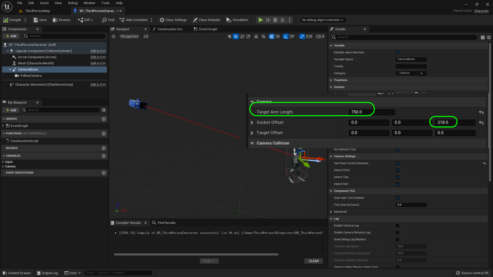

### Lock Cameras and Mechanics

[previous](../setting-up/README.md#user-content-setting-up-unreal--github) • [home](../README.md#uuser-content-ue4-intro-to-level-design) • [next](../holodeck/README.md#user-content-setting-up-holodeck)

Blocking out or **Gray Blocking** a level is standard practice in most level based video game genres.  It allows us to navigate and play through a space to judge game mechanics and decide if the level works or not.  There is no use to adding lots of custom great art, to then realize that the game play does not work as designed.  This allows us to test the interactivity first before adding artwork to a level.

Now the first step before gray blocking is to make a final decision on physics of our main controllable character.  How would I know how to place platforms without knowing how far the player can jump.  We also need a near final camera as it will need to fit or adapt to the environment you set up.  We will do a very quick version of this first step that sometimes takes months/years on novel mechanics design.

The same thing could be true of any other application.  Why not as an architect, build a very simple version of the structure and navigate it first.  See what you like and don't like about your rough draft.  Then when you are happy you can go back to your modelling software and prepare a final detailed structure.

In this case I am envisioning a third person platformer like **Mario** and we will customize the default settings to alter the behabior to be more appropriate for this genre. Lets take a quick look at defining our paramters.

 

---

##### `Step 1.`\|`UE5LD`|:small_blue_diamond:

Now open the **ThirdPersonCharacter** blueprint that you find in **Content | ThirdPersonBP | Blueprints | ThirdPersonCharacter**. Make sure you are in the **Viewport** tab. Now click on the **Camera Boom** component.  It is the parent of the FollowCamera.  This acts as a spring so that when the camera collides with geometry it acts as a spring to keep the camera from going into geometry. This is represented with the **red** arrow in the editor.

##### `Step 2.`\|`UE5LD`|:small_blue_diamond: :small_blue_diamond: 

The camera is very tight to the player light an action shooter.  We want a camera that is a bit further away.  In our charactre blueprint there is a boom that adjusts the distance and angle of the camera from the player. Select the **Camera Boom** component.  Change the **Target Arm Length** to a number like `750`.  Then adjust the **Target Offset | Z** value to a value like `218`. Now the camera is above and further away but is not rotated facing the player.  Lets fix that.

##### `Step 3.`\|`UE5LD`|:small_blue_diamond: :small_blue_diamond: :small_blue_diamond:
Now select the **FollowCamera** component and adjust the **Rotation Y** to `345`.  This will pitch the camera down 15 degrees pointing towards the back of the player's head.

##### `Step 4.`\|`UE5LD`|:small_blue_diamond: :small_blue_diamond: :small_blue_diamond: :small_blue_diamond:

Press **Compile** in the blueprint then run the game and run into the back wall to see that the spring arm stops (and the player sort of disappears).  We will fix that in a later lesson when we dig more into blueprints. For now you can see that our camera is further back and high up looking down at the player.

https://user-images.githubusercontent.com/5504953/175455582-938251d1-fb04-493d-8f6f-98a4b4d617a2.mp4

##### `Step 5.`\|`UE5LD`| :small_orange_diamond:

Open up the **ThirdPersonCharacter** blueprint and select the **CharacterMovement** component.  This is where all the adjustments for player physics is held.  Let's first change the gravity.  We want a bit of moon like physics for **Gravity**. If you hover the cursor over **Gravity Scale** you will get a description of what it does.  The default is `1.75`. Let's make it more like the moon gravity and set it to `1.35`. The lower the number, the lower the gravitational force.

##### `Step 6.`\|`UE5LD`| :small_orange_diamond: :small_blue_diamond:

Press the **Compile** button on the blueprint and run the game.  Now look at how the player's gravity changes and the player floats more when jumping. The physics feel like you are on the moon.

https://user-images.githubusercontent.com/5504953/175456397-6f38bba5-3469-4ea7-9e4d-57ac4dc9694a.mp4

##### `Step 7.`\|`UE5LD`| :small_orange_diamond: :small_blue_diamond: :small_blue_diamond:

Lets make a few more changes.  Lets make our character run a bit faster.  In the blueprint change the **Character Movement: Walking | Max Walk Speed** to `800 cm/s`(the default was 500 cm/s). This will give us a more arcady quick feel. Play the game and tune the value to your liking.

##### `Step 8.`\|`UE5LD`| :small_orange_diamond: :small_blue_diamond: :small_blue_diamond: :small_blue_diamond:

Now lets make the player jump higher and give the ability for the player to adjust his direction mid flight.  In **Character Movement: Jumping / Falling** change **Jump Z Velocity** to `700.0` to make the player jump height. To give you more control in the air after you jump you can increase the **Air Control** to `0.5`. Play the game and tune the numbers to your liking. None of these numbers are \"correct\" or \"right\".  These are all up to you and how you want your character to move.

##### `Step 9.`\|`UE5LD`| :small_orange_diamond: :small_blue_diamond: :small_blue_diamond: :small_blue_diamond: :small_blue_diamond:

Press the <kbd>Compile</kbd> button and play agian.  Now we can jump a little higher and have more control to change direction in air.

https://user-images.githubusercontent.com/5504953/175457618-432304c9-00d0-4c9f-8c4f-5b1045e05ae5.mp4

##### `Step 10.`\|`UE5LD`| :large_blue_diamond:

It is sluggish when turning directions, we want a very snappy turn. We will adjust the **Character Movement (Rotation Settings) | Rotation Rate Z** to `1000`. Play the game and tune the numbers to your liking.

##### `Step 11.`\|`UE5LD`| :large_blue_diamond: :small_blue_diamond: 

Play the game and make any changes to what I suggested.  Get the player to move the way you envision a player should move in an arcady third person game. It still feels a bit slugging when I start from idle.  I would like a faster acceleration.

https://user-images.githubusercontent.com/5504953/175459161-76916521-4e49-40d4-b0d0-3b98cb26d480.mp4

##### `Step 12.`\|`UE5LD`| :large_blue_diamond: :small_blue_diamond: :small_blue_diamond: 

Go to **Character Movement | Max Acceleration** and change it to `10000.0`.

##### `Step 13.`\|`UE5LD`| :large_blue_diamond: :small_blue_diamond: :small_blue_diamond:  :small_blue_diamond: 

##### `Step 14.`\|`UE5LD`| :large_blue_diamond: :small_blue_diamond: :small_blue_diamond: :small_blue_diamond:  :small_blue_diamond: 

##### `Step 15.`\|`UE5LD`| :large_blue_diamond: :small_orange_diamond: 

OK, lets save and update our repository.  Press **File | Save All** in **Unreal**. Press the <kbd>Source Control</kbd> button and select `Submit to Source Control...`. Add a **Commit** message and press the <kbd>Submit</kbd> button.

Open **GitHub Desktop** and press <kbd>Push origin</kbd> to update the server.  If you do not do this it will be saved locally but not on **GitHub**.

We will move on to setting up a new level to do some prepatory work before we can commence gray blocking.

| [previous](../setting-up/README.md#user-content-setting-up-unreal--github)| [home](../README.md#user-content-ue4-intro-to-level-design) | [next](../holodeck/README.md#user-content-setting-up-holodeck)|
|---|---|---|
