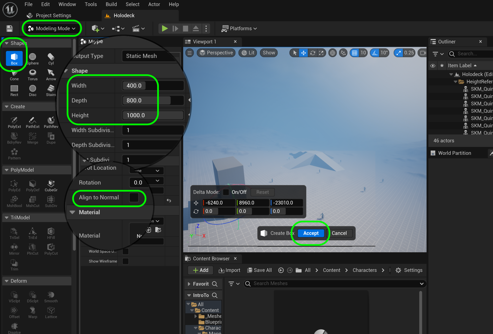
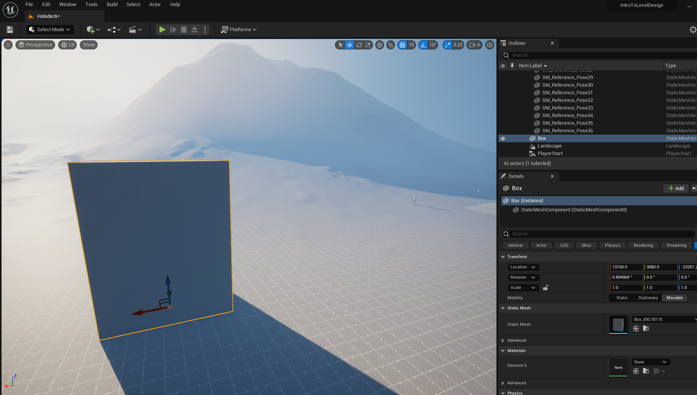
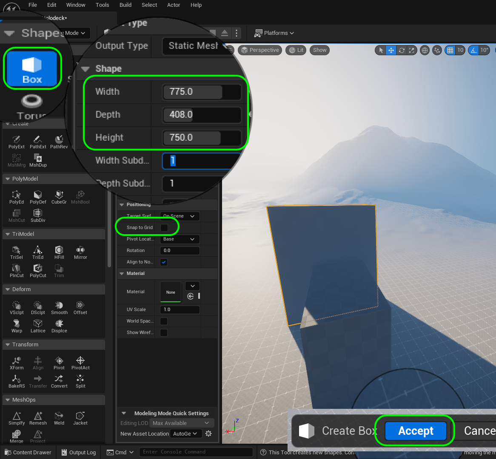
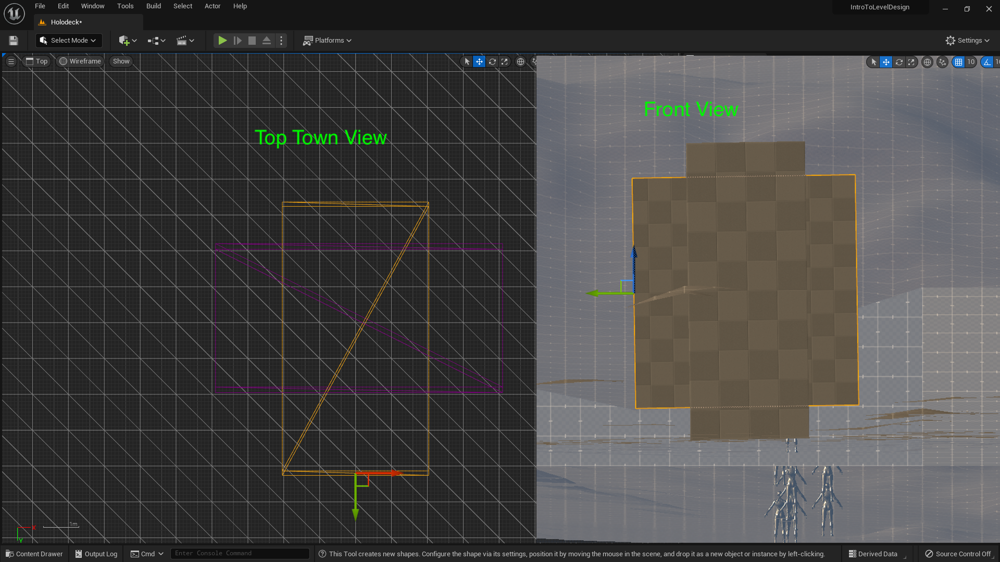
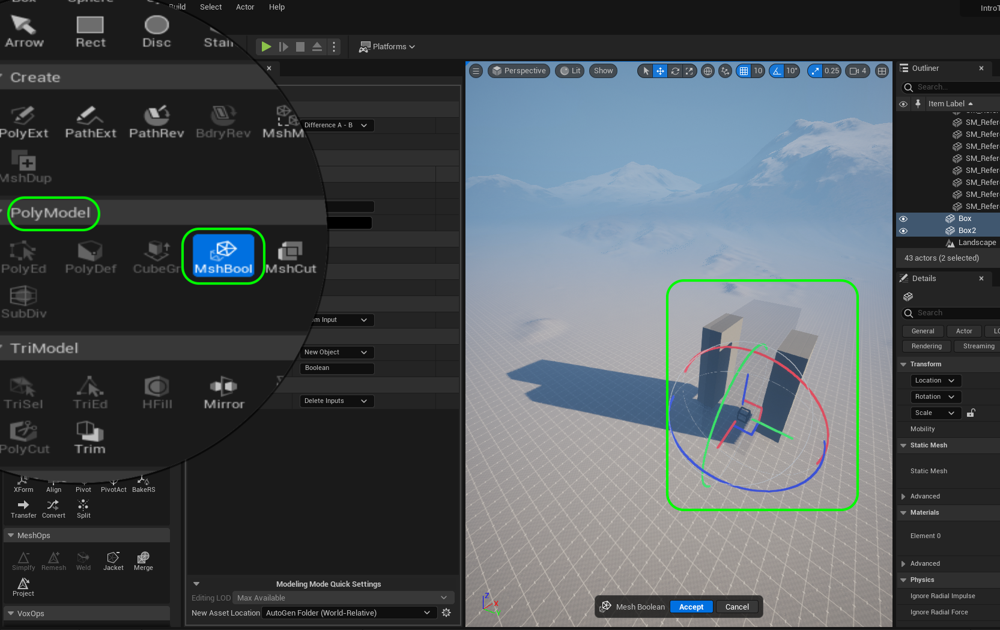
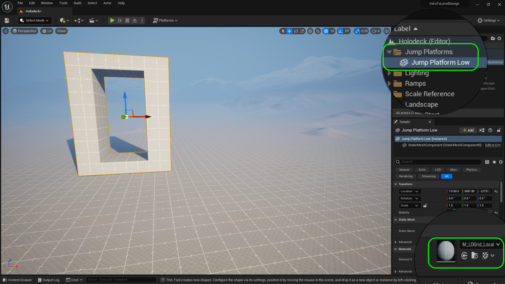
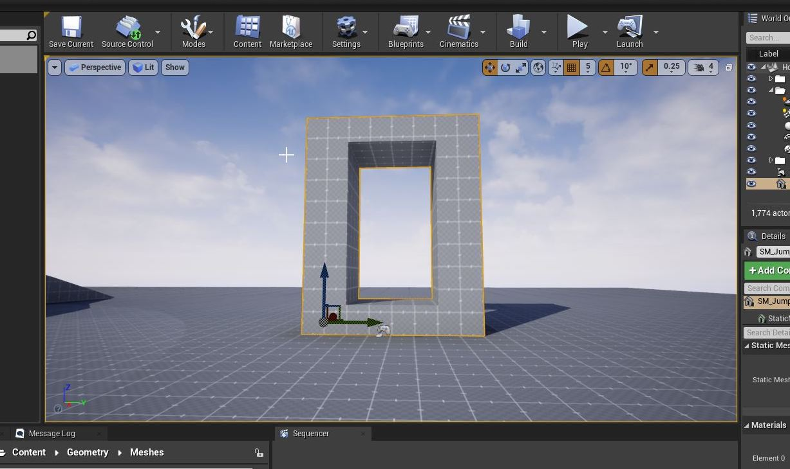
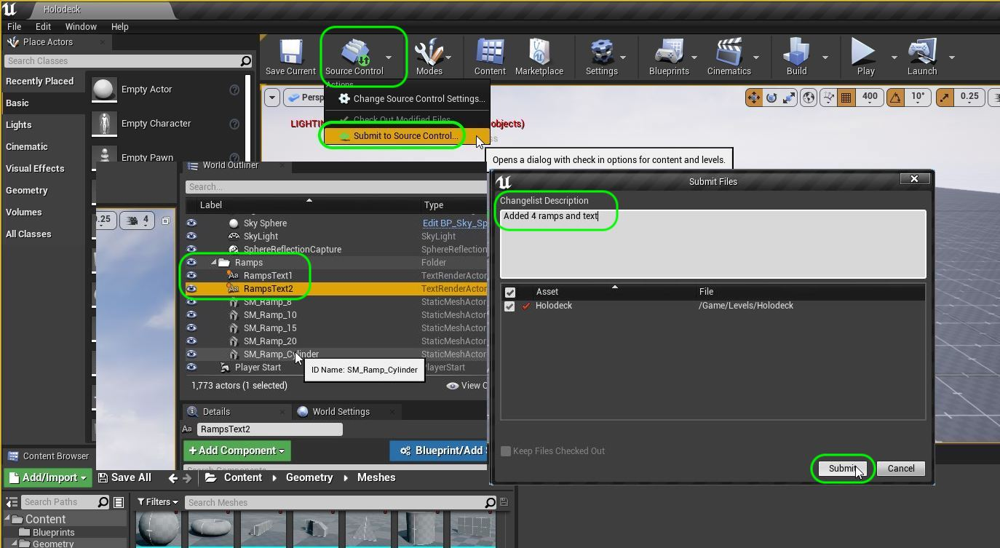
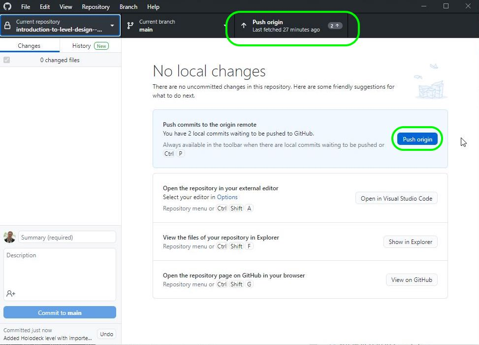

### Double Jumping

[previous](../ramps2/README.md#user-content-finish-remaining-3-ramps) • [home](../README.md#user-content-ue4-intro-to-level-design) • [next](../gameplay-scale/README.md#user-content-gameplay--scale-register)

Now we are going to figure out how high the player can jump for getting onto platforms.  This is our core mechanic so it is important to be happy with this and understand it better.  Lets start by making a hole in a column to vertically jump through.  This will give us information about the size of the portal to fit the player **and** the camera.  We will do this for easy single jump, hard single jump, easy double jump and hard double jump.   We also should add a double jump to the physics in the **ThirdPersonCharacter** blueprint.

 

---

##### `Step 1.`\|`UE5LD`|:small_blue_diamond:

Go to **Select Mode** and switch back to **Modeling** mode.  Select a **Box** and make it a **Width** of `400`, **Depth** of `800` and **Height** of `1000`. Press the <kbd>Complete</kbd> and put it on the ground.

##### `Step 2.`\|`UE5LD`|:small_blue_diamond: :small_blue_diamond: 

Now go back to ??? mode and lift the box and press the <kbd>End</kbd> key and place it next to the ramps you just created (give yourself some breathing room). 

##### `Step 3.`\|`UE5LD`|:small_blue_diamond: :small_blue_diamond: :small_blue_diamond:

Lets create a second box that we will use to cut a hole in the existing one. Go back to the **Modeling** mode and create another **Box** that is a **Width** of `775`, **Depth** of `408` and **Height** of `750`. Press the <kbd>Complete</kbd> and put it on the ground next to the other box.

##### `Step 4.`\|`UE5LD`|:small_blue_diamond: :small_blue_diamond: :small_blue_diamond: :small_blue_diamond:

Place smaller box through bigger box.  Use the top, side and front views to center it through the shape. You will want the smaller box to cut a hole through the middle of the bigger one.  This will create our jump platform.  I have adjusted it to a meter in height.

##### `Step 5.`\|`UE5LD`| :small_orange_diamond:

We are able to use these shapes as a positive volume, or we can use it as a negative volume to subtract one shape from a positive volume.  This is by using a Mesh Boolean function.

Select both boxes in the scene. Now go to the **PolyModel** group and select **MshBool** (Mesh Boolean).  This will allow us to subtract one shape from the other.  Depending on the order you clicked them on it will be either **Difference A-B** or **Difference B-A**. When you are ready, press the <kbd>Accept</kbd> button to create a new shape. 

##### `Step 6.`\|`UE5LD`| :small_orange_diamond: :small_blue_diamond:

Create a new folder called 
 

##### `Step 7.`\|`UE5LD`| :small_orange_diamond: :small_blue_diamond: :small_blue_diamond:

Now lets fix the pivot so it is at the ground plane.  Change to **Front** view and right click the bottom right vertex.

##### `Step 8.`\|`UE5LD`| :small_orange_diamond: :small_blue_diamond: :small_blue_diamond: :small_blue_diamond:

Right click on the open graph and select **Pivot | Set as Pivot Offset**.

##### `Step 9.`\|`UE5LD`| :small_orange_diamond: :small_blue_diamond: :small_blue_diamond: :small_blue_diamond: :small_blue_diamond:

Now select **both** the additive and subtractive brushes and we will convert them to a single static mesh.  Press the <kbd>Create Static Mesh</kbd> button then select the **Geometry | Meshes** folder and call this mesh `SM_JumpPlatform_Low`. Press the green <kbd>Create Static Mesh</kbd> button to complete the conversion.

##### `Step 10.`\|`UE5LD`| :large_blue_diamond:
Remember there is no collision volume. Open up **SM_JumpPlatform_Low** in the editor and change **Collision | Collisoin Complexity** to `Use Complex Collisions As Simple`.  Now turn on **Collision | Simple Collision** and you should see the collision mesh being the same as the static mesh.

##### `Step 11.`\|`UE5LD`| :large_blue_diamond: :small_blue_diamond: 

Now we want to understand the scale of the world we need to build and this is based on the player physics.  If the player has real world physics we can use real world scale (a floor of a building is 20 feet tall for example).  But with exaggerated physics we need exagerated scale for it to work.  So run the game and jump and my character based on my settings can jump 3 meters (~9.8 feet).

https://user-images.githubusercontent.com/5504953/128029695-3bf2ac00-aa39-4e49-a3ac-c64221fce573.mp4

##### `Step 12.`\|`UE5LD`| :large_blue_diamond: :small_blue_diamond: :small_blue_diamond: 

Run the game and jump through the hole. Make sure the camera clears.  In my case it does.  But we need to add a double jump to the game to see if this causes a problem.

https://user-images.githubusercontent.com/5504953/128029891-740da1f1-52d3-464b-9d12-d47390dd9daf.mp4

##### `Step 13.`\|`UE5LD`| :large_blue_diamond: :small_blue_diamond: :small_blue_diamond:  :small_blue_diamond: 

Open the **ThirdPersonCharacter** blueprint and select the **Event Graph** and go to the **Jump** section and make room to add nodes for double jumping.

##### `Step 14.`\|`UE5LD`| :large_blue_diamond: :small_blue_diamond: :small_blue_diamond: :small_blue_diamond:  :small_blue_diamond: 

Right click on the open graph and add a **Event On Landed** node to the blueprint. Connect it to the **Stop Jumping** as we will stop jumping when the player hits the ground.  Disconnect ththe **Stop Jumping** node by right clicking on **InputAction Jump** and select **Break Link to Stop Jumping**. Press the **Compile** button and run the game and it should behave the same way as previously.

https://user-images.githubusercontent.com/5504953/128031003-ef83222c-8552-4e3d-8310-369d8eb11a32.mp4

##### `Step 15.`\|`UE5LD`| :large_blue_diamond: :small_orange_diamond: 

Add a **DoN** node.  This runs a given number of times and stops until it is reset.  Set the **N** value to `2`.  This means that it will start at **0** then when the player presses the **Jump** button it will go to **1**, then when the player presses it again it will go to **2**.  When the player lands it will be reset back to **0**.  Disconnect the **Jump** execution pin and attach the **InputAction Jump** execution pin to the **DoN** execution pin.

##### `Step 16.`\|`UE5LD`| :large_blue_diamond: :small_orange_diamond:   :small_blue_diamond: 

The output of the **DoN** pin is an integer (any whole number, either positive or negative).  The switch will allow us to run a different piece of code dending on the value of the integer which in this case will be **0, 1 or 2**. Pull from the **DoN | Counter** pin and type **Switch on Int** and add this node.

##### `Step 17.`\|`UE5LD`| :large_blue_diamond: :small_orange_diamond: :small_blue_diamond: :small_blue_diamond:

Connect the output **Exit** execution pin from **DoN** to the **Switch on Int** node.  Make sure the output of the **Counter** pin goes to the **Switch on Int | Selection** pin.  Press the **Add pin +** three times to get `0, 1, 2` execution pins for the switch statement.

Connect the output of **1** to the input execution pin of the **Jump** node.  Connect the execution pin from the output of the **Stop Jumping** node to the **Reset** pin of the **DoN** node.  This way the **DoN** resets the **N** integer to `0` when this is run when the player lands.So it starts at **0**, the player presses jump then the **Jump** node gets executed. When the player lands it resets back to 0 and the player can jump again.

##### `Step 18.`\|`UE5LD`| :large_blue_diamond: :small_orange_diamond: :small_blue_diamond: :small_blue_diamond: :small_blue_diamond:

Right click on the **Event Graph** and select a **Launch Character** node to give the player an additional vertical force to make them double jump.

##### `Step 19.`\|`UE5LD`| :large_blue_diamond: :small_orange_diamond: :small_blue_diamond: :small_blue_diamond: :small_blue_diamond: :small_blue_diamond:

Connect the output of the **Switch on Int | 2** execution node to the **Launch Character** execution pin. Change the **Z** value in **Launch Velocity** to `300`.

##### `Step 20.`\|`UE5LD`| :large_blue_diamond: :large_blue_diamond:

Go to the blueprint an select the **Character Movement** component.  In the **Details** panel type in `jump` and look for **Jump Z Velocity**.  Change this to `500`.

##### `Step 21.`\|`UE5LD`| :large_blue_diamond: :large_blue_diamond: :small_blue_diamond:

If you build lighting or run the game you will notice sometimes that the static meshes that go from a brush to a mesh in the editor will show up black.

Open SM_JumpPlatform_Low and in **General Settings | Light Map Resolution** change the value to `256` and in **Light Map Coordinate Index** change this value to `1`.

Now build lighting again and the problem should be fixed.

##### `Step 22.`\|`UE5LD`| :large_blue_diamond: :large_blue_diamond: :small_blue_diamond: :small_blue_diamond:

Now we do not judge the distances based on the player model as this is not used for collision.  It is the **Capsule Component** in the **Third Person Character** blueprint. Chnage the **Capsule Component | Rendering | Hiddent in Game** and deselect it.

Run the game and press jump multiple times. You should notice a boost to vertical height on the second press but not a third press.  Also, if you double jump when falling downwards it pauses the player creating an odd hiccup.  On the next page we will fix this.

Save and Commmit all of your changes to github.

https://user-images.githubusercontent.com/5504953/128046337-9a2ae249-7847-40f4-a9a8-9e90c17a433d.mp4

___

<!--  -->

| [previous](../ramps2/README.md#user-content-finish-remaining-3-ramps)| [home](../README.md#user-content-ue4-intro-to-level-design) | [next](../gameplay-scale/README.md#user-content-gameplay--scale-register)|
|---|---|---|
