### Double Jumping

[previous](../ramps2/README.md#user-content-finish-remaining-3-ramps) • [home](../README.md#user-content-ue4-intro-to-level-design) • [next](../readme/README.md#user-content-readmemd-file)

Now we are going to figure out how high the player can jump for getting onto platforms.  This is our core mechanic so it is important to be happy with this and understand it better.  Lets start by making a hole in a column to vertically jump through.  This will give us information about the size of the portal to fit the player **and** the camera.  We will do this for easy single jump, hard single jump, easy double jump and hard double jump.   We also should add a double jump to the physics in the **ThirdPersonCharacter** blueprint.

 

---

##### `Step 1.`\|`SUU&G`|:small_blue_diamond:

Add a BSP **Box** to the level next to the ramps.  Give yourself lots of room. Move the **Player Start** component in front of it and rotate it so that the **Red** arrow faces the newly dropped box.

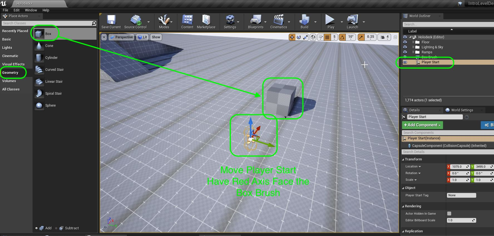

##### `Step 2.`\|`FHIU`|:small_blue_diamond: :small_blue_diamond: 

Lets make it a big jump column with plenty of room to jump through.  Edit the **Brush Settings** to `400.0`, `800.0` and `1000.0`.

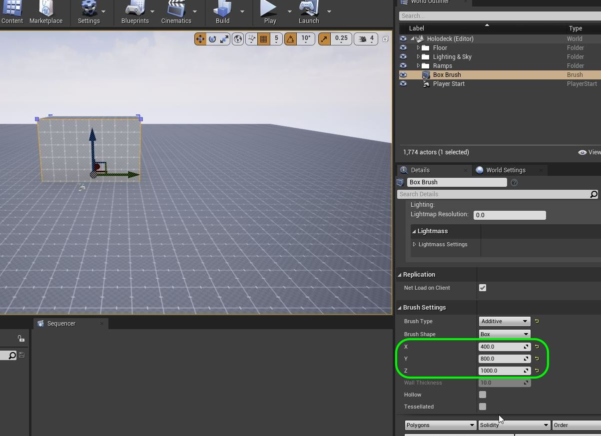

##### `Step 3.`\|`SUU&G`|:small_blue_diamond: :small_blue_diamond: :small_blue_diamond:

Lets raise the box as the pivot is centered and half of it is underground.  Right click on the box in the **World Outliner** and select **Geomoetry | Select All Adjacent Surfaces**.

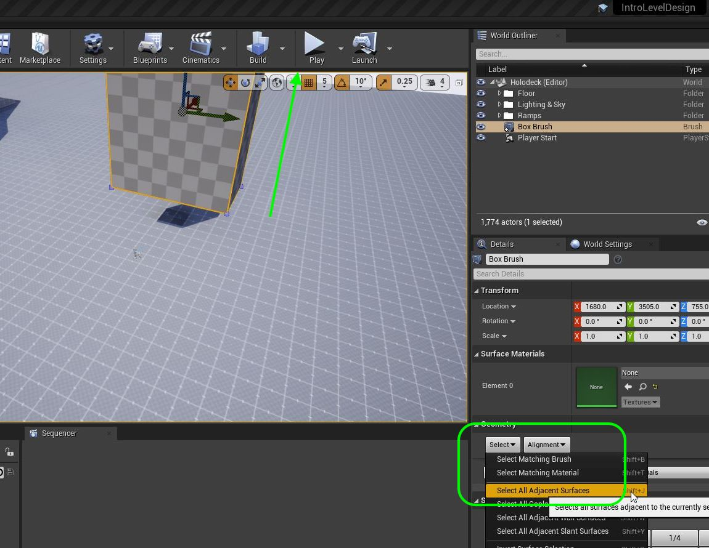

##### `Step 4.`\|`SUU&G`|:small_blue_diamond: :small_blue_diamond: :small_blue_diamond: :small_blue_diamond:

Add base material to jump platform.

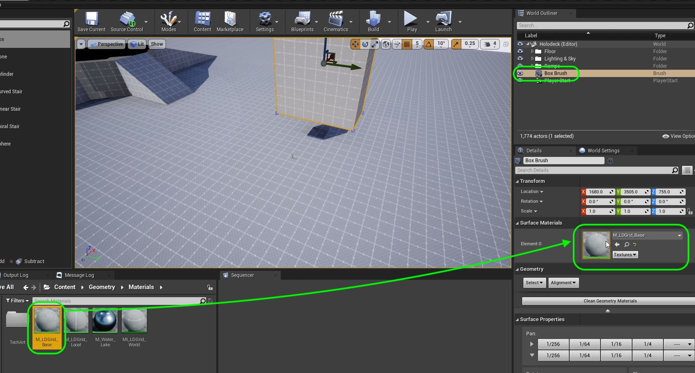

##### `Step 5.`\|`SUU&G`| :small_orange_diamond:

Press the <kbd>End</kbd> key to snap the platform to the ground.

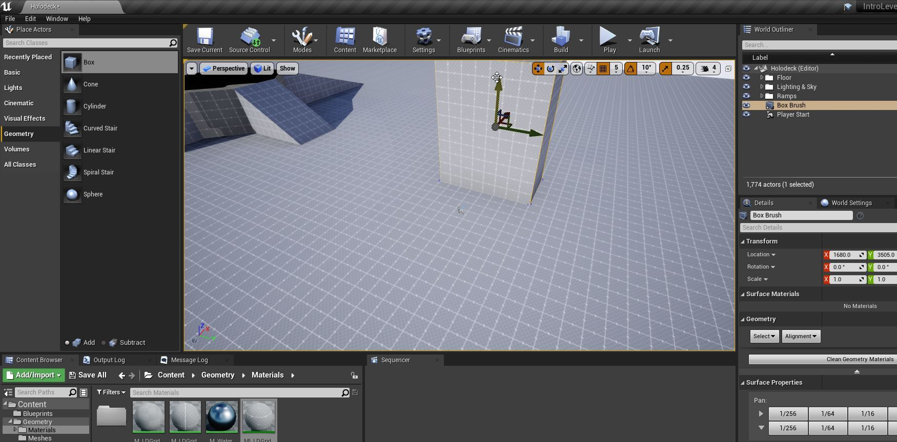

##### `Step 6.`\|`SUU&G`| :small_orange_diamond: :small_blue_diamond:

The cool thing about BSP's is that we can not only add positive volumes, but we can subtract volumes to sculpt out more complex shapes.

Now we need to cut a hole in this polygon for the player to jump through.  We can do this with the same BSP but change it to remove (subtract) the volume instead of adding to it.  We can use another box to cut a hole in the existin gobx.  Drag another **Box** into the scene and change the **Brush Type** to `Subtractive`.  This will subtract any brush volume in the level. Move it into the current box and see it cut a hole.

Resize the brush to cut a hole from about 1 meter (each cube in the texture is a meter) with room for the camera to move through.  My settings in teh **Brush Shaped** ended up as `775`, `408`, `750` in **X, Y, Z**
 
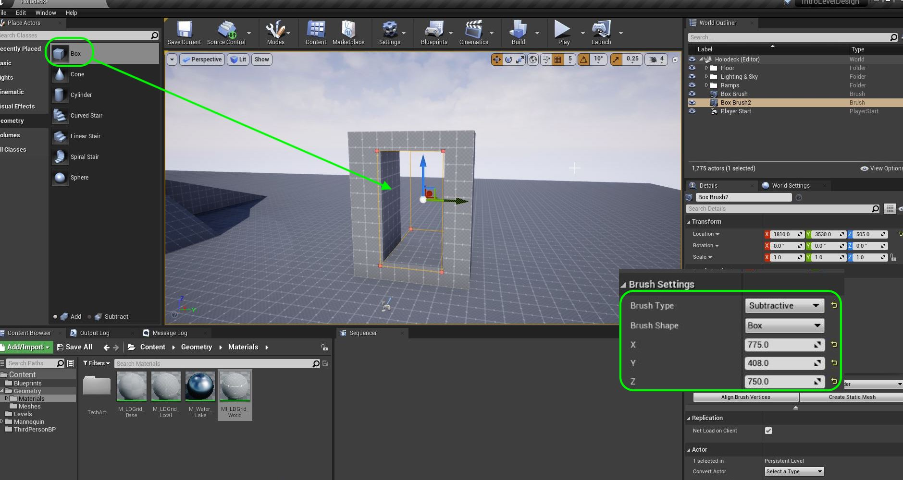

##### `Step 7.`\|`SUU&G`| :small_orange_diamond: :small_blue_diamond: :small_blue_diamond:

Now lets fix the pivot so it is at the ground plane.  Change to **Front** view and right click the bottom right vertex.

##### `Step 8.`\|`SUU&G`| :small_orange_diamond: :small_blue_diamond: :small_blue_diamond: :small_blue_diamond:

Right click on the open graph and select **Pivot | Set as Pivot Offset**.

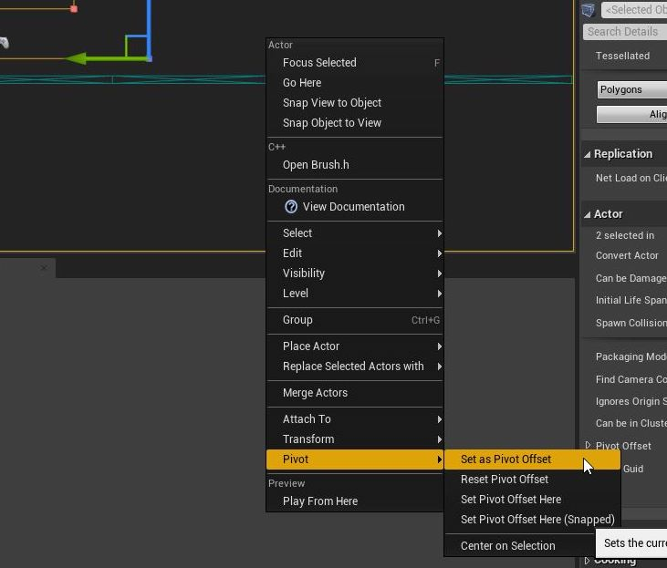

##### `Step 9.`\|`SUU&G`| :small_orange_diamond: :small_blue_diamond: :small_blue_diamond: :small_blue_diamond: :small_blue_diamond:

Now select **both** the additive and subtractive brushes and we will convert them to a single static mesh.  Press the <kbd>Create Static Mesh</kbd> button then select the **Geometry | Meshes** folder and call this mesh `SM_JumpPlatform_Low`. Press the green <kbd>Create Static Mesh</kbd> button to complete the conversion.

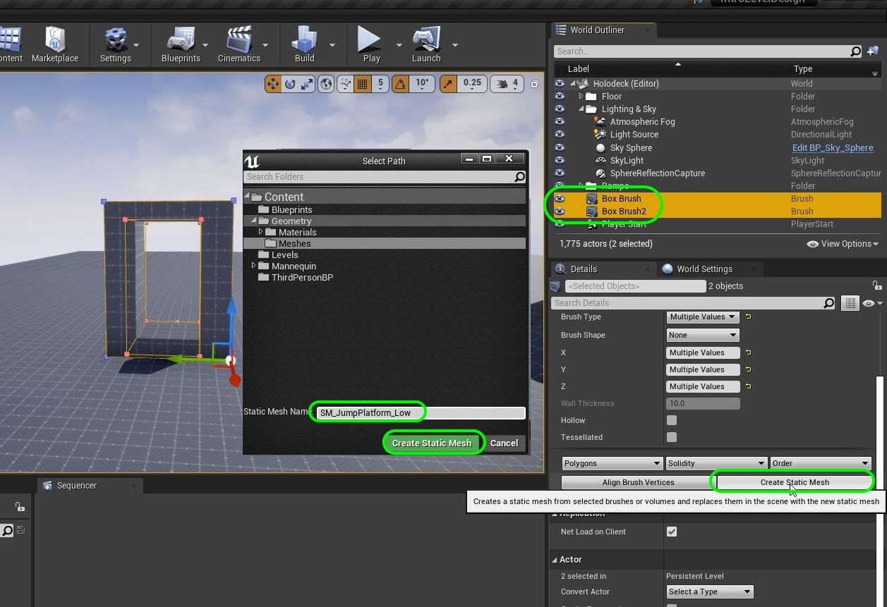

##### `Step 10.`\|`SUU&G`| :large_blue_diamond:
Remember there is no collision volume. Open up **SM_JumpPlatform_Low** in the editor and change **Collision | Collisoin Complexity** to `Use Complex Collisions As Simple`.  Now turn on **Collision | Simple Collision** and you should see the collision mesh being the same as the static mesh.

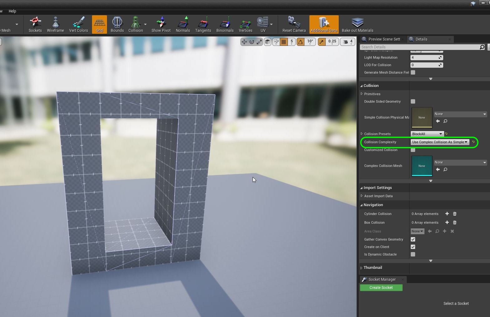

##### `Step 11.`\|`SUU&G`| :large_blue_diamond: :small_blue_diamond: 

Now we want to understand the scale of the world we need to build and this is based on the player physics.  If the player has real world physics we can use real world scale (a floor of a building is 20 feet tall for example).  But with exaggerated physics we need exagerated scale for it to work.  So run the game and jump and my character based on my settings can jump 3 meters (~9.8 feet).

https://user-images.githubusercontent.com/5504953/128029695-3bf2ac00-aa39-4e49-a3ac-c64221fce573.mp4

##### `Step 12.`\|`SUU&G`| :large_blue_diamond: :small_blue_diamond: :small_blue_diamond: 

Run the game and jump through the hole. Make sure the camera clears.  In my case it does.  But we need to add a double jump to the game to see if this causes a problem.

https://user-images.githubusercontent.com/5504953/128029891-740da1f1-52d3-464b-9d12-d47390dd9daf.mp4

##### `Step 13.`\|`SUU&G`| :large_blue_diamond: :small_blue_diamond: :small_blue_diamond:  :small_blue_diamond: 

Open the **ThirdPersonCharacter** blueprint and select the **Event Graph** and go to the **Jump** section and make room to add nodes for double jumping.

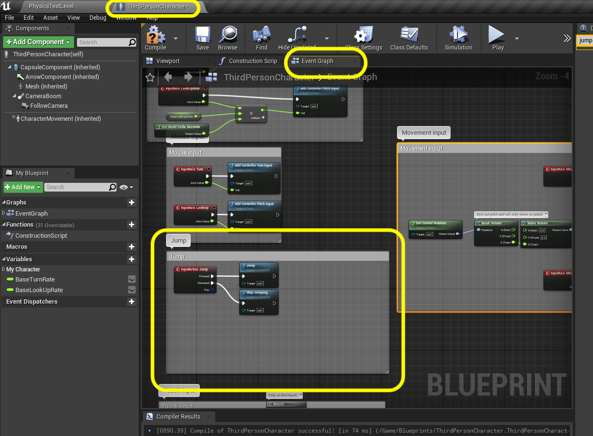

##### `Step 14.`\|`SUU&G`| :large_blue_diamond: :small_blue_diamond: :small_blue_diamond: :small_blue_diamond:  :small_blue_diamond: 

Right click on the open graph and add a **Event On Landed** node to the blueprint. Connect it to the **Stop Jumping** as we will stop jumping when the player hits the ground.  Disconnect ththe **Stop Jumping** node by right clicking on **InputAction Jump** and select **Break Link to Stop Jumping**. Press the **Compile** button and run the game and it should behave the same way as previously.

https://user-images.githubusercontent.com/5504953/128031003-ef83222c-8552-4e3d-8310-369d8eb11a32.mp4

##### `Step 15.`\|`SUU&G`| :large_blue_diamond: :small_orange_diamond: 

Add a **DoN** node.  This runs a given number of times and stops until it is reset.  Set the **N** value to `2`.  This means that it will start at **0** then when the player presses the **Jump** button it will go to **1**, then when the player presses it again it will go to **2**.  When the player lands it will be reset back to **0**.  Disconnect the **Jump** execution pin and attach the **InputAction Jump** execution pin to the **DoN** execution pin.

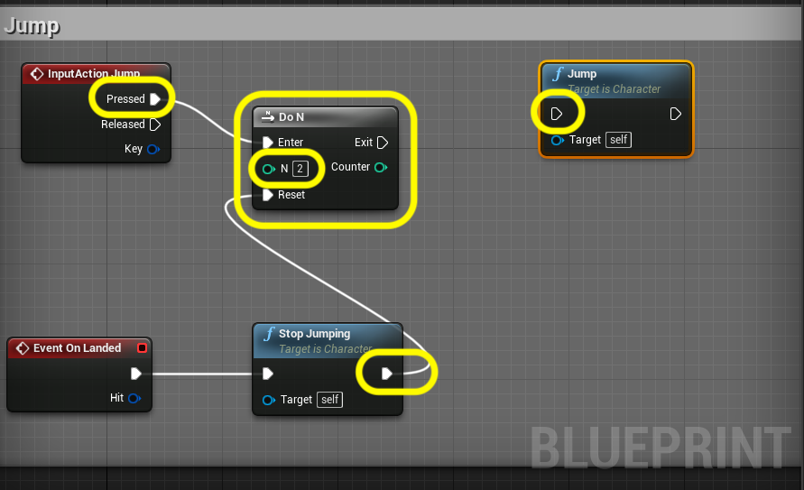

##### `Step 16.`\|`SUU&G`| :large_blue_diamond: :small_orange_diamond:   :small_blue_diamond: 

The output of the **DoN** pin is an integer (any whole number, either positive or negative).  The switch will allow us to run a different piece of code dending on the value of the integer which in this case will be **0, 1 or 2**. Pull from the **DoN | Counter** pin and type **Switch on Int** and add this node.

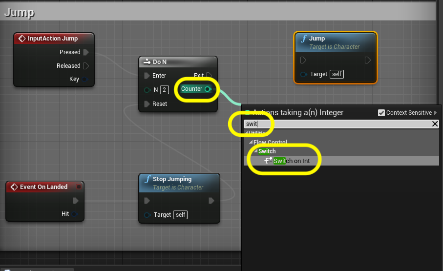

##### `Step 17.`\|`SUU&G`| :large_blue_diamond: :small_orange_diamond: :small_blue_diamond: :small_blue_diamond:

Connect the output **Exit** execution pin from **DoN** to the **Switch on Int** node.  Make sure the output of the **Counter** pin goes to the **Switch on Int | Selection** pin.  Press the **Add pin +** three times to get `0, 1, 2` execution pins for the switch statement.

Connect the output of **1** to the input execution pin of the **Jump** node.  Connect the execution pin from the output of the **Stop Jumping** node to the **Reset** pin of the **DoN** node.  This way the **DoN** resets the **N** integer to `0` when this is run when the player lands.So it starts at **0**, the player presses jump then the **Jump** node gets executed. When the player lands it resets back to 0 and the player can jump again.

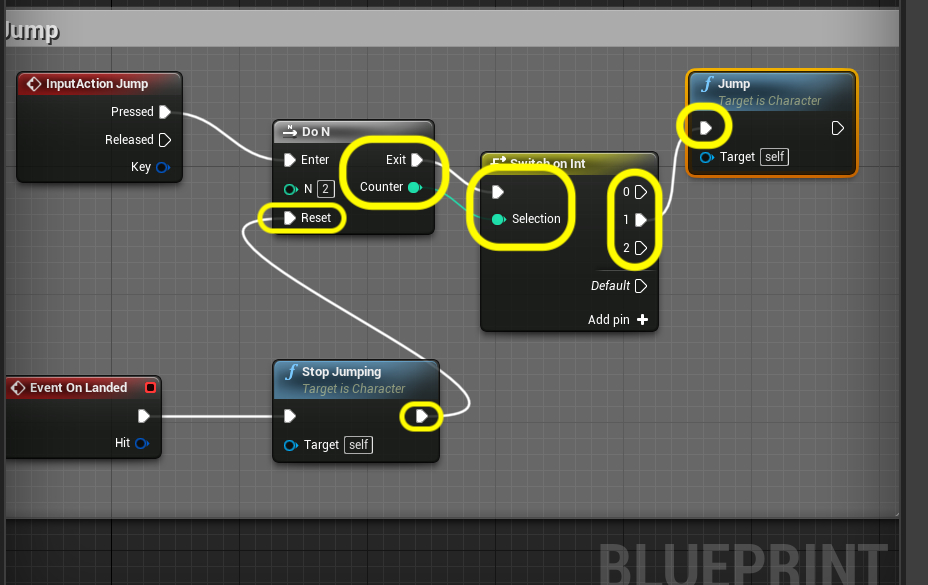

##### `Step 18.`\|`SUU&G`| :large_blue_diamond: :small_orange_diamond: :small_blue_diamond: :small_blue_diamond: :small_blue_diamond:

Right click on the **Event Graph** and select a **Launch Character** node to give the player an additional vertical force to make them double jump.

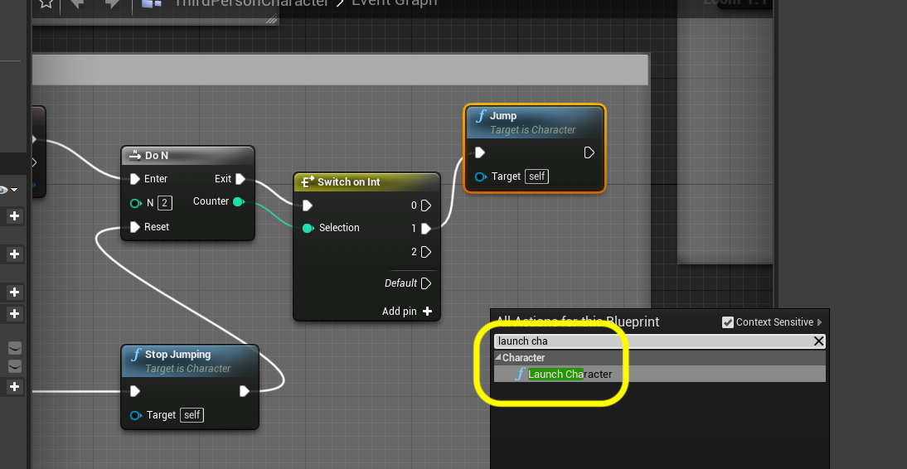

##### `Step 19.`\|`SUU&G`| :large_blue_diamond: :small_orange_diamond: :small_blue_diamond: :small_blue_diamond: :small_blue_diamond: :small_blue_diamond:

Connect the output of the **Switch on Int | 2** execution node to the **Launch Character** execution pin. Change the **Z** value in **Launch Velocity** to `300`.

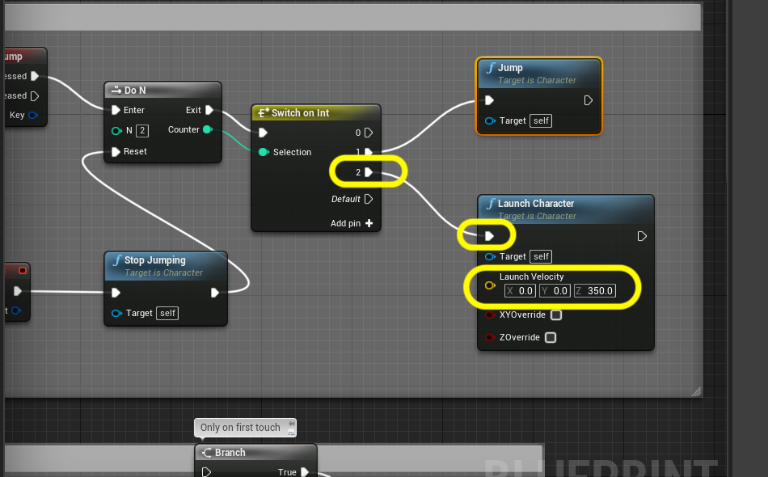

##### `Step 20.`\|`SUU&G`| :large_blue_diamond: :large_blue_diamond:

Go to the blueprint an select the **Character Movement** component.  In the **Details** panel type in `jump` and look for **Jump Z Velocity**.  Change this to `500`.

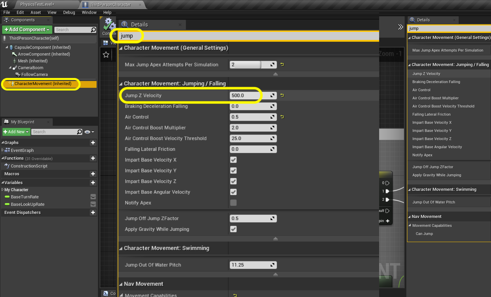

##### `Step 21.`\|`SUU&G`| :large_blue_diamond: :large_blue_diamond: :small_blue_diamond:

If you build lighting or run the game you will notice sometimes that the static meshes that go from a brush to a mesh in the editor will show up black.

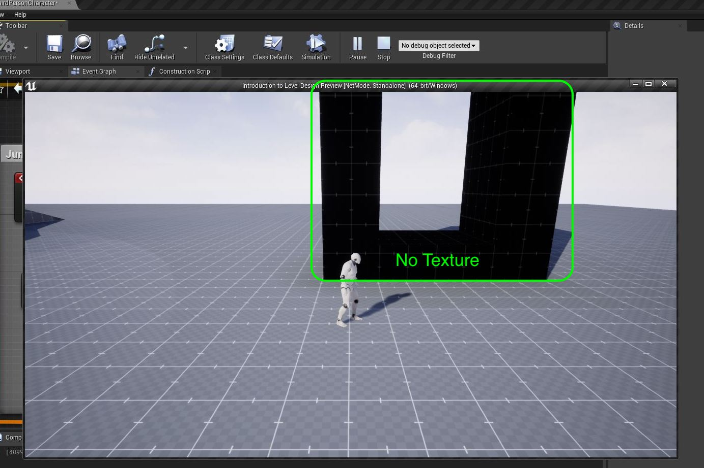

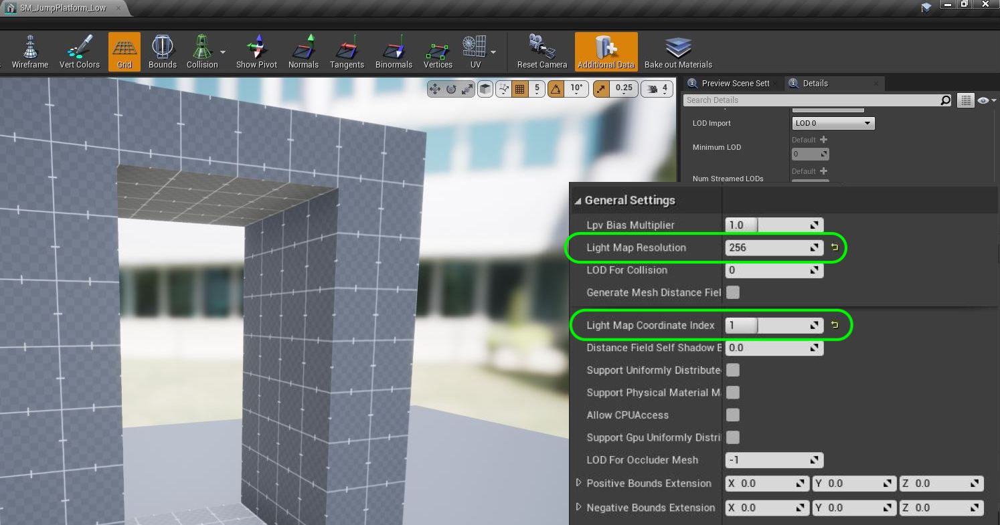

___

##### `Step 22.`\|`SUU&G`| :large_blue_diamond: :large_blue_diamond: :small_blue_diamond: :small_blue_diamond:

Run the game and press jump multiple times. You should notice a boost to vertical height on the second press but not a third press.  Also, if you double jump when falling downwards it pauses the player creating an odd hiccup.  On the next page we will fix this.

| [previous](../ramps2/README.md#user-content-finish-remaining-3-ramps)| [home](../README.md#user-content-ue4-intro-to-level-design) | [next](../readme/README.md#user-content-readmemd-file)|
|---|---|---|
