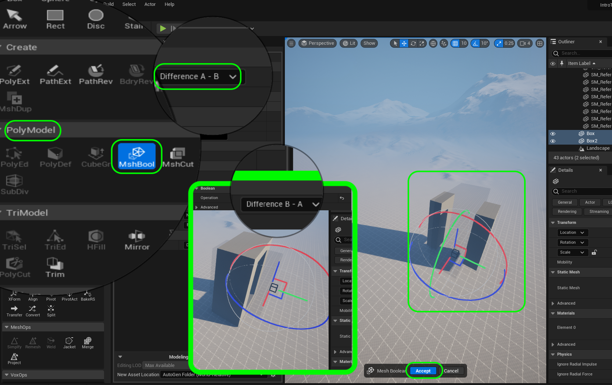
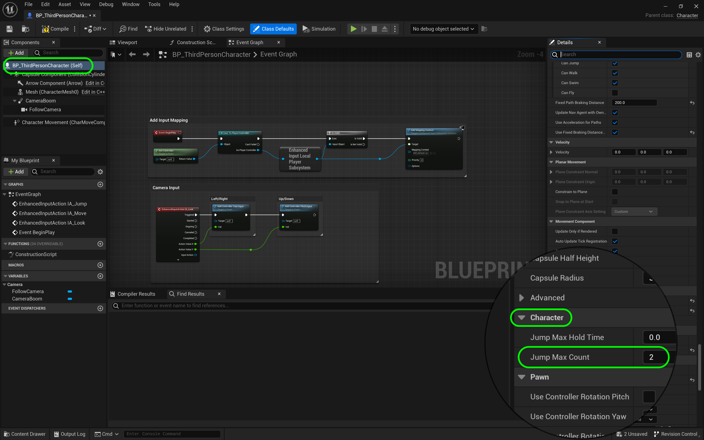
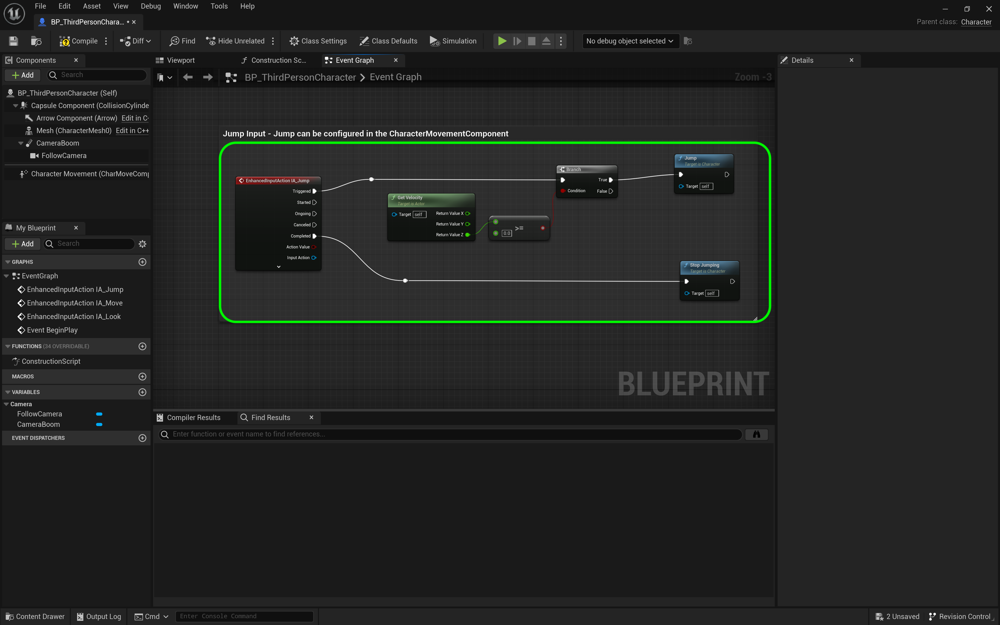

### Double Jumping

[previous](../ramps2/README.md#user-content-finish-remaining-3-ramps) • [home](../README.md#user-content-ue4-intro-to-level-design) • [next](../gameplay-scale/README.md#user-content-gameplay--scale-register)

Now we are going to figure out how high the player can jump for getting onto platforms.  This is our core mechanic so it is important to be happy with this and understand it better.  Lets start by making a hole in a column to vertically jump through.  This will give us information about the size of the portal to fit the player **and** the camera.  We will do this for easy single jump, hard single jump, easy double jump and hard double jump.   We also should add a double jump to the physics in the **ThirdPersonCharacter** blueprint.

 

---

##### `Step 1.`\|`UE5LD`|:small_blue_diamond:

Go to **Select Mode** and switch back to **Modeling** mode.  Select a **Box** and make it a **Width** of `400`, **Depth** of `800` and **Height** of `1000`. Make sure **Align to Normal** is `false`. Press the <kbd>Create Box</kbd> to place it in the level then press the <kbd>Accept</kbd> to save the work.

##### `Step 2.`\|`UE5LD`|:small_blue_diamond: :small_blue_diamond: 

Now go back to ??? mode and lift the box and press the <kbd>End</kbd> key and place it next to the ramps you just created (give yourself some breathing room). 

##### `Step 3.`\|`UE5LD`|:small_blue_diamond: :small_blue_diamond: :small_blue_diamond:

Lets create a second box that we will use to cut a hole in the existing one. Go back to the **Modeling** mode and create another **Box** that is a **Width** of `775`, **Depth** of `408` and **Height** of `750`. Press the <kbd>Complete</kbd> and put it on the ground next to the other box.

##### `Step 4.`\|`UE5LD`|:small_blue_diamond: :small_blue_diamond: :small_blue_diamond: :small_blue_diamond:

Place smaller box through bigger box.  Use the top, side and front views to center it through the shape. You will want the smaller box to cut a hole through the middle of the bigger one.  This will create our jump platform.  I have adjusted it to a meter in height.

##### `Step 5.`\|`UE5LD`| :small_orange_diamond:

We are able to use these shapes as a positive volume, or we can use it as a negative volume to subtract one shape from a positive volume.  This is by using a Mesh Boolean function.

Select both boxes in the scene. Now go to the **PolyModel** group and select **MshBool** (Mesh Boolean).  This will allow us to subtract one shape from the other.  Depending on the order you clicked them on it will be either **Difference A-B** or **Difference B-A**. When you are ready, press the <kbd>Accept</kbd> button to create a new shape. 

##### `Step 6.`\|`UE5LD`| :small_orange_diamond: :small_blue_diamond:

Create a new folder in your **Outliner** called `Jump Platform Low`.  Assign `M_LDDgrid_Local` material to it.  Now we have a shape that we can jump through! 
 

##### `Step 7.`\|`UE5LD`| :small_orange_diamond: :small_blue_diamond: :small_blue_diamond:

Lets go to the folder where these generated shapes are kept. I deleted the two cubes and kept the jump platform.  I then moved it to the **Meshes** folder.

##### `Step 8.`\|`UE5LD`| :small_orange_diamond: :small_blue_diamond: :small_blue_diamond: :small_blue_diamond:

Rename the static mesh to `SM_JumpPlatform_Low`.

##### `Step 9.`\|`UE5LD`| :small_orange_diamond: :small_blue_diamond: :small_blue_diamond: :small_blue_diamond: :small_blue_diamond:

Raise the jump platform up and press the <kbd>End</kbd> key to get it to sit on the ground. 

##### `Step 10.`\|`UE5LD`| :large_blue_diamond:
Move the player start from the ramps to the new jump platform.  Rotate it to point to the platform.

##### `Step 11.`\|`UE5LD`| :large_blue_diamond: :small_blue_diamond: 

Run the game and jump through the hole. Make sure the camera clears.  In my case it does.  But we need to add a double jump to the game to see if this causes a problem. Also, if you move the camera around you will have collision issues.  We will not deal with fixing this now.  We will leave it as is.

https://user-images.githubusercontent.com/5504953/181350876-22daaa76-ada5-4a59-9b00-561581af6ebc.mp4

##### `Step 12.`\|`UE5LD`| :large_blue_diamond: :small_blue_diamond: :small_blue_diamond: 

Now I didn't populate our reference character in this area.  So I am going to go and select all the static mesh characters I have in the **Scale Reference** folder and press the <kbd>Alt</kbd> key with the red gizmo on the moving the static meshes.  This will duplicate them.  Place them in the area that you need to.  Then raise them up and press the <kbd>End</kbd> key to get them all on the ground plane.

https://user-images.githubusercontent.com/5504953/181407845-2c33c685-ecc7-4608-a2e5-670f4e71990d.mp4

##### `Step 13.`\|`UE5LD`| :large_blue_diamond: :small_blue_diamond: :small_blue_diamond:  :small_blue_diamond: 

Open the **ThirdPersonCharacter** blueprint and select the top component **BP_ThirdPersonCharacter (Self)** and search for **Jump Max Count**.  Lets set this to `2` so we can double jump!

##### `Step 14.`\|`UE5LD`| :large_blue_diamond: :small_blue_diamond: :small_blue_diamond: :small_blue_diamond:  :small_blue_diamond: 

Now press the <kbd>Compile</kbd> button then go to the game and press <kbd>Play</kbd>. Now you can double jump but there is one thing I don't like.  It allows you to double jump when you are falling.  Lets look at adjusting this.

https://user-images.githubusercontent.com/5504953/181525660-71c045e2-3c50-4d7a-9f23-84d74508b12e.mp4

##### `Step 15.`\|`UE5LD`| :large_blue_diamond: :small_orange_diamond: 

So how can we tell if a player is moving up or down.  The best way is to look at the player velocity.  The difference between speed and velocity is that speed is just displacement over time without knowing which direction the object is moving in. Velocity also has a direction so it represents both a direction and a magnitude (amount of displacememnt).  Unreal uses a vector (x, y, z) to represent the velocity and the displacement is common to represent cm/second. The black dotted line represents how much the actor will move over a second of time and in in which direction.

##### `Step 16.`\|`UE5LD`| :large_blue_diamond: :small_orange_diamond:   :small_blue_diamond: 

To tell if the player is moving down is to isolate the **Z** axis.  So if the Z axis is at 0 (on the ground or the apex of the jum) then the player can double jump, if it is less than 0 then we want to disable jumping.

##### `Step 17.`\|`UE5LD`| :large_blue_diamond: :small_orange_diamond: :small_blue_diamond: :small_blue_diamond:

So open up the **BP_ThirdPersonCharacter** player blueprint we edited earlier.  Go to the **Event Graph** tab and find the section tha has a title of **Jump Input**.  Make some room between the **Input Action** and the **Jumping Nodes**.  Right click on the open graph and type **Get Velocity**.  

##### `Step 18.`\|`UE5LD`| :large_blue_diamond: :small_orange_diamond: :small_blue_diamond: :small_blue_diamond: :small_blue_diamond:

The **Return Value** is a single pin and returns a **Vector** struct.  What is a struct?  It is a structure that contains multiple variables.  In this case it contains three floating point numbers representing X, Y & Z.

##### `Step 19.`\|`UE5LD`| :large_blue_diamond: :small_orange_diamond: :small_blue_diamond: :small_blue_diamond: :small_blue_diamond: :small_blue_diamond:

So we want to isolate the **Z** vector.  How do we do this?  We right lick on the **Return Value** and select **Split Struct Pin**.  This will change it to three individual variables and we can now isolate the **Z** pin.

##### `Step 20.`\|`UE5LD`| :large_blue_diamond: :large_blue_diamond:

Now you need to pull of the **Z** pin and then type `>=` as we want the >= operator.  This allows us to confirm that the velocity in Z is either 0 or positive.

##### `Step 21.`\|`UE5LD`| :large_blue_diamond: :large_blue_diamond: :small_blue_diamond:

Now pull off the output pin from the **>=** node.  This is a **Boolean** which is either **True** or **False**.  This will allow us to check to see if the **Z** velocity is greater or equal to zero and if so then allow jumping otherise do nothing. 

Pull off this pin and select a **Branch** node. Connect the output of **Input Jump | Pressed** to the input execution pin on the **Branch** node.  Connect the **True** pin from the **Branch** node to the **Jump** node.  Make sure the output of the boolean **>=** is connected to the **Condition** pin on the **Branch** node.

##### `Step 22.`\|`UE5LD`| :large_blue_diamond: :large_blue_diamond: :small_blue_diamond: :small_blue_diamond:

Do ths same thing for jumping with a touch pad.

##### `Step 23.`\|`UE5LD`| :large_blue_diamond: :large_blue_diamond: :small_blue_diamond: :small_blue_diamond: :small_blue_diamond:

Now press the <kbd>Play</kbd> button and you should only be able to jump when moving up (or on the ground for that matter).  And you can only jump twice!  Great job - lets keep  going.

https://user-images.githubusercontent.com/5504953/181570832-33c19fc7-d270-4c09-872c-0eed41ee35ce.mp4

___

<!--  -->

| [previous](../ramps2/README.md#user-content-finish-remaining-3-ramps)| [home](../README.md#user-content-ue4-intro-to-level-design) | [next](../gameplay-scale/README.md#user-content-gameplay--scale-register)|
|---|---|---|
