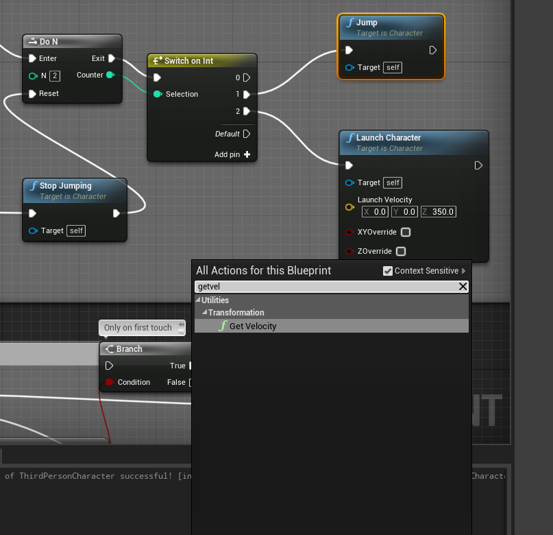
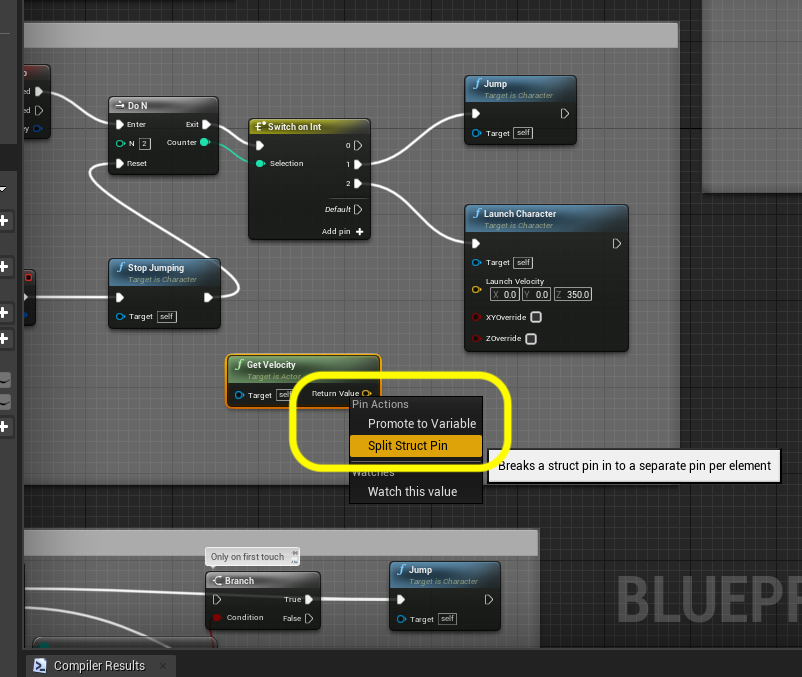
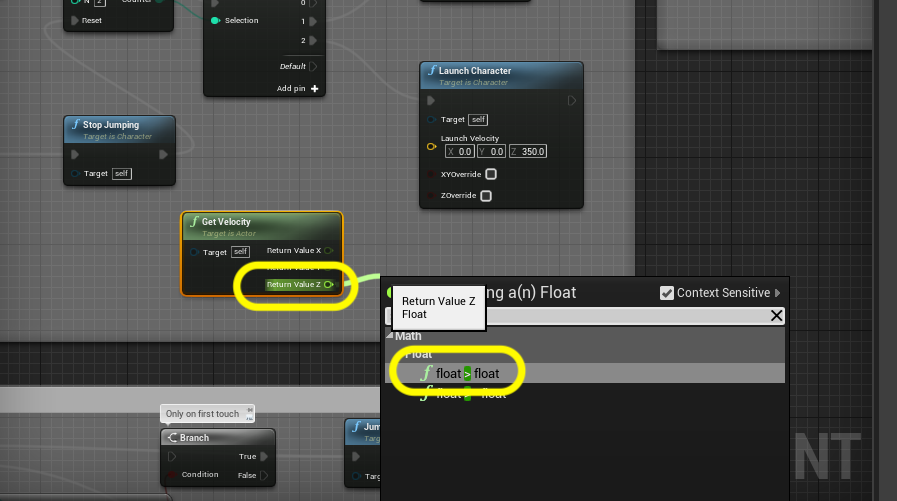
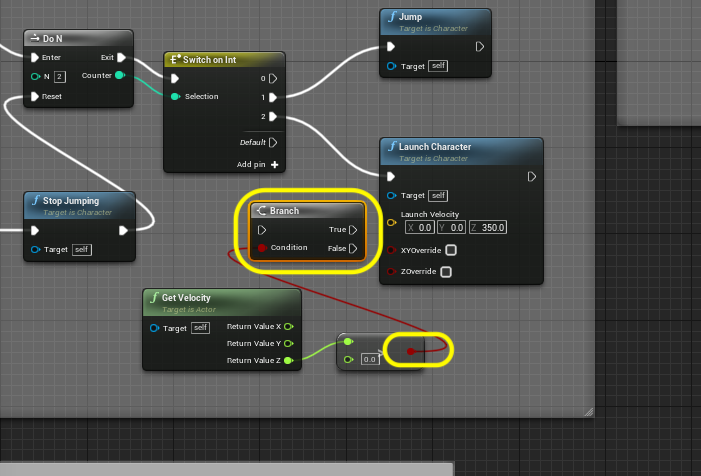
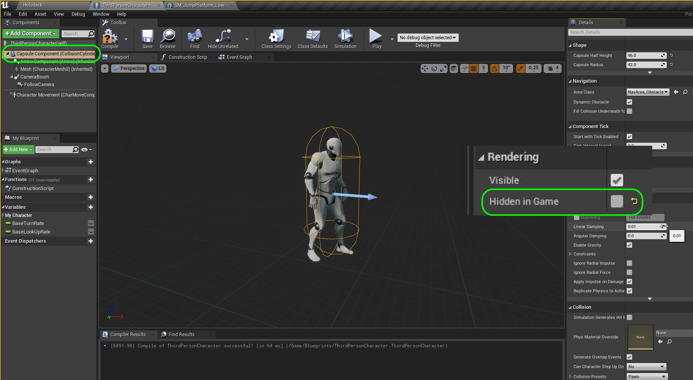

### Gameplay & Scale Register

[previous](../double-jump/README.md#user-content-double-jumping) • [home](../README.md#user-content-ue4-intro-to-level-design) • [next](../double-jump/README.md#user-content-double-jumping)

Lets finish our double jump and start creating a gameplay and scale register that we can use for level design to make sure that our placement of objects will be to scale and work with gameplay.

We will use this information to create more jump platforms.

 

---

##### `Step 1.`\|`SUU&G`|:small_blue_diamond:

So we should not let the player double jump when falling (it doesn't work right based on the current physics of this actor). We need to find out if the player is falling and not double jump if this is the case.  We need to do this before we launch the character on the double jump.  It the player is rising then double jump if the player is falling then do not run this node.

We need to access the character's velocity and look to see if it's **Z** component is positive or not.  Right click on the open graph and type `Get Velocity` and select this node.

##### `Step 2.`\|`FHIU`|:small_blue_diamond: :small_blue_diamond: 

This node contains all of the axes for the velocity including its **X, Y & Z** vector.  Right click on the **Get Velocity | Return Value** node and select **Split Struct Pin**.

##### `Step 3.`\|`SUU&G`|:small_blue_diamond: :small_blue_diamond: :small_blue_diamond:

Now we need to check the **Z** component as this is the up and down vector. If it is positive it is going up and if it is negative then the character is falling.  Pull off of the **Get Velocity | Return Value Z** pin and type `>` (greater than symbol).  Then select `Float > Float`,

##### `Step 4.`\|`SUU&G`|:small_blue_diamond: :small_blue_diamond: :small_blue_diamond: :small_blue_diamond:

We will need an if conditional state to check to see if the **Return Value Z** is greater than zero.  If so, the player is going up.  In blueprints this is done by right clicking and adding a **Branch** node to the graph.

##### `Step 5.`\|`SUU&G`| :small_orange_diamond:

Highjack the execution pin from **Switch on Int | 2** and send it to the input execution pin in the **Branch** node.  Then send the **True** output pin to the **Launch Character** node. 

A positing **Z** value is upwards movement.  So if it is above 0 the player is moving up.  We want to applly the double jump through this true pin.  If the player has stopped at the top of their apex (0) or are falling (< 0) then we do nothing and ignore this second jump button press.

##### `Step 6.`\|`SUU&G`| :small_orange_diamond: :small_blue_diamond:

Now test your work.  You should only be able to double jump when the player is rising and not falling.  This should get rid of the hiccup we previously had.

https://user-images.githubusercontent.com/5504953/128200570-345e44eb-b148-4d4c-978c-1f2fe6b77704.mp4

##### `Step 7.`\|`SUU&G`| :small_orange_diamond: :small_blue_diamond: :small_blue_diamond:

We do not measure the player but we measure the player's collision volume.  This is what determines where the player collides in the world. So if the collision volume doesn't pass through the player won't.  This is the **Capsule Component** in the player blueprint.  This is what we are measuring for. 

Go to to **Third Person Character** and press on the **Capsule Component**.  Look for **Rendering** and turn **Hidden in Game** `off`. This way we can see the capsule collider in game which will help with grey blocking.

##### `Step 8.`\|`SUU&G`| :small_orange_diamond: :small_blue_diamond: :small_blue_diamond: :small_blue_diamond:

Now lets imagine that we have tested and tweaked the physics to be exactly what we wanted (we do want to lock player physics before begining an actual level gray block).  So we can establish some scale and gameplay metrics and enter it into our register.

We can easily measure scale by going in the editor and putting a player in the level (don't forget to remove them after) and change to an orthographic view like **Front**.  Hold the middle mouse button (can't seem to do this on a touchpad) and drag from one end to the other and you will get the result in unreal units (uu/cm).

##### `Step 9.`\|`SUU&G`| :small_orange_diamond: :small_blue_diamond: :small_blue_diamond: :small_blue_diamond: :small_blue_diamond:

Now then we have the first entry in our Scale Register. Since uu's default to cm we will stick with the metric system from now on.

**Scale Register**
|Item|Dimensions|
|-------------|-------------|
|Player Height | 1.92 m|
|Player Width | .84 m|

##### `Step 10.`\|`SUU&G`| :large_blue_diamond:

We now can go into the game and jump and double jump and measure roughly the distances that we can make from standing.

**Gameplay Register**
|Element | Measure|
|-------------|-------------|
|Single Jump | ~180 |
|Double Jump | ~255|

##### `Step 11.`\|`SUU&G`| :large_blue_diamond: :small_blue_diamond: 

Now lets double jump and see if we have enough clearance.  In my case my camera can still clip the top of the platform ceiling which causes a glitch. Lets fix this. Make any adjustments but the height seems good for mine and no collision issues with the camera.

https://user-images.githubusercontent.com/5504953/128208780-4f8313bc-33fb-42ce-914e-89c1fcbaf884.mp4

##### `Step 12.`\|`SUU&G`| :large_blue_diamond: :small_blue_diamond: :small_blue_diamond: 

We can now add this to our scale register.

**Scale Register**
|Item|Dimensions|
|-------------|-------------|
|Player Height | 1.92 m|
|Player Width | .84 m|
|Double Jump Opening Height | 7.5 m|

##### `Step 13.`\|`SUU&G`| :large_blue_diamond: :small_blue_diamond: :small_blue_diamond:  :small_blue_diamond: 

##### `Step 14.`\|`SUU&G`| :large_blue_diamond: :small_blue_diamond: :small_blue_diamond: :small_blue_diamond:  :small_blue_diamond: 

##### `Step 15.`\|`SUU&G`| :large_blue_diamond: :small_orange_diamond: 

##### `Step 16.`\|`SUU&G`| :large_blue_diamond: :small_orange_diamond:   :small_blue_diamond: 

##### `Step 17.`\|`SUU&G`| :large_blue_diamond: :small_orange_diamond: :small_blue_diamond: :small_blue_diamond:

##### `Step 18.`\|`SUU&G`| :large_blue_diamond: :small_orange_diamond: :small_blue_diamond: :small_blue_diamond: :small_blue_diamond:

##### `Step 19.`\|`SUU&G`| :large_blue_diamond: :small_orange_diamond: :small_blue_diamond: :small_blue_diamond: :small_blue_diamond: :small_blue_diamond:

##### `Step 20.`\|`SUU&G`| :large_blue_diamond: :large_blue_diamond:

##### `Step 21.`\|`SUU&G`| :large_blue_diamond: :large_blue_diamond: :small_blue_diamond:

___

| [previous](../double-jump/README.md#user-content-double-jumping)| [home](../README.md#user-content-ue4-intro-to-level-design) | [next](../readme/README.md#user-content-readmemd-file)|
|---|---|---|
