### Gameplay & Scale Register

[previous](../double-jump/README.md#user-content-double-jumping) • [home](../README.md#user-content-ue4-intro-to-level-design) • [next](../long-jump/README.md#user-content-long-jump)

Lets finish our double jump and start creating a gameplay and scale register that we can use for level design to make sure that our placement of objects will be to scale and work with gameplay.

We will use this information to create more jump platforms.

 

---

##### `Step 1.`\|`UE5LD`|:small_blue_diamond:

Now in video games one of the most expensive portions is rendering graphics and resolving collisions.  For rendering graphics, the more polygons we have in the scene (especially the ones we see in the camera) the slower the framerate and the more processor and GPU will be used.

For collisions it comes down to shape complexity and how many objects in the scene need to be checked for collision. The more complex the shapes the more places we have to check on the two models potentially colliding to see if there is an actual collision.  So in games we try and use "cheap" collisions as much as we can.  

##### `Step 2.`\|`UE5LD`|:small_blue_diamond: :small_blue_diamond: 

So for our player the most common collision detection is with the ground to unsure they should be running/walking instead of falling. This is done every frame and it doesn't look at the foot model of the character.  It uses a very simple **capsule** (a cylinder with two hemispherical ends). 

For a player collision a simple shape that provides satisfactory collision ends up being a capsule.  A box collider would have edges and the player wouldn't move smoothly along edges when jumping or when climbing stairs.

##### `Step 3.`\|`UE5LD`|:small_blue_diamond: :small_blue_diamond: :small_blue_diamond:

So whe figuring out how far and high we can jump, we do not measure the player but we measure the player's collision volume.  This is what determines where the player collides in the world. So if the collision volume doesn't pass through the player won't.  This is the **Capsule Component** in the player blueprint.  This is what we are measuring for. 

Go to to **Third Person Character** and press on the **Capsule Component**.  Look for **Rendering** and turn **Hidden in Game** `off`. This way we can see the capsule collider in game which will help with grey blocking.

##### `Step 4.`\|`UE5LD`|:small_blue_diamond: :small_blue_diamond: :small_blue_diamond: :small_blue_diamond:

Now lets imagine that we have tested and tweaked the physics to be exactly what we wanted (we do want to lock player physics before begining an actual level gray block).  So we can establish some scale and gameplay metrics and enter it into our register.

We can easily measure scale by going in the editor and putting a player in the level (don't forget to remove them after) and change to an orthographic view like **Front**.  Hold the middle mouse button (can't seem to do this on a touchpad) and drag from one end to the other and you will get the result in unreal units (uu/cm).

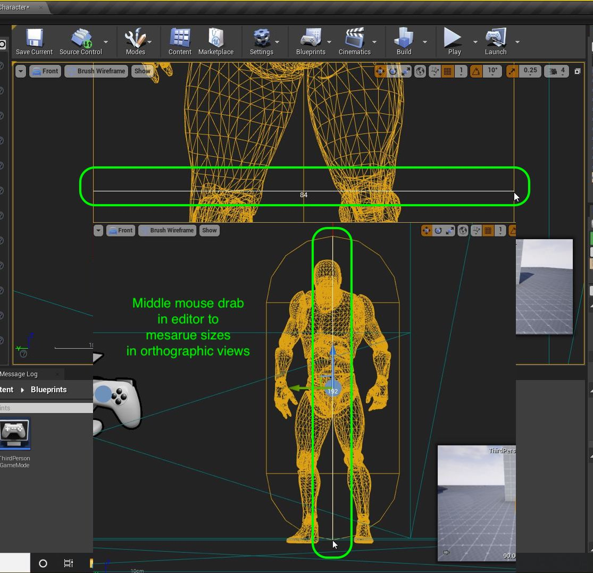

##### `Step 5.`\|`UE5LD`| :small_orange_diamond:

Now then we have the first entry in our Scale Register. Since uu's default to cm we will stick with the metric system from now on.

**Scale Register**
|Item|Dimensions|
|-------------|-------------|
|Player Height | 1.92 m|
|Player Width | .84 m|

##### `Step 6.`\|`UE5LD`| :small_orange_diamond: :small_blue_diamond:

We now can go into the game and jump and double jump and measure roughly the distances that we can make from standing.

**Gameplay Register**
|Element | Measure|
|-------------|-------------|
|Single Jump | ~180 |
|Double Jump | ~255|

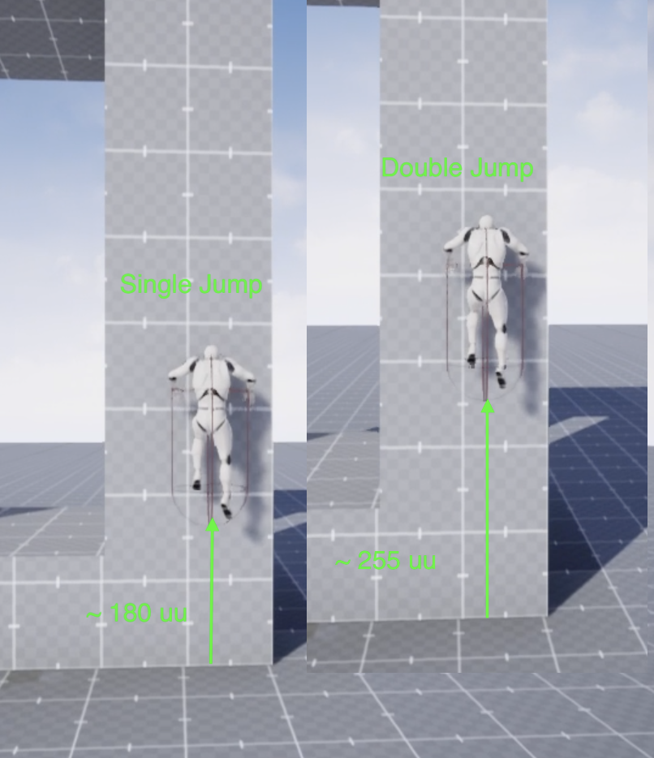

##### `Step 7.`\|`UE5LD`| :small_orange_diamond: :small_blue_diamond: :small_blue_diamond:

Now lets double jump and see if we have enough clearance.  In my case my camera can still clip the top of the platform ceiling which causes a glitch. Lets fix this. Make any adjustments but the height seems good for mine and no collision issues with the camera.

https://user-images.githubusercontent.com/5504953/128208780-4f8313bc-33fb-42ce-914e-89c1fcbaf884.mp4

##### `Step 8.`\|`UE5LD`| :small_orange_diamond: :small_blue_diamond: :small_blue_diamond: :small_blue_diamond:

We can now add this to our scale register. We will round it up to 7.5.

**Scale Register**
|Item|Dimensions|
|-------------|-------------|
|Player Height | 1.92 m|
|Player Width | .84 m|
|Double Jump Opening Height | 7.5 m|

##### `Step 9.`\|`UE5LD`| :small_orange_diamond: :small_blue_diamond: :small_blue_diamond: :small_blue_diamond: :small_blue_diamond:

Our first jump platform we created was about 110 uu units high (1.1 meters).  The player can easily clear it with a single jump. Now lets make two more jump platforms.  One that can just clear a single jump.  And one that can just clear a double jump. For these you will have to make the jump platforms taller to accomodate the higher positioning of the opening.

Repeat the process and create another jump platform in a brush with a jump height of **180 uu's** with an opening of **750** and call it `BR_JumpPlatform_Mid` & `BR_JumpPlatform_Mid_Inner`.

https://user-images.githubusercontent.com/5504953/128357947-66d11e0f-3e15-4040-b437-d5b0b8bc9e23.mp4

##### `Step 10.`\|`UE5LD`| :large_blue_diamond:

Run the game and test your work.  In my case I can easily clear the platform with a single jump.

https://user-images.githubusercontent.com/5504953/128358498-173a1f8f-d2fb-421d-8d62-122833a3c0b7.mp4

##### `Step 11.`\|`UE5LD`| :large_blue_diamond: :small_blue_diamond: 

In fact we clear it too easily.  After some trial and error I am much happier with a single jump height of 2 meters.  I update the gameplay register **and** the jump to reflect this adjustment.

**Gameplay Register**
|Element | Measure|
|-------------|-------------|
|Single Jump | 200 |
|Double Jump | ~255|

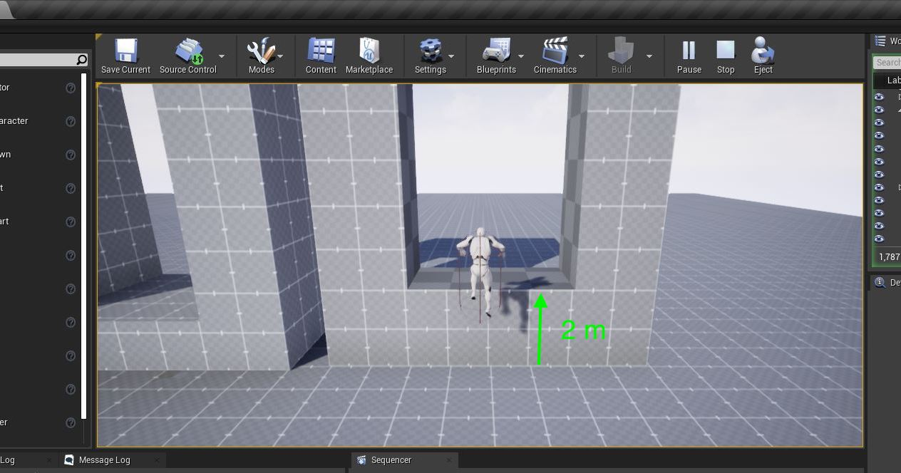

##### `Step 12.`\|`UE5LD`| :large_blue_diamond: :small_blue_diamond: :small_blue_diamond: 

Now lets duplicate the middle brushes to create our third and final jump.  I called them: `BR_JumpPlatform_Tall` & `BR_JumpPlatform_Tall_Inner`. Play around with the double jump height and update the register. I settled on 324 units as the setting I thought was right:

**Gameplay Register**
|Element | Measure|
|-------------|-------------|
|Single Jump | 200 |
|Double Jump | 324|

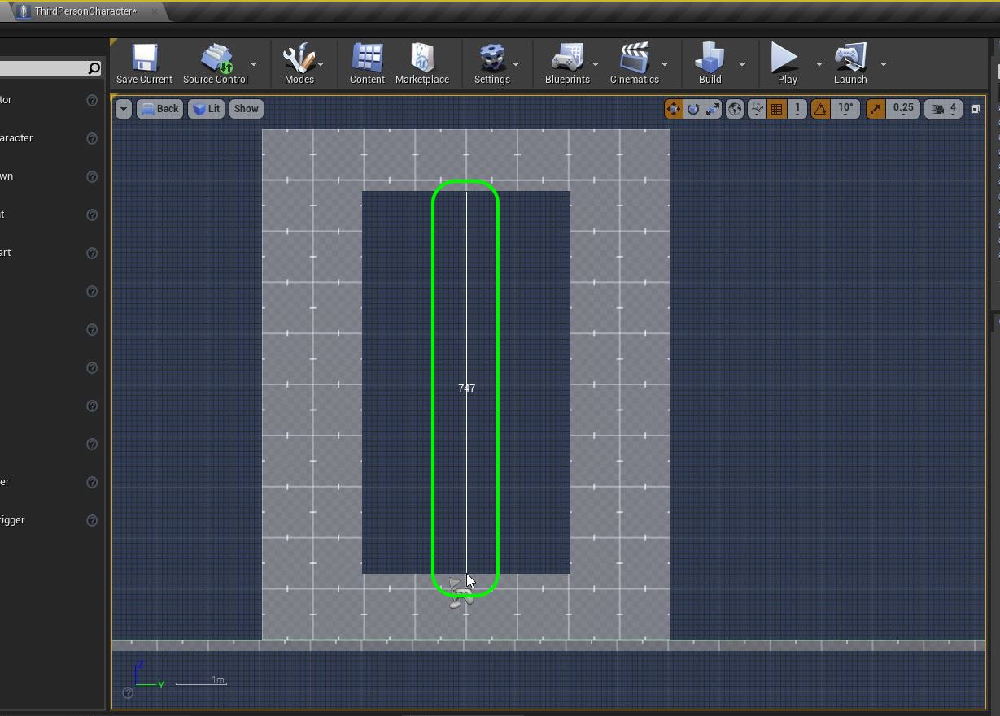

##### `Step 13.`\|`UE5LD`| :large_blue_diamond: :small_blue_diamond: :small_blue_diamond:  :small_blue_diamond: 

Add a `Jump Platforms` folder and add the three platforms to it.  It should have one static mesh and four brushes.

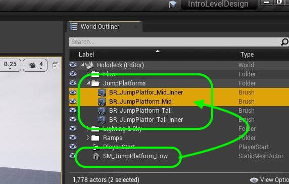

##### `Step 14.`\|`UE5LD`| :large_blue_diamond: :small_blue_diamond: :small_blue_diamond: :small_blue_diamond:  :small_blue_diamond: 

Now play the game and make sure you are happy with the brushes.  When you are lets convert them to static meshes.  The only difference this time is that you need to select **Two** objects the positive and negative space to export as a single mesh.  So select both brushes for the mid platform and press the <kbd>Create Static Mesh</kbd> button.  Select the **Geometry | Meshes** folder and call it `SM_JumpPlatform_Mid`.  Repeat this for the tall platform as well.

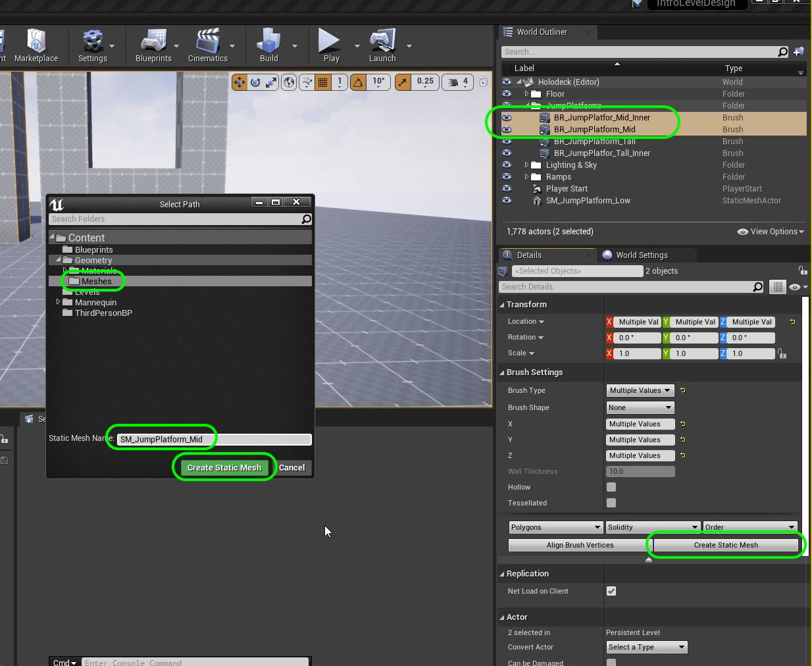

##### `Step 15.`\|`UE5LD`| :large_blue_diamond: :small_orange_diamond: 

Now make sure you three static meshes are in the folder and are correctly named.  Also, press the <kbd>Build</kbd> button. Run the game.  The collisions are missing in the two new platforms and the material is not rendering it is black.

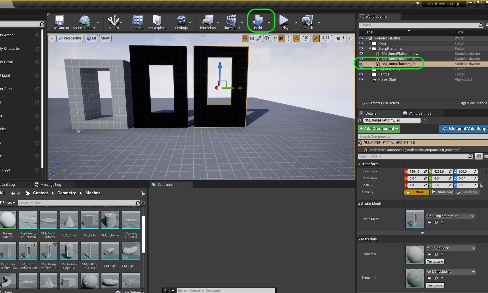

##### `Step 16.`\|`UE5LD`| :large_blue_diamond: :small_orange_diamond:   :small_blue_diamond: 

Play the game and make sure you jumps are still working the way they were before they were turned into brushes.  Mine worked fine.

https://user-images.githubusercontent.com/5504953/128370608-e0f67775-84ed-46e1-ac37-d612c141dc75.mp4

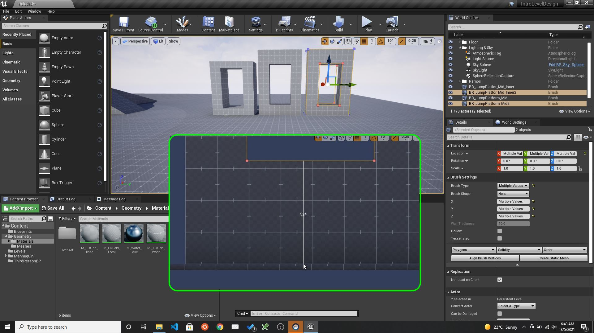

##### `Step 17.`\|`UE5LD`| :large_blue_diamond: :small_orange_diamond: :small_blue_diamond: :small_blue_diamond:

Open up both models and change **Collision Complexity** to `Use Complex As Simple` and adjust the **Light Map Coordinate Index** to `1`, and **Light Map Resolution** to `256`.

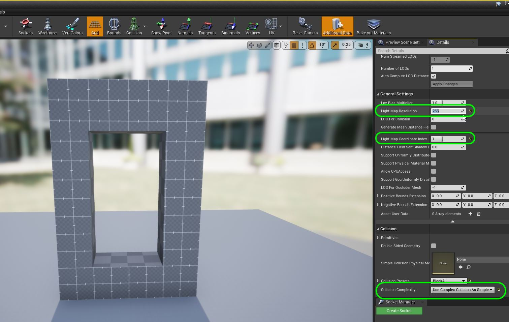

##### `Step 18.`\|`UE5LD`| :large_blue_diamond: :small_orange_diamond: :small_blue_diamond: :small_blue_diamond: :small_blue_diamond:

Copy the text over and move it over the Jump Platforms, rename it and place it in the **Jump Platforms** folder.  Save all of your work, commit it and upload to **GitHub**.

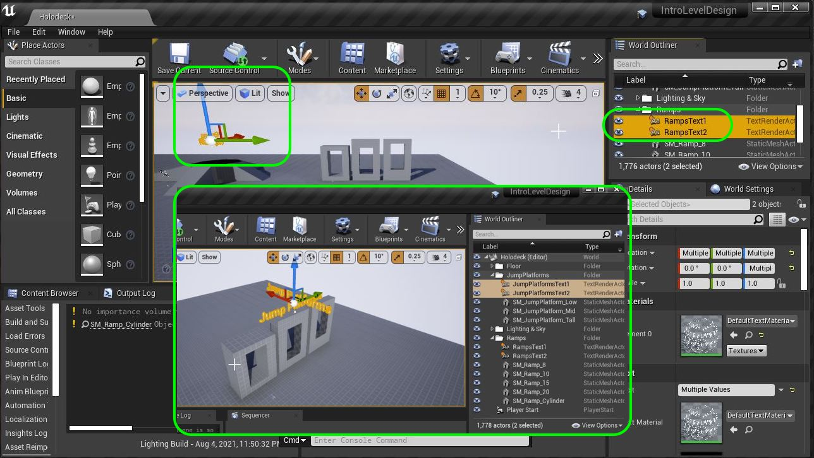

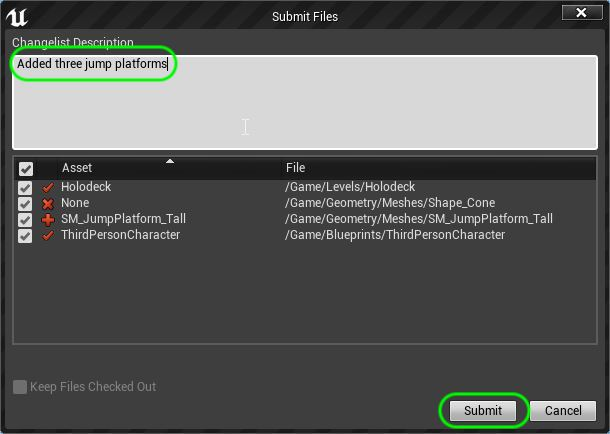

##### `Step 19.`\|`UE5LD`| :large_blue_diamond: :small_orange_diamond: :small_blue_diamond: :small_blue_diamond: :small_blue_diamond: :small_blue_diamond:

##### `Step 20.`\|`UE5LD`| :large_blue_diamond: :large_blue_diamond:

##### `Step 21.`\|`UE5LD`| :large_blue_diamond: :large_blue_diamond: :small_blue_diamond:

##### `Step 22.`\|`UE5LD`| :large_blue_diamond: :large_blue_diamond: :small_blue_diamond: :small_blue_diamond:

___

<!--  -->

| [previous](../double-jump/README.md#user-content-double-jumping)| [home](../README.md#user-content-ue4-intro-to-level-design) | [next](../long-jump/README.md#user-content-long-jump)|
|---|---|---|
