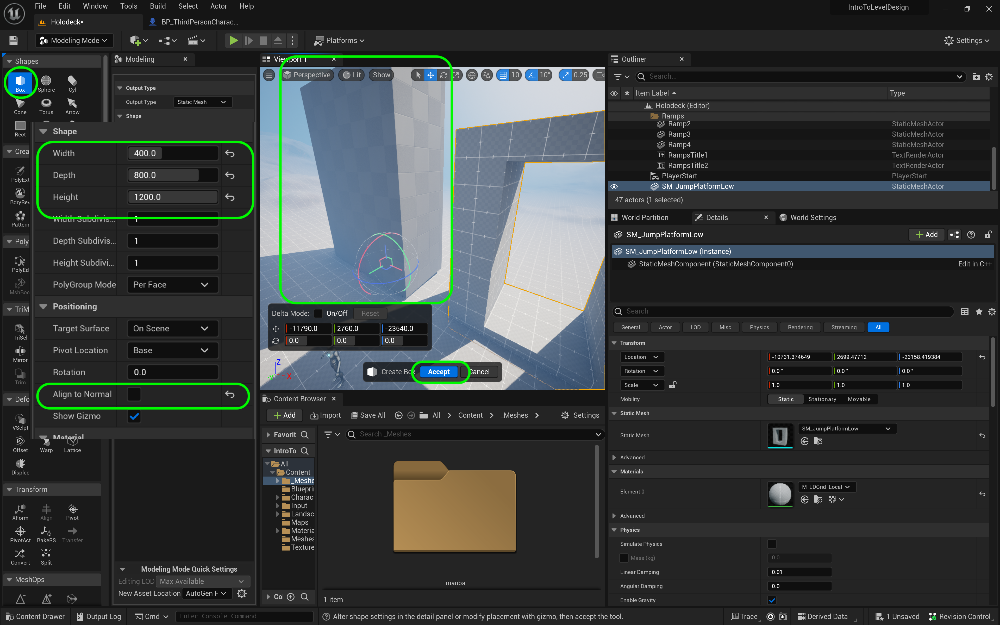

### Gameplay & Scale Register

[previous](../double-jump/README.md#user-content-double-jumping) • [home](../README.md#user-content-ue4-intro-to-level-design) • [next](../long-jump/README.md#user-content-long-jump)

Lets finish our double jump and start creating a gameplay and scale register that we can use for level design to make sure that our placement of objects will be to scale and work with gameplay.

We will use this information to create more jump platforms.

 

---

##### `Step 1.`\|`UE5LD`|:small_blue_diamond:

Now in video games one of the most expensive portions is rendering graphics and resolving collisions.  For rendering graphics, the more polygons we have in the scene (especially the ones we see in the camera) the slower the framerate and the more processor and GPU will be used.

For collisions it comes down to shape complexity and how many objects in the scene need to be checked for collision. The more complex the shapes the more places we have to check on the two models potentially colliding to see if there is an actual collision.  So in games we try and use "cheap" collisions as much as we can.  

##### `Step 2.`\|`UE5LD`|:small_blue_diamond: :small_blue_diamond: 

So for our player the most common collision detection is with the ground to unsure they should be running/walking instead of falling. This is done every frame and it doesn't look at the foot model of the character.  It uses a very simple **capsule** (a cylinder with two hemispherical ends). 

For a player collision a simple shape that provides satisfactory collision ends up being a capsule.  A box collider would have edges and the player wouldn't move smoothly along edges when jumping or when climbing stairs.

##### `Step 3.`\|`UE5LD`|:small_blue_diamond: :small_blue_diamond: :small_blue_diamond:

So whe figuring out how far and high we can jump, we do not measure the player but we measure the player's collision volume.  This is what determines where the player collides in the world. So if the collision volume doesn't pass through the player won't.  This is the **Capsule Component** in the player blueprint.  This is what we are measuring for. 

Now this collision volume is NOT visible in game as the player doesn't even know it exists.  Lets see it, which will help us in level design as it is all abou collision volumes.

Go to to **Third Person Character** and press on the **Capsule Component**.  Look for **Rendering** and turn **Hidden in Game** `off`. This way we can see the capsule collider in game which will help with grey blocking.

##### `Step 4.`\|`UE5LD`|:small_blue_diamond: :small_blue_diamond: :small_blue_diamond: :small_blue_diamond:

Now lets imagine that we have tested and tweaked the physics to be exactly what we wanted (we do want to lock player physics before begining an actual level gray block).  So we can establish some scale and gameplay metrics and enter it into our register.

We need to know the size of the player to know what it can fit in and what it can't can't.  This dictates minimum size for doors and other objects we want to craft.

We can easily measure scale by going in the editor and putting a player in the level (don't forget to remove them after) and change to an orthographic view like **Front** or **Left**.  I like putting it in **Wireframe** view as well to be extra accurate. Hold the middle mouse button (can't seem to do this on a touchpad) and drag from one end to the other and you will get the result in unreal units (uu/cm).

##### `Step 5.`\|`UE5LD`| :small_orange_diamond:

Now if we walk our player up to the wall when we press play we can confirm these measurements and they look accurate right next to the material that is a square meter in size.

Now then we have the first entry in our Scale Register. Since uu's default to cm we will stick with the metric system from now on. The player is 1.79 meters tall (~5' 10") and a width and depth of .71 m (~2' 4").

**Scale Register**
|Item|Dimensions|
|-------------|-------------|
|Player Height | 1.79 m|
|Player Width | .71 m|

##### `Step 6.`\|`UE5LD`| :small_orange_diamond: :small_blue_diamond:

We now can go into the game and jump and double jump and measure roughly the distances that we can make from standing.

**Gameplay Register**
|Element | Measure|
|-------------|-------------|
|Single Jump | ~200 |
|Double Jump | ~410|

##### `Step 7.`\|`UE5LD`| :small_orange_diamond: :small_blue_diamond: :small_blue_diamond:

Now lets double jump and see if we have enough clearance without adjusting the camera up or down.  In my case my camera can still clip the top of the platform ceiling which causes a glitch.

##### `Step 8.`\|`UE5LD`| :small_orange_diamond: :small_blue_diamond: :small_blue_diamond: :small_blue_diamond:
Lets fix this. Remake the first platform to be 1200 cm tall with a center 950 cm opening instead of the original 1000cm/775cm. We can now add this to our scale register. We will ame an opening to jump through 9.5 meters.

**Scale Register**
|Item|Dimensions|
|-------------|-------------|
|Player Height | 1.92 m|
|Player Width | .84 m|
|Double Jump Opening Height | 9.5 m|

Create a new cube that is a **Width** of `400`, **Depth** of `800` and **Height** of `1200`.  Assign the `M_LDGrid_Local** material to the box. Press the <kbd>Complete</kbd> button. 

##### `Step 9.`\|`UE5LD`| :small_orange_diamond: :small_blue_diamond: :small_blue_diamond: :small_blue_diamond: :small_blue_diamond:

Now lets create a shape to cut a whole that is a **Width** of `775`, **Depth** of `408` and **Height** of `950`. Center it in the larger bux shape.  Make sure both boxes have **Rotatings** at `0`, `0`, `0`.

##### `Step 10.`\|`UE5LD`| :large_blue_diamond:

Now we will have it cut a hole in the larger shape by selecting both objects and then **PolyModel | MshBool**.  It will either be **Difference A-B** or **Difference B-A** depending on the order of selection.  When you have it correct press the <kbd>Accept</kbd> button.

##### `Step 11.`\|`UE5LD`| :large_blue_diamond: :small_blue_diamond: 

Now lets delete the old smaller jump platform.  You will get a warning and you can **Prelace References** with the new object I creaetd which is **Boolean_507B** (yours will be different, you can right click on the new shape and select **Find in Content** to get the name and location).

##### `Step 12.`\|`UE5LD`| :large_blue_diamond: :small_blue_diamond: :small_blue_diamond: 

Delete the old shapes from the **Content Drawer** and move the **Static Mesh** to the **Meshes** folder.  Selet **Content** and right click then select **Fix Up Redirectors in Folder**. Now rename the file back to the original `SM_JumpPlatform_Low`.

##### `Step 13.`\|`UE5LD`| :large_blue_diamond: :small_blue_diamond: :small_blue_diamond:  :small_blue_diamond: 

Run the game and notice that we can now double jump and don't have the camera hit the top of the platform.  We are done with our low example.

https://user-images.githubusercontent.com/5504953/182050177-c135a839-cbd3-4b28-ae7c-52bb49cabda8.mp4

##### `Step 14.`\|`UE5LD`| :large_blue_diamond: :small_blue_diamond: :small_blue_diamond: :small_blue_diamond:  :small_blue_diamond: 

Our first jump platform we created was about 110 uu units high (1.1 meters).  The player can easily clear it with a single jump. Now lets make two more jump platforms.  One that can just clear a single jump.  And one that can just clear a double jump. For these you will have to make positions that reflect our gameplay register.

**Gameplay Register**
|Element | Measure|
|-------------|-------------|
|Single Jump | ~200 |
|Double Jump | ~410|

Lets create a platorm with a 2 meter height so a **Width** of `400`, **Depth** of `800` and **Height** of `1300` with a hole that is still a **Width** of `775`, **Depth** of `408` and **Height** of `950`. 

Clean up the directory and name it `SM_JumpPlatform_Mid`. If the first jump was tricky - this jump is hard to make with a single jump but not impossible. Run the game and test your work.  In my case I can easily clear the platform with a single jump.

https://user-images.githubusercontent.com/5504953/182051619-0caaf950-2f97-465d-a40f-d261ea3c0647.mp4

##### `Step 15.`\|`UE5LD`| :large_blue_diamond: :small_orange_diamond: 
register **and** the jump to reflect this adjustment.

Now lets create a jump height of 4 meters.  Lets call it `BR_JumpPlatform_Tall`.  I will let you do this on its own.  Then press run and double jump over the platform.

https://user-images.githubusercontent.com/5504953/182051795-244c175e-b02e-4f50-9cbe-7679c60c098f.mp4

##### `Step 16.`\|`UE5LD`| :large_blue_diamond: :small_orange_diamond:   :small_blue_diamond: 

Create a new folder called **Jump Platforms** and move the three platofmrs in it.  Name them correctly in the **World Outliner**. Also, make sure you have the three meshes correclty named in the **Meshes** folder.

##### `Step 17.`\|`UE5LD`| :large_blue_diamond: :small_orange_diamond: :small_blue_diamond: :small_blue_diamond:

##### `Step 18.`\|`UE5LD`| :large_blue_diamond: :small_orange_diamond: :small_blue_diamond: :small_blue_diamond: :small_blue_diamond:

Now play the game and make sure you are happy with the jump platforms.  

##### `Step 19.`\|`UE5LD`| :large_blue_diamond: :small_orange_diamond: :small_blue_diamond: :small_blue_diamond: :small_blue_diamond: :small_blue_diamond:

Copy the text over and move it over the Jump Platforms, rename it and place it in the **Jump Platforms** folder.  Save all of your work, commit it and upload to **GitHub**.

##### `Step 20.`\|`UE5LD`| :large_blue_diamond: :large_blue_diamond:

##### `Step 21.`\|`UE5LD`| :large_blue_diamond: :large_blue_diamond: :small_blue_diamond:

##### `Step 22.`\|`UE5LD`| :large_blue_diamond: :large_blue_diamond: :small_blue_diamond: :small_blue_diamond:

___

<!--  -->

| [previous](../double-jump/README.md#user-content-double-jumping)| [home](../README.md#user-content-ue4-intro-to-level-design) | [next](../long-jump/README.md#user-content-long-jump)|
|---|---|---|
