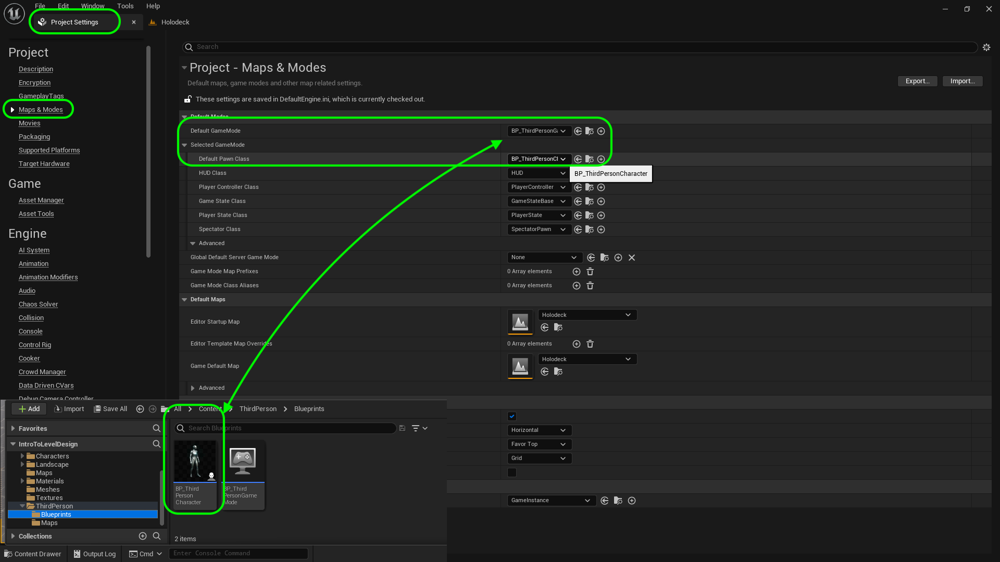
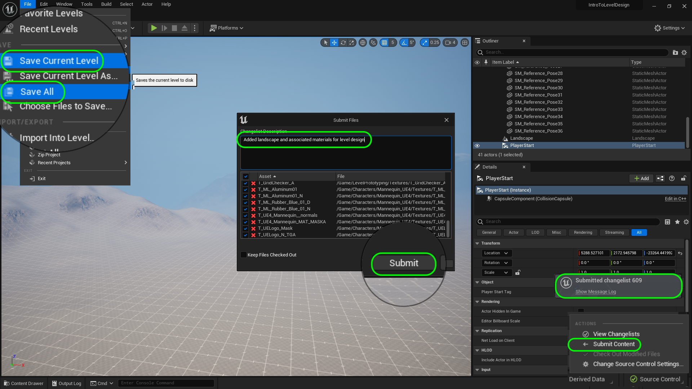

### Setting Up Holodeck II

[previous](../holodeck/README.md#user-content-setting-up-holodeck) • [home](../README.md#user-content-ue4-hello-world) • [next](../ramp/README.md#user-content-creating-custom-meshes)

Finish setting up our level.

 

---

##### `Step 1.`\|`UE5LD`|:small_blue_diamond:

When migrating Unreal knows all the files that this material needs to render correctly.  Agree to all of them.  An explorer window will pop up to where you want to migrate to?  You need to go to the route level design folder that contains your `.uproject` file and then select the **Content** folder. It is always best to migrate to the route **Content** folder to preserve all the prior folders from the source project you are importing from.

You should see a message that declares the migration succesful at the bottom right corner.

##### `Step 2.`\|`UE5LD`|:small_blue_diamond: :small_blue_diamond: 

Now we will also need another material.  Go the the **Content | Materials** folder and look for **M_LDGrid_Local** and right click and press the **Asset Actions | Migrate** button.  Use the same **Content** folder and press the <kbd>Select Folder</kbd> button. If a pop up says they some files were already imported you can choose to overwrite or not, in this case it doesn't really matter.

##### `Step 3.`\|`UE5LD`|:small_blue_diamond: :small_blue_diamond: :small_blue_diamond:

Now reopen the **Level Design** game we left that we now migrated these files to. Woops we load up to the old map we are no longer needing.  To change the default press **Edit | Project Settings** and change **Maps & Modes**.

##### `Step 4.`\|`UE5LD`|:small_blue_diamond: :small_blue_diamond: :small_blue_diamond: :small_blue_diamond:

Now reopen the **Maps | Holodeck** game we left that we now migrated these files to. Now select the **Landscape** in the **Outliner** and drag **Content | Materials | MI_Landscape** to the **Landscape Material** slot.

##### `Step 5.`\|`UE5LD`| :small_orange_diamond:

Now take a look and we have a basic set of ground materials we have to cover our landscape.

##### `Step 6.`\|`UE5LD`| :small_orange_diamond: :small_blue_diamond:

Open up **MI_Landscape** and set **Use Debug Material Low Flat** to `true` first at the left of the option then after.  The first one allows you to edit this setting which defaults to false but want to switch to true.  This allows us to replace grass with a texture that has a scale chart that will make it better for level design showing us scale in 1 meter squares. 

##### `Step 7.`\|`UE5LD`| :small_orange_diamond: :small_blue_diamond: :small_blue_diamond:

Press play and notice that it uses the same player we used in the last map.  Where does the game decide to use this character.  It is a global setting that you can see in **Edit | Project Settings | Maps & Modes**.  Look at the **Default Pawn Class** and you see it is using the same blueprint character we edited.

##### `Step 8.`\|`UE5LD`| :small_orange_diamond: :small_blue_diamond: :small_blue_diamond: :small_blue_diamond:

Press the <kbd>Place Actors</kbd> button and type in **Player Start**.  Add it to the middle of the level in the flat area which is where we will be working.  Press the <kbd>End</kbd> key to pop the actor to be right on the ground so the player doesn't fall when you press start.  

https://user-images.githubusercontent.com/5504953/177665010-1048b403-a25b-4781-8314-ed2094f610f3.mp4

##### `Step 9.`\|`UE5LD`| :small_orange_diamond: :small_blue_diamond: :small_blue_diamond: :small_blue_diamond: :small_blue_diamond:

How do we control where the player launches when we hit play?  If you press the **...** three dots next to the <kbd>Play</kbd> button you will see that you can launch the player the **Currenct Camera Location** or a **Default Player Start**.  Make sure the settings is set to **Default Player Start**.

https://user-images.githubusercontent.com/5504953/177664981-ce617563-060d-46d9-b3a5-d019b1da5cac.mp4

##### `Step 10.`\|`UE5LD`| :large_blue_diamond:

Now why does the engine spawn a player in this new level.  It is done by the template.  If you go to **Edit | Project Settings | Maps & Modes**, it is the **Default Gamemode | Default Pawn Class**.  This is used for every level unless overidden (which we did not do).  In this **GameMode** blueprint it is using the **BP_Third_Person** character that edited prior.

##### `Step 11.`\|`UE5LD`| :large_blue_diamond: :small_blue_diamond: 

Select the **File | Save All** then press the <kbd>Source Control</kbd> button and select **Source Control...**. Enter a **Changelist Description** and then press <kbd>Submit Content</kbd>. Update the **Changelist Description** message and with the latest changes. Make sure all the files are correct and press the <kbd>Submit</kbd> button. A confirmation will pop up on the bottom right with a message about a changelist was submitted with a commit number.

<!--  -->

| [previous](../holodeck/README.md#user-content-setting-up-holodeck)| [home](../README.md#user-content-ue4-hello-world) | [next](../ramp/README.md#user-content-creating-custom-meshes)|
|---|---|---|
