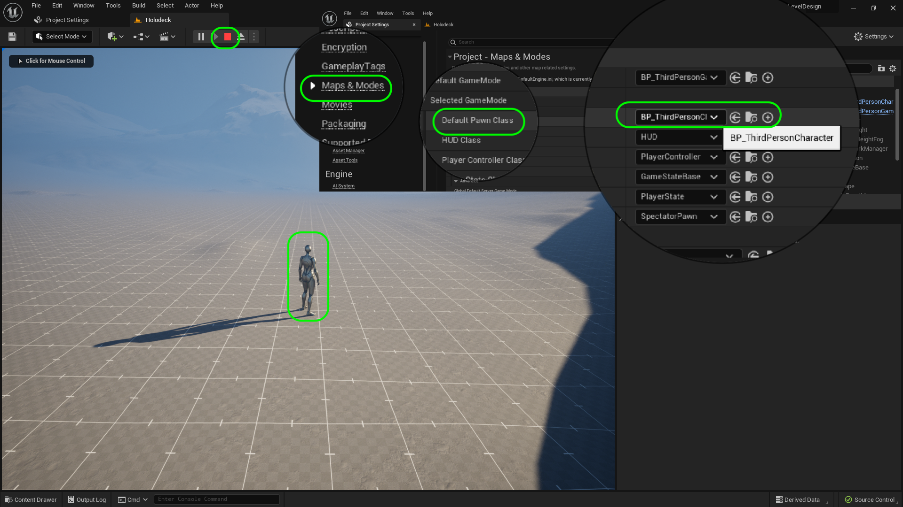

### Setting Up Holodeck II

[previous](../holodeck/README.md#user-content-setting-up-holodeck) • [home](../README.md#user-content-ue4-hello-world) • [next](../readme/README.md#user-content-readmemd-file)

Finish setting up our level.

 

---

##### `Step 1.`\|`UE5LD`|:small_blue_diamond:

When migrating Unreal knows all the files that this material needs to render correctly.  Agree to all of them.  An explorer window will pop up to where you want to migrate to?  You need to go to the route level design folder that contains your `.uproject` file and then select the **Content** folder. It is always best to migrate to the route **Content** folder to preserve all the prior folders from the source project you are importing from.

You should see a message that declares the migration succesful at the bottom right corner.

##### `Step 2.`\|`UE5LD`|:small_blue_diamond: :small_blue_diamond: 

Now we will also need another material.  Go the the **Content | Materials** folder and look for **M_LDGrid_Local** and right click and press the **Asset Actions | Migrate** button.  Now you can deselect the files in the **Tech Art** folder as we have already migrated them.  Use the same **Content** folder and press the <kbd>Select Folder</kbd> button. 

##### `Step 3.`\|`UE5LD`|:small_blue_diamond: :small_blue_diamond: :small_blue_diamond:

Now reopen the **Level Design** game we left that we now migrated these files to. Woops we load up to the old map we are no longer needing.  To change the default press **Edit | Project Settings** and change **Maps & Modes**.

##### `Step 4.`\|`UE5LD`|:small_blue_diamond: :small_blue_diamond: :small_blue_diamond: :small_blue_diamond:

Now reopen the **Maps | Holodeck** game we left that we now migrated these files to. Now select the **Landscape** in the **Outliner** and drag **Content | Materials | MI_Landscape** to the **Landscape Material** slot.

##### `Step 5.`\|`UE5LD`| :small_orange_diamond:

Now take a look and we have a basic set of ground materials we have to cover our landscape.

##### `Step 6.`\|`UE5LD`| :small_orange_diamond: :small_blue_diamond:

Open up **MI_Landscape** and set **Use Debug Material Low Flat** to `true` first at the left of the option then after.  The first one allows you to edit this setting which defaults to false but want to switch to true.  This allows us to replace grass with a texture that has a scale chart that will make it better for level design showing us scale in 1 meter squares. 

##### `Step 7.`\|`UE5LD`| :small_orange_diamond: :small_blue_diamond: :small_blue_diamond:

Press play and notice that it uses the same player we used in the last map.  Where does the game decide to use this character.  It is a global setting that you can see in **Edit | Project Settings | Maps & Modes**.  Look at the **Default Pawn Class** and you see it is using the same blueprint character we edited.

##### `Step 8.`\|`UE5LD`| :small_orange_diamond: :small_blue_diamond: :small_blue_diamond: :small_blue_diamond:

Now we notice that the player might fall into place.  How do we control where the player launches when we hit play?  If you press the **...** three dots next to the <kbd>Play</kbd> button you will see that you can launch the player the **Currenct Camera Location** or a **Default Player Start**.  Make sure the settings is set to **Default Player Start**.

https://user-images.githubusercontent.com/5504953/177664981-ce617563-060d-46d9-b3a5-d019b1da5cac.mp4

##### `Step 9.`\|`UE5LD`| :small_orange_diamond: :small_blue_diamond: :small_blue_diamond: :small_blue_diamond: :small_blue_diamond:

Press the <kbd>Place Actors</kbd> button and type in **Player Start**.  Add it to the middle of the level in the flat area which is where we will be working.  Press the <kbd>End</kbd> key to pop the actor to be right on the ground so the player doesn't fall when you press start.  Now when you play the game the player starts at the location of the player start actor.

https://user-images.githubusercontent.com/5504953/177665010-1048b403-a25b-4781-8314-ed2094f610f3.mp4

##### `Step 10.`\|`UE5LD`| :large_blue_diamond:

##### `Step 11.`\|`UE5LD`| :large_blue_diamond: :small_blue_diamond: 

##### `Step 12.`\|`UE5LD`| :large_blue_diamond: :small_blue_diamond: :small_blue_diamond: 

##### `Step 13.`\|`UE5LD`| :large_blue_diamond: :small_blue_diamond: :small_blue_diamond:  :small_blue_diamond: 

##### `Step 14.`\|`UE5LD`| :large_blue_diamond: :small_blue_diamond: :small_blue_diamond: :small_blue_diamond:  :small_blue_diamond: 

##### `Step 15.`\|`UE5LD`| :large_blue_diamond: :small_orange_diamond: 

##### `Step 16.`\|`UE5LD`| :large_blue_diamond: :small_orange_diamond:   :small_blue_diamond: 

##### `Step 17.`\|`UE5LD`| :large_blue_diamond: :small_orange_diamond: :small_blue_diamond: :small_blue_diamond:

##### `Step 18.`\|`UE5LD`| :large_blue_diamond: :small_orange_diamond: :small_blue_diamond: :small_blue_diamond: :small_blue_diamond:

##### `Step 19.`\|`UE5LD`| :large_blue_diamond: :small_orange_diamond: :small_blue_diamond: :small_blue_diamond: :small_blue_diamond: :small_blue_diamond:

##### `Step 20.`\|`UE5LD`| :large_blue_diamond: :large_blue_diamond:

##### `Step 21.`\|`UE5LD`| :large_blue_diamond: :large_blue_diamond: :small_blue_diamond:

Now this material has a grid on it and it has a grid.  This grid is 1 meter square and gives us a good sense of scale of the level we are working on.  If you move it notice that the grid stays in **World Space** and doesn't move with the geometry.  This allows us to place multiple pieces next to each other without the **Z Fighting** you normally get with two planes at the same level.  This allows you to craft levels without visual side effects.  It is most effective to use this material on the ground.

https://user-images.githubusercontent.com/5504953/127792618-a0178091-50be-4ac0-b07e-4be090dee90e.mp4

To make placing the floor pieces easier we want the grid snap to be at 400 Unreal Units (400 cm or 4 m).  The menu only has **100** and **500**.  

Go to **Edit | Editor Preferences** and type in the search window type `snap` and look for **Decimal Grid Sizes** and on the `500` entry press the arrow and select **Insert**.  Then change this value to `400` and make sure it is between the **100** and **500** value.

Now you can set the snap to **400** in the game as it added this new value!

Now with the snap set, make a large floor section.  I made mine 40 by 20 floor units (which would be 160 by 80 meters) large.

https://user-images.githubusercontent.com/5504953/127794749-addeda67-6832-433d-8335-3f00f00711ca.mp4

folder `Floor`.  Now copy all the other items except for **Player Start** into a `Lighting & Sky` folder.

Adjust the **Player Start** to be on the ground (you can press the <kbd>end</kbd> button so it snaps to the ground) and is in the center of the level.

Now press play and run the game with the simple floor and run around.  You can get a sense with this higher speed how fast we can move through this level.

https://user-images.githubusercontent.com/5504953/127795765-918f0459-897b-425e-81cd-9bd491d92429.mp4

OK, lets save and update our repository.  Press **File | Save All** in **Unreal**. Press the <kbd>Source Control</kbd> button and select `Submit to Source Control...`. Add a **Commit** message and press the <kbd>Submit</kbd> button.

Open **GitHub Desktop** and press <kbd>Push origin</kbd> to update the server.  If you do not do this it will be saved locally but not on **GitHub**.

We will move on next to adding our first ramp to the game.

<!--  -->

| [previous](../holodeck/README.md#user-content-setting-up-holodeck)| [home](../README.md#user-content-ue4-hello-world) | [next](../readme/README.md#user-content-readmemd-file)|
|---|---|---|
