### Setting Up Holodeck

[previous](../camera-mechanics/README.md#user-content-lock-cameras-and-mechanics) • [home](../README.md#user-content-ue4-hello-world) • [next](../readme/README.md#user-content-readmemd-file)

Now we normally create a level where we test out all of our mechanics to make sure it works.  This is often refered to as a test level, gym or holodeck all representing a level that is not meant to be played by the user but is used for testing mechanics and assets for gray blocking. We will use this to understand the scale of the objects we need to build to match the mechanics.

 

---

##### `Step 1.`\|`SUU&G`|:small_blue_diamond:

Lets organize the content folder for our project and start a new level. Lets add a floor to the game. We have two **Meshes** (geometry) folders.  One in the **Third Person** folder and the other in the **Geometry** folder.  Lets move the meshes from **Third Person** to the **Geometry | Meshes** folder.  

Unreal redirects the files so it still looks to see that empty **Meshes** folder.  To have **Unreal** point to the new folder directly and automatically clean up the empty folder right click on **Content** and select `Fix Up Redirectors in Folder`.  This will take a bit and you will see that the folder is now gone and the files are in the new folder.

Please note that the **Red X** icon indicates that it is not commited in Unreal.

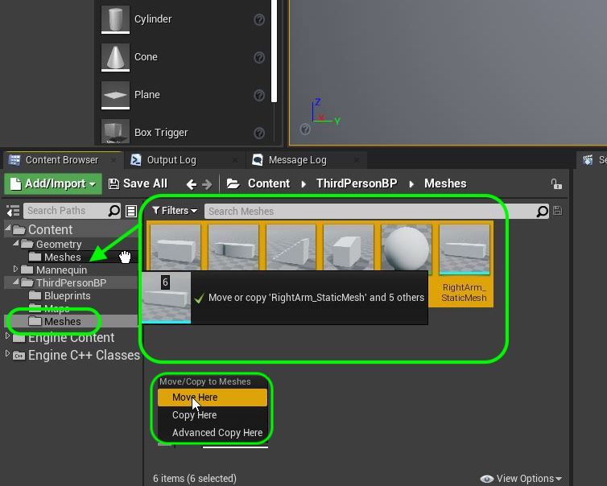

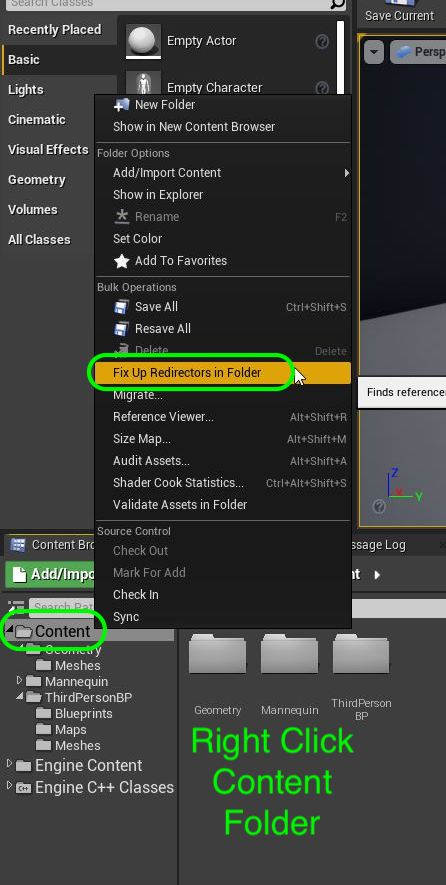

##### `Step 2.`\|`FHIU`|:small_blue_diamond: :small_blue_diamond: 

 Move the **Blueprints** and **Maps** folder from **ThirdPerson** to the root **Content** folder.  

 Right click on **Content** and select `Fix Up Redirectors in Folder` to clean up redirects and delete empty folders. 

 Change the name of the folder **Maps** to `Levels`. Unreal uses both terms and I think **Levels** is more generally recognized.  

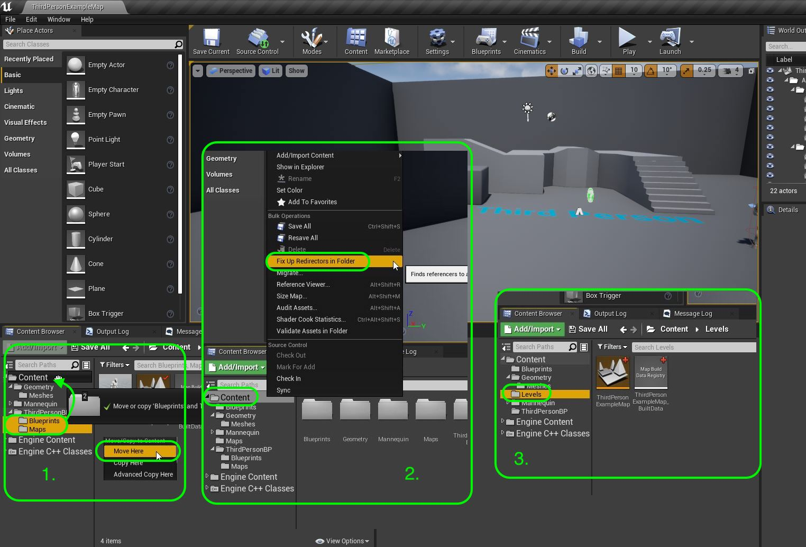

##### `Step 3.`\|`SUU&G`|:small_blue_diamond: :small_blue_diamond: :small_blue_diamond:

Before we start a gray block level we need to create a test level to understand how our player moves and how high and far to make jumps.  We also want to create ramps for players to run up and down.  To do this we will create a test level just meant to test physics so we can get an understanding of how the player moves.  Select the **Maps** folder and press **File | New Level**.

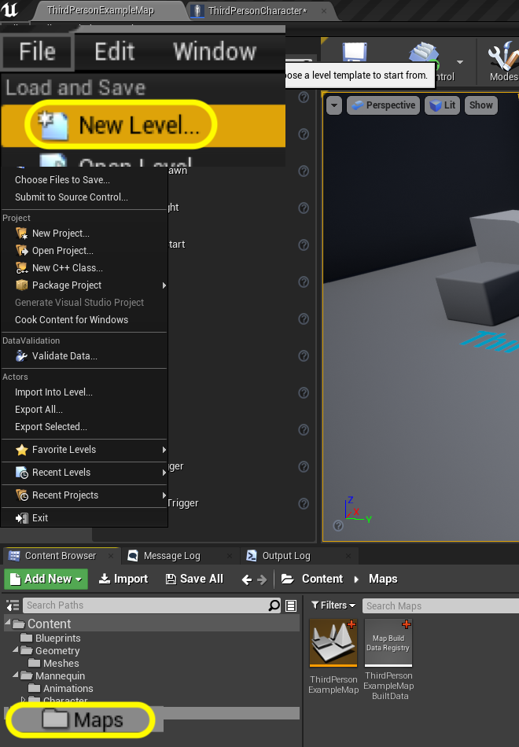

##### `Step 4.`\|`SUU&G`|:small_blue_diamond: :small_blue_diamond: :small_blue_diamond: :small_blue_diamond:

Select the **Default** type of level.

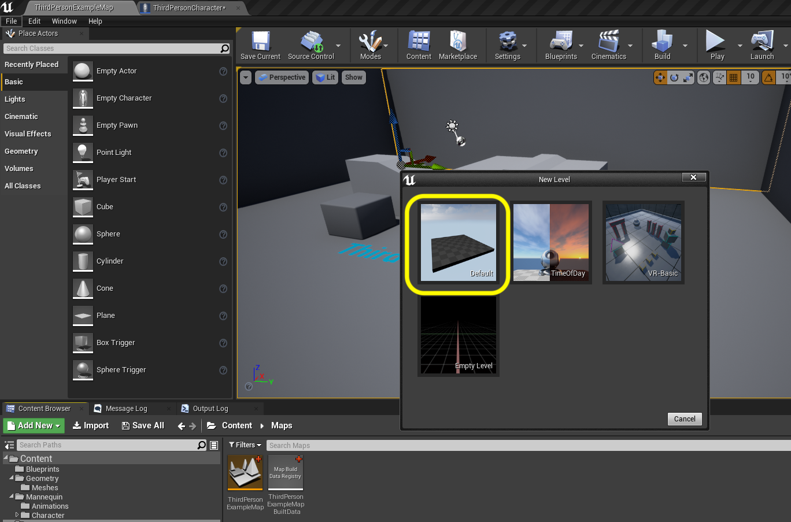

##### `Step 5.`\|`SUU&G`| :small_orange_diamond:

Go to **File | Save Current** and call the level `Holodeck` and save it to the **Levels** folder. Press the **Save** button.

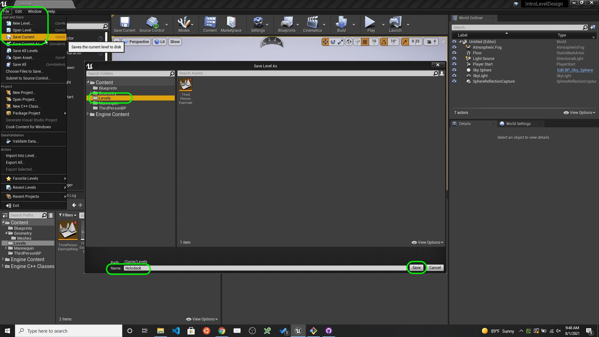

##### `Step 6.`\|`SUU&G`| :small_orange_diamond: :small_blue_diamond:

So we should end up with the **Holodeck** in the **Levels** folder.

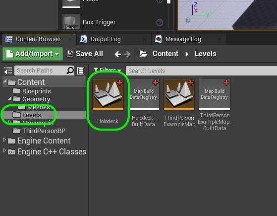

##### `Step 7.`\|`SUU&G`| :small_orange_diamond: :small_blue_diamond: :small_blue_diamond:

Press **Settings | Project Settings** and change the **Editor Startup Map** and **Game Startup Map** to `Holodeck`",

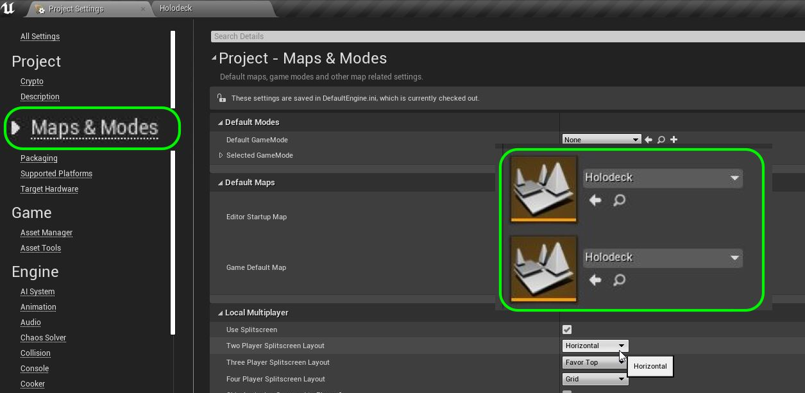

##### `Step 8.`\|`SUU&G`| :small_orange_diamond: :small_blue_diamond: :small_blue_diamond: :small_blue_diamond:

Press play and notice that it uses the **Default Pawn**.  This is the character that is loaded in the default level. It is a first person fly around view.  This is the default pawn if one is not specified in the **Game Mode** in either **Project Settings** or **World Settings**.

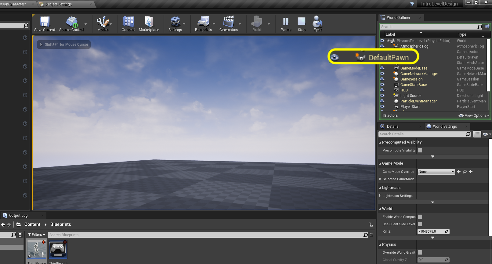

##### `Step 9.`\|`SUU&G`| :small_orange_diamond: :small_blue_diamond: :small_blue_diamond: :small_blue_diamond: :small_blue_diamond:

Press **Settings | World Settings**.  Each map allows you to adjust the game mode settings.  There is a special **GameMode** blueprint that we already have included with this template. Go to **GameMode Override** and select `ThirdPersonGameMode`.

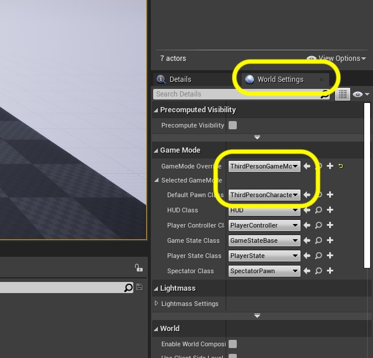

##### `Step 10.`\|`SUU&G`| :large_blue_diamond:

Now press play and we should have the character controls we had previously with all of its logic.  Press **Save All** and update Github by **committing** and **pushing** all the changes made. Next up we will lay out the floor and select a custom material.

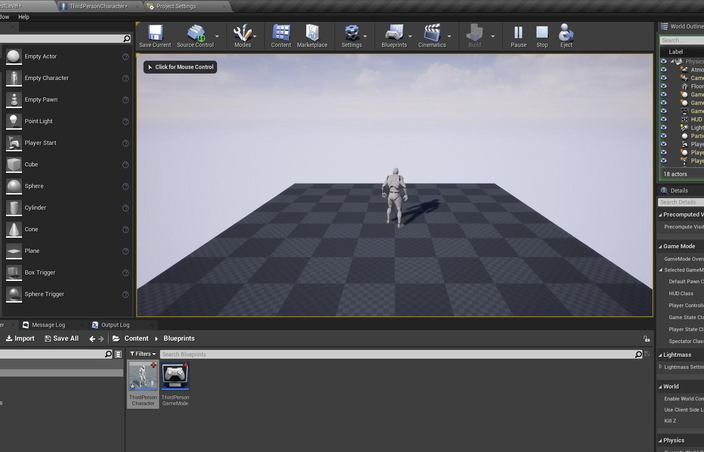

##### `Step 11.`\|`SUU&G`| :large_blue_diamond: :small_blue_diamond: 

We will need to use some assets for the level design that will make the process easier.  Go to [UE4-Level-Design-Assets](https://github.com/maubanel/UE4-Level-Design-Assets). Press the green <kbd>Code</kbd> button and select `Open with GitHub Desktop`.

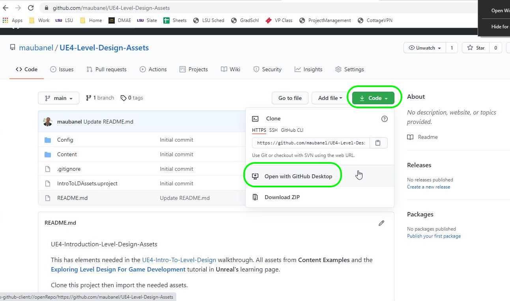.  

##### `Step 12.`\|`SUU&G`| :large_blue_diamond: :small_blue_diamond: :small_blue_diamond: 

Now select a **Local** folder to temporarilly save the project.  I put mine on my desktop then press the <kbd>Clone</kbd> button.

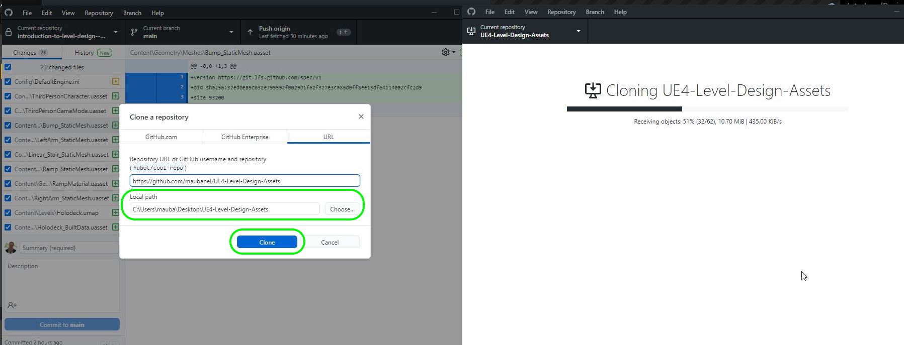

##### `Step 13.`\|`SUU&G`| :large_blue_diamond: :small_blue_diamond: :small_blue_diamond:  :small_blue_diamond: 

Select the **Blueprints** and **Geometry** folders and right mouse click and select `Migrate`.  Then press the <kbd>Ok</kbd> button to start the migration. Select the root of the **Content** folder in **Documents | Unreal Projects | Introduction to Level Design | Content**.
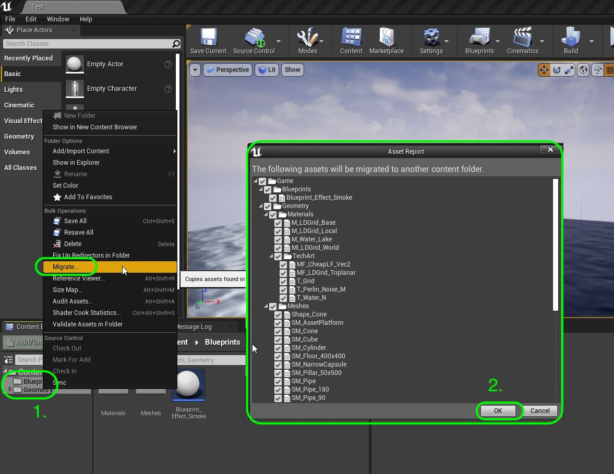

##### `Step 14.`\|`SUU&G`| :large_blue_diamond: :small_blue_diamond: :small_blue_diamond: :small_blue_diamond:  :small_blue_diamond: 

Now go back to the **Holodeck** level in **Unreal** and look in the **Content | Geometry | Meshes** folder.  You should see some new static mesheds including **SM_Floor_400x400**.  If you look at it it is 400cm (1 UE4 unit is 1 cm) by 400cm by 20cm.  This is 4 meters by 4 meters by .2 meters.
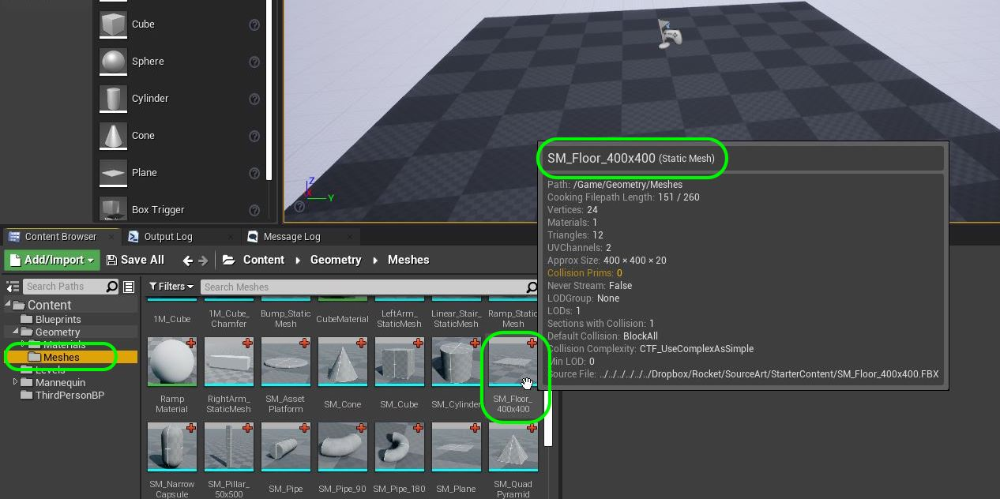

##### `Step 15.`\|`SUU&G`| :large_blue_diamond: :small_orange_diamond: 

Delete the old floor that came with the template.  Drag and drop one piece of **SM_Floor_400x400** in the level.  Make sure it is at **Location** `0, 0, 0`. If it is not there is a yellow arrow that you can press to reset it.  Now look this piece of geometry has a special material called **MI_LDGrid_World**. Notice that when you scale the mesh that the grid grows and doesn't scale.

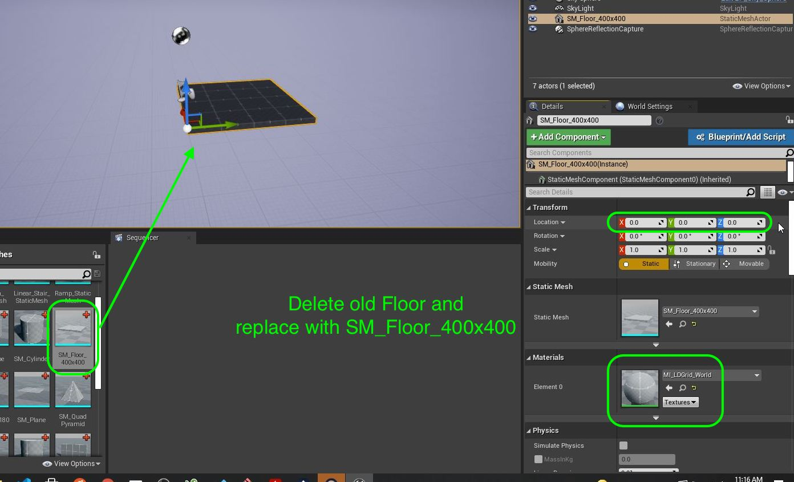

##### `Step 16.`\|`SUU&G`| :large_blue_diamond: :small_orange_diamond:   :small_blue_diamond: 

Now this material has a grid on it and it has a grid.  This grid is 1 meter square and gives us a good sense of scale of the level we are working on.  If you move it notice that the grid stays in **World Space** and doesn't move with the geometry.  This allows us to place multiple pieces next to each other without the **Z Fighting** you normally get with two planes at the same level.  This allows you to craft levels without visual side effects.  It is most effective to use this material on the ground.

https://user-images.githubusercontent.com/5504953/127792618-a0178091-50be-4ac0-b07e-4be090dee90e.mp4

##### `Step 17.`\|`SUU&G`| :large_blue_diamond: :small_orange_diamond: :small_blue_diamond: :small_blue_diamond:

To make placing the floor pieces easier we want the grid snap to be at 400 Unreal Units (400 cm or 4 m).  The menu only has **100** and **500**.  

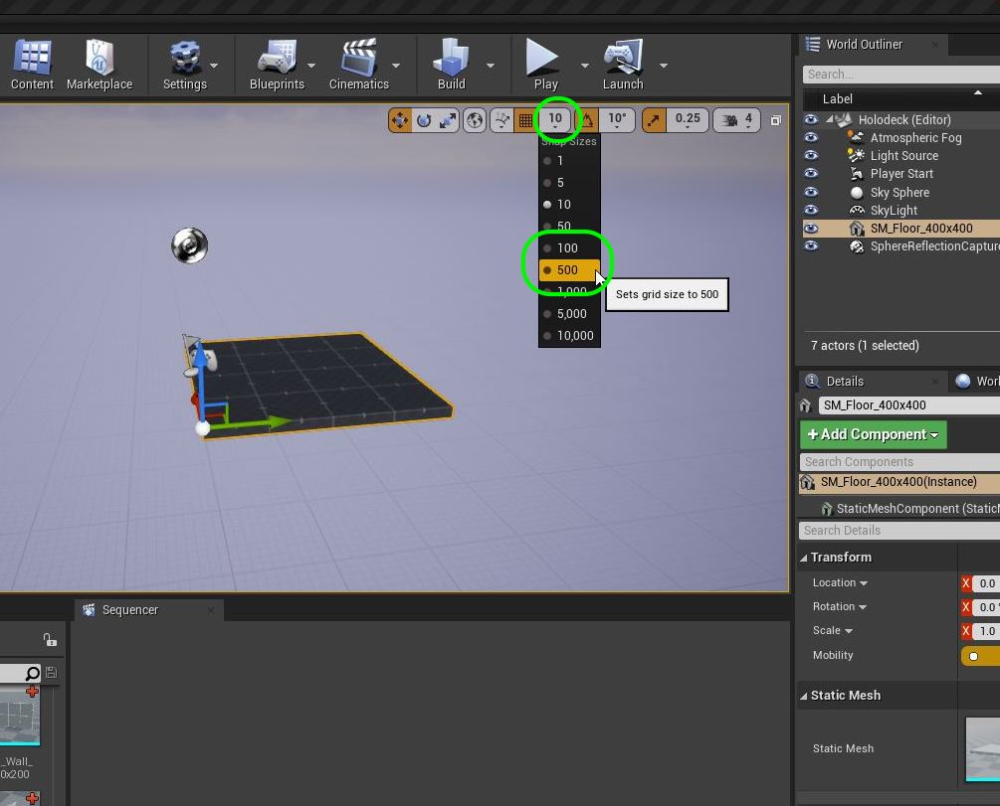

##### `Step 18.`\|`SUU&G`| :large_blue_diamond: :small_orange_diamond: :small_blue_diamond: :small_blue_diamond: :small_blue_diamond:

Go to **Edit | Editor Preferences** and type in the search window type `snap` and look for **Decimal Grid Sizes** and on the `500` entry press the arrow and select **Insert**.  Then change this value to `400` and make sure it is between the **100** and **500** value.

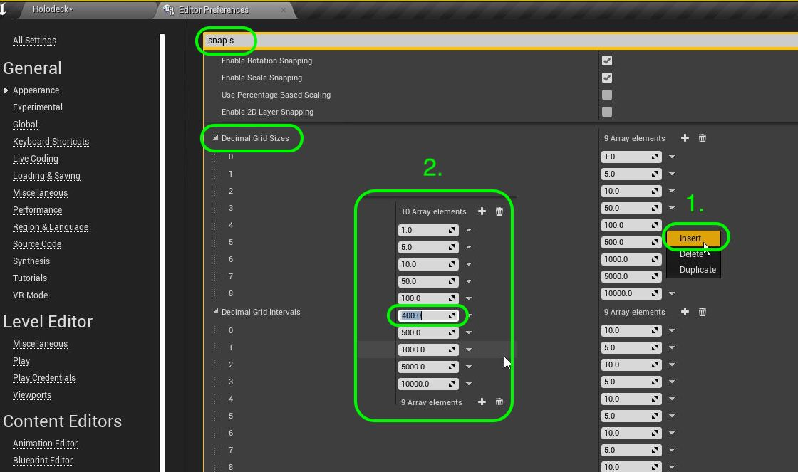

##### `Step 19.`\|`SUU&G`| :large_blue_diamond: :small_orange_diamond: :small_blue_diamond: :small_blue_diamond: :small_blue_diamond: :small_blue_diamond:

Now you can set the snap to **400** in the game as it added this new value!

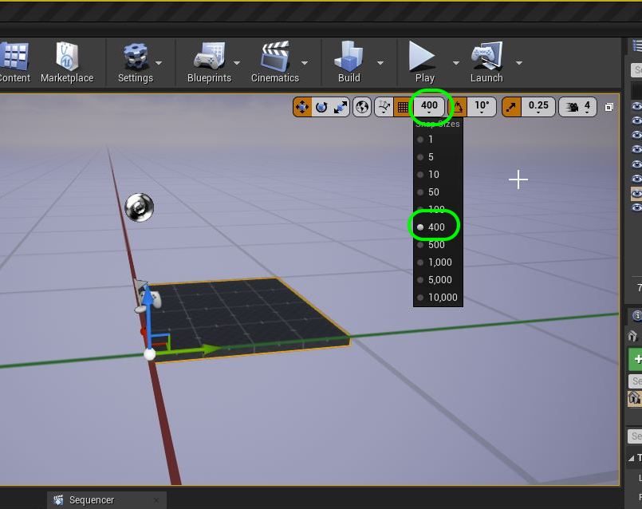

##### `Step 20.`\|`SUU&G`| :large_blue_diamond: :large_blue_diamond:

Now with the snap set, make a large floor section.  I made mine 40 by 20 floor units (which would be 160 by 80 meters) large.

https://user-images.githubusercontent.com/5504953/127794749-addeda67-6832-433d-8335-3f00f00711ca.mp4

##### `Step 21.`\|`SUU&G`| :large_blue_diamond: :large_blue_diamond: :small_blue_diamond:

Lets organize the **World Outliner**.  Select all the floor pieces and right click and select 
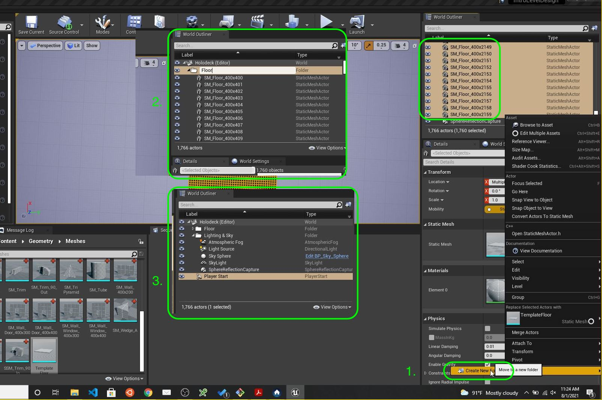

___

| [previous](../camera-mechanics/README.md#user-content-lock-cameras-and-mechanics)| [home](../README.md#user-content-ue4-hello-world) | [next](../readme/README.md#user-content-readmemd-file)|
|---|---|---|
