### Setting Up Holodeck

[previous](../camera-mechanics/README.md#user-content-lock-cameras-and-mechanics) • [home](../README.md#user-content-ue4-intro-to-level-design) • [next](../holodeck-ii/README.md#user-content-setting-up-holodeck-ii)

Now we normally create a level where we test out all of our mechanics to make sure it works.  This is often refered to as a test level, gym or holodeck all representing a level that is not meant to be played by the user but is used for testing mechanics and assets for gray blocking. We will use this to understand the scale of the objects we need to build to match the mechanics.

 

---

##### `Step 1.`\|`UE5LD`|:small_blue_diamond:

Lets organize the content folder and clean up the structure a bit. Lets start by cleaning up the current folder and removing elements we do not need.  There are two manequins, the old one and the new one.  Right mouse click on the **Mannequin_UE4** folder and select the <kbd>Delete</kbd> button.  Now a very small pop up appears and we press the <kbd>Delete</kbd> button for a second time.

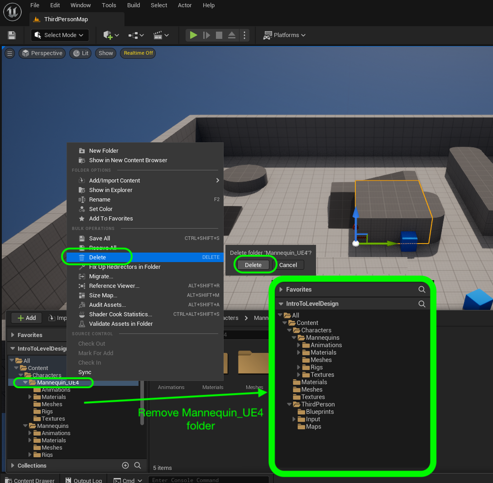

##### `Step 2.`\|`UE5LD`|:small_blue_diamond: :small_blue_diamond: 

It is critical to **NEVER** use the operating system finder to change **ANYTHING** inside the **Content** folder.  This needs to all be done in **Unreal**.  You will most likely break something in your game if you don't head this warning.

Now **Unreal** leaves metatdata and breadcrumbs for moved and deleted files.  It is always best practice when moving files, deleting files or renaming files to finish up by right clicking on the **Content** folder and selecting  **Fix Up Redirectors in Folder**.  This will relink everything and get rid of this meta data.

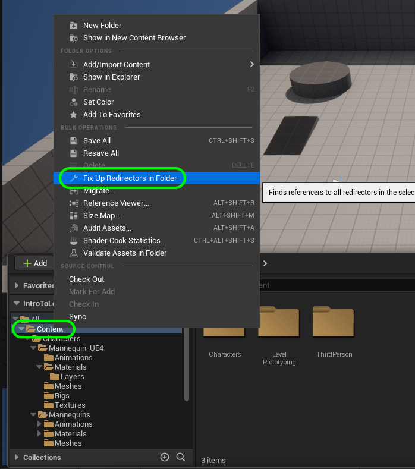

##### `Step 3.`\|`UE5LD`|:small_blue_diamond: :small_blue_diamond: :small_blue_diamond:

Sometimes a file is referenced and you do not delete all the folders.  You have to sometimes go back and delete them one at a time.

Now it did not delete all my folder. Go back and delete the folders again then right click on the **Content** folder and select  **Fix Up Redirectors in Folder**. Do this until you have all the folders you want removed gone.  You might have to load up a new level (**File | New Level** to accomplish this). You also might have to go to **P4V** and delete any ghost files that are still in the folder (it is OK to delete files that are not entered into source control and are not being used by the game).  This usually means that **Unreal** has lost track of this file and the folder won't delete until it is gone.

https://user-images.githubusercontent.com/5504953/177067308-a38e2c37-06a2-4d9d-8a98-f27d5fa98c06.mp4

##### `Step 4.`\|`UE5LD`|:small_blue_diamond: :small_blue_diamond: :small_blue_diamond: :small_blue_diamond:

Move the three folders in the **Third Person Folder** to the root of Content.  This means moving the **Bluepritns**, **Input** and **Maps** folder.  Make sure you delete the empty folders left over.  At the end right click on **Content** and select **Fix Up Redirectors in Folder**.

##### `Step 5.`\|`UE5LD`| :small_orange_diamond:

Before we start a gray block level we need to create a test level to understand how our player moves and how high and far to make jumps.  We also want to create ramps for players to run up and down.  To do this we will create a test level just meant to test physics so we can get an understanding of how the player moves.  Select the **File | New Level** and select an **Empty** level and press the <kbd>Create</kbd> button.

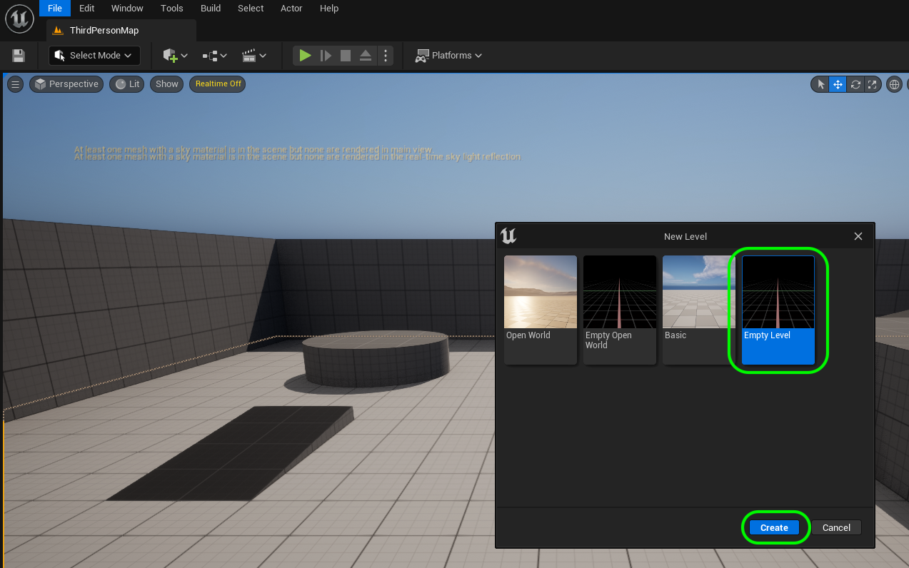

##### `Step 6.`\|`UE5LD`| :small_orange_diamond: :small_blue_diamond:

Select the **Window | Env Ligth Mixer** to get the environmental light mixer overlay.  Drag a **Sky Light**,  **Atmospheric Light**, **Sky Atmosphere**, **Volumetric Clouds**, and **Height Fog** to the level.

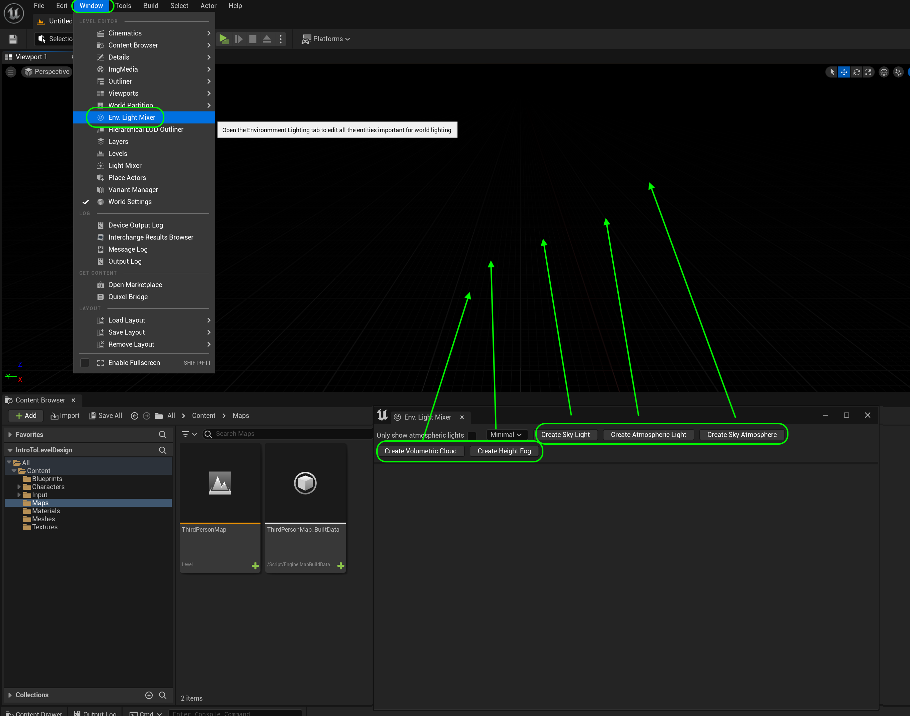

##### `Step 7.`\|`UE5LD`| :small_orange_diamond: :small_blue_diamond: :small_blue_diamond:

Now we have the basic lighitng set-up for a level. The  **Atmospheric Light** adds a **Directional Light** that acts as the sun. 

>The Directional Light simulates light that is being emitted from a source that is infinitely far away. This means that all shadows cast by this light will be parallel, making this the ideal choice for simulating sunlight - [Directional Light](https://docs.unrealengine.com/5.2/en-US/directional-lights-in-unreal-engine/)

The **Sky Atmoshpere** changes how the sun reflects with the atmosphere based on time of day and location. Without it the sky is black as if we are in outer space.

>The Sky Atmosphere component in Unreal Engine is a physically-based sky and atmosphere-rendering technique. It's flexible enough to create an Earth-like atmosphere with time-of-day featuring sunrise and sunset, or to create extraterrestrial atmospheres of an exotic nature. - [Sky Atmosphere](https://docs.unrealengine.com/5.2/en-US/sky-atmosphere-component-in-unreal-engine/).

The third element that works together with the atmosphere and clouds in the [SkyLight](https://docs.unrealengine.com/5.2/en-US/sky-lights-in-unreal-engine/).

>The Sky Light captures the distant parts of your level and applies that to the scene as a light. That means the sky's appearance and its lighting/reflections will match, even if your sky is coming from atmosphere, or layered clouds on top of a skybox, or distant mountains. You can also manually specify a cubemap to use. - [Skylight](https://docs.unrealengine.com/5.2/en-US/sky-lights-in-unreal-engine/)

The one thing that is missing is visibility in the air.  Normally there is a bit of haze, particles or fog that restricts your viewing distance. The final element that will help bring this scene together is [Exponential Height Fog](https://docs.unrealengine.com/5.2/en-US/exponential-height-fog-in-unreal-engine/).

>Exponential Height Fog creates more density in low places of a map and less density in high places. The transition is smooth, so you never get a hard cutoff as you increase altitude. Exponential Height Fog also provides two fog colors—one for the hemisphere facing the dominant directional light (or straight up if none exists), and another color for the opposite hemisphere. - [Exponential Height Fog](https://docs.unrealengine.com/5.2/en-US/exponential-height-fog-in-unreal-engine/).

Finally the [Volumetric Cloud](https://docs.unrealengine.com/5.2/en-US/volumetric-cloud-component-in-unreal-engine/) component allows us to have highly realistic clouds that responds to the other lighting components in the scene.  

>The Volumetric Cloud component is a physically-based cloud rendering system that uses a material-driven approach to give artists and designers the freedom to create any type of clouds they need for their projects. The cloud system handles dynamic time-of-day setups that is complemented by the Sky Atmosphere and Sky Light using the real time capture mode. The system provides scalable, artist-defined clouds that can adapt to projects using ground views, flying, and ground to outer space transitions. - [Volumetric Cloud](https://docs.unrealengine.com/5.2/en-US/volumetric-cloud-component-in-unreal-engine/) 

Feel free to read the instructions and tweak any values.

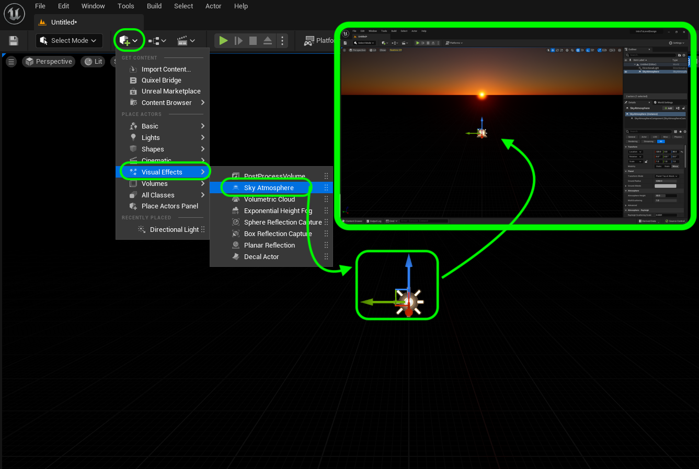

##### `Step 8.`\|`UE5LD`| :small_orange_diamond: :small_blue_diamond: :small_blue_diamond: :small_blue_diamond:

Now there is a special rotational widget that can be used for rotating the light to get different times of day (different angles the sun is position at).  You press the <kbd>Cntrl L</kbd> key to bring up the controller then let go of the <kbd>L</kbd> key while still holding <kbd>Cntrl</kbd>.  You can then move the mouse around and have the sun point at any angle.  I picked one that worked best for me. I then released the <kbd>Cntrl</kbd> key to lock in the position.

https://user-images.githubusercontent.com/5504953/172624138-fdd5d5eb-28ad-4adc-9ada-79f4e447f9e5.mp4

##### `Step 9.`\|`UE5LD`| :small_orange_diamond: :small_blue_diamond: :small_blue_diamond: :small_blue_diamond: :small_blue_diamond:

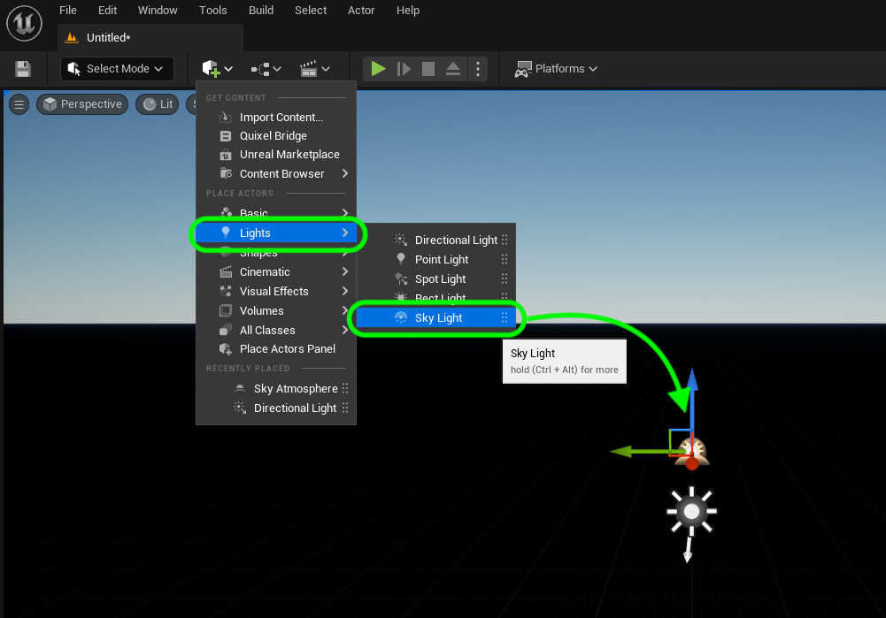

##### `Step 10.`\|`UE5LD`| :large_blue_diamond:

Select **Place Actor | Special Effect | Exponential Height Fog** and drag it into the level.

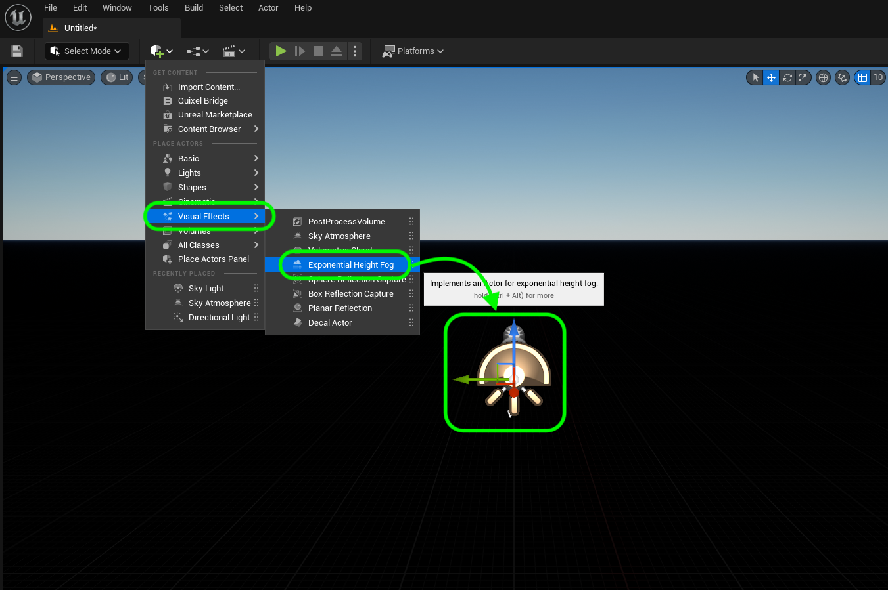

##### `Step 11.`\|`UE5LD`| :large_blue_diamond: :small_blue_diamond: 

Now lets use a cool landscape as opposed to a flat ground plane like there was in the template level.  We will be using a height map to generate the topology of a landscape.  What is a [height map](https://en.wikipedia.org/wiki/Heightmap)?

>A heightmap contains one channel interpreted as a distance of displacement or "height" from the "floor" of a surface and sometimes visualized as luma of a grayscale image, with black representing minimum height and white representing maximum height. - Wikipedia

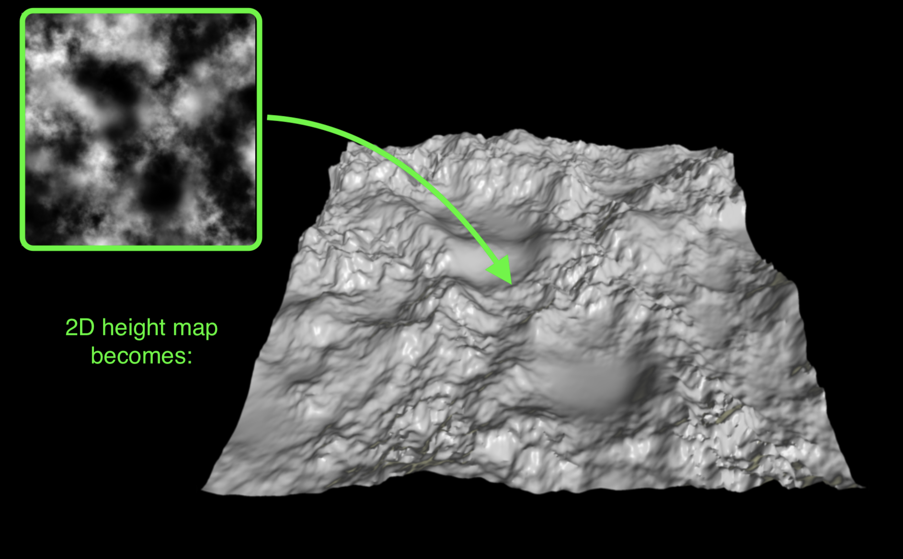

##### `Step 12.`\|`UE5LD`| :large_blue_diamond: :small_blue_diamond: :small_blue_diamond: 

Unreal recommends various [height map](https://docs.unrealengine.com/4.27/en-US/BuildingWorlds/Landscape/TechnicalGuide/) dimensions that they support. By default 1 pixel equals 1 meter in UE5 space.  So a `1109` by `1009` pixel image will be (1.009 * 1.009) 1.018081 kilometers squared (or .416 square miles) in size.

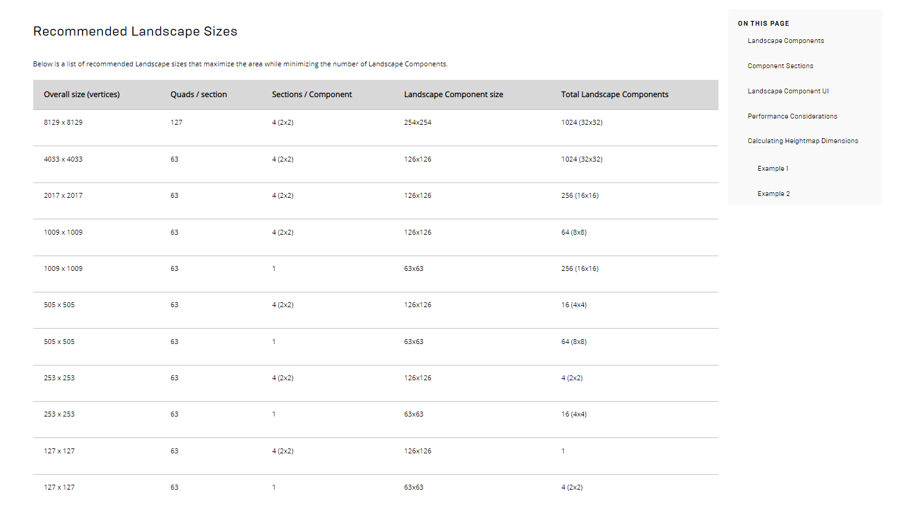

##### `Step 13.`\|`UE5LD`| :large_blue_diamond: :small_blue_diamond: :small_blue_diamond:  :small_blue_diamond: 

Not only 'should' it be one of the recommended sizes but it has to be **16 bits** and in **Grayscale** mode for it to work in Unreal correctly.

If it were 8 bits per channel (2 ^ 8) we would only represent 256 different heights.  A 16 bit grayscale (2 ^ 16) gives us 65536 different heights. This makes for much more detailed terrain.

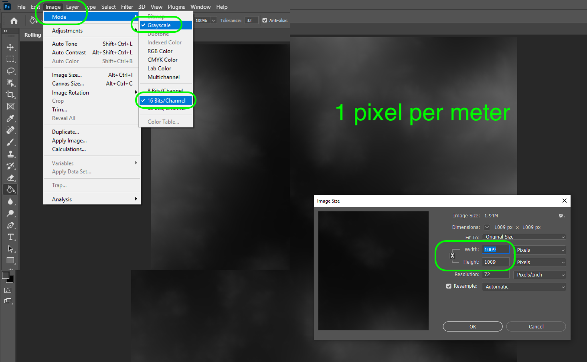

##### `Step 14.`\|`UE5LD`| :large_blue_diamond: :small_blue_diamond: :small_blue_diamond: :small_blue_diamond:  :small_blue_diamond: 

Please note if that you are trying to adjust photoshop files to work that using the **Export** option will always reduce the bit depth to 8 bit.  You need to use **Save** or **Save As** to preserve the bit depth.

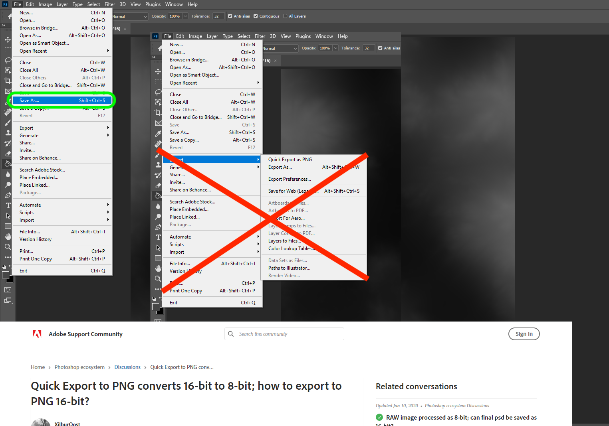

##### `Step 15.`\|`UE5LD`| :large_blue_diamond: :small_orange_diamond: 

Download this free height map I downloaded from [moton forge pictures](https://www.motionforgepictures.com/environment-height-maps-free-download/) and adjusted it to the correct format in **Photoshop**.  Download the process file [RollingHillsHeightMap.png](../files/RollingHillsHeightMap.png). Now press the <kbd>Modes</kbd> and switch to **Landscape** mode.

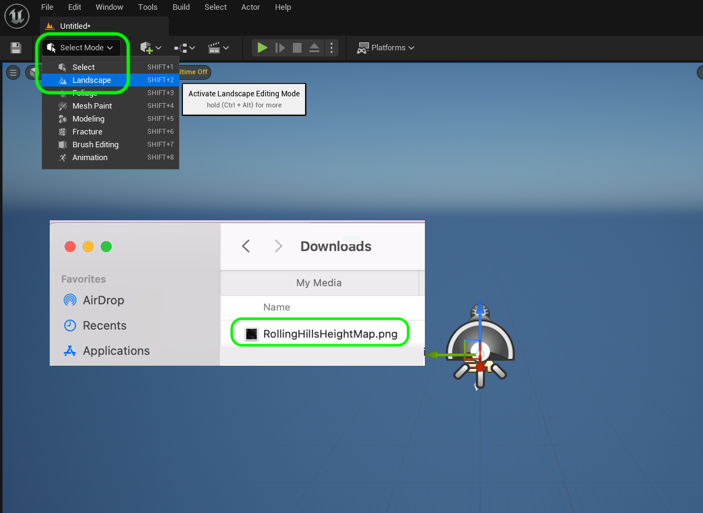

##### `Step 16.`\|`UE5LD`| :large_blue_diamond: :small_orange_diamond:   :small_blue_diamond: 

Press the **Import from File** tab and select the `...` from the **Heightmap from File** and select the **RollingHillsHeightMap.png** we downloaded above.  Press the <kbd>Open</kbd> button.

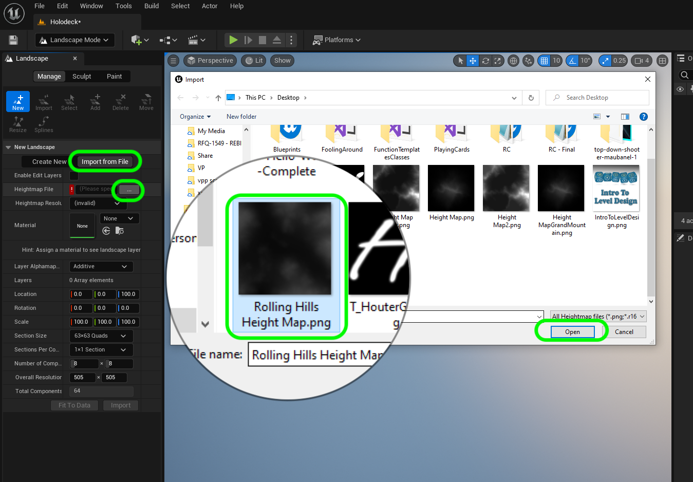

##### `Step 17.`\|`UE5LD`| :large_blue_diamond: :small_orange_diamond: :small_blue_diamond: :small_blue_diamond:

Press the <kbd>Fix to Data</kbd> button to make sure the settings correspond to the resolution of the map provided.  Then press the <kbd>Import</kbd> button. Now you should have a cool looking landscape with a large flat portion in the center that we cna use.

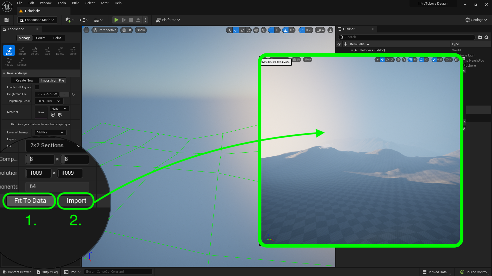

##### `Step 18.`\|`UE5LD`| :large_blue_diamond: :small_orange_diamond: :small_blue_diamond: :small_blue_diamond: :small_blue_diamond:

Now we do not need to be in **Landscape** mode any more.  Press the <kbd>Mode</kbd> and go back to **Select** mode. Fly around teh level.  You can increase the camera speed so it is quicker to fly around and look at the new map you created.

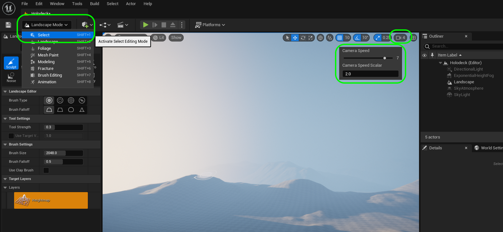

https://user-images.githubusercontent.com/5504953/177608479-82abbb8e-bb97-43e4-ad0c-e9ab8fa59d08.mp4

##### `Step 19.`\|`UE5LD`| :large_blue_diamond: :small_orange_diamond: :small_blue_diamond: :small_blue_diamond: :small_blue_diamond: :small_blue_diamond:

Now lets save our work in this level.  Right click on **Content** and right click and select **New Folder**. Call it `Maps`.  Press **File | Save Current Level** and call the new level `Holodeck` and save it in the **Maps** folder. Now exit Unreal as we will load up another project that we will grab some assets we would like to use.

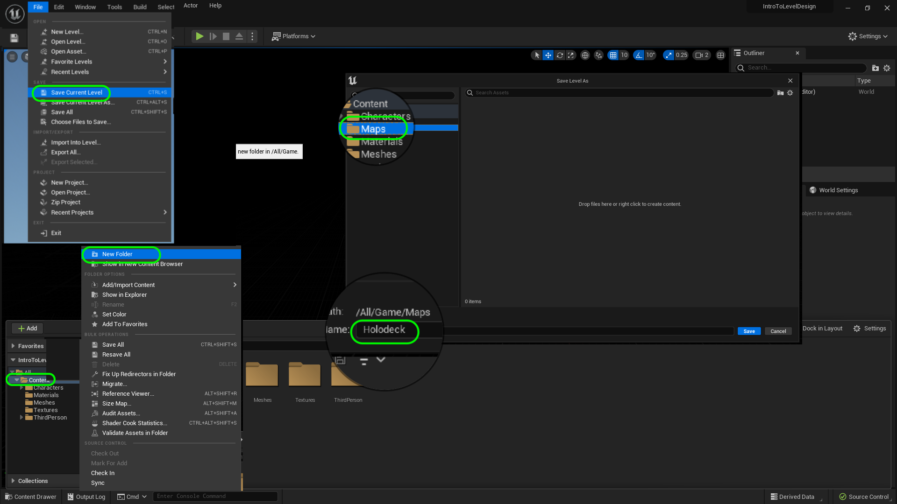

##### `Step 20.`\|`UE5LD`| :large_blue_diamond: :large_blue_diamond:

You will need some materials and textures for the landscape.  Go to [github.com/LSU-UE4/UE5-Level-Design-Assets](https://github.com/LSU-UE4/UE5-Level-Design-Assets).  Click on the green <kbd>Code</kbd> button and select **Download ZIP**.

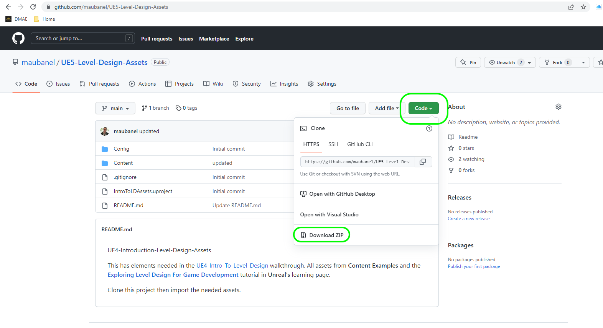

##### `Step 21.`\|`UE5LD`| :large_blue_diamond: :large_blue_diamond: :small_blue_diamond:

Unzip the folder and open up **IntroToLDAssets.uproject** and go to **Content Drawer | Landscape | Materials** and right click on **M_Landscape** and select **Asset Actions | Migrate**.  This will start the migration process of all the files you will need for our project.

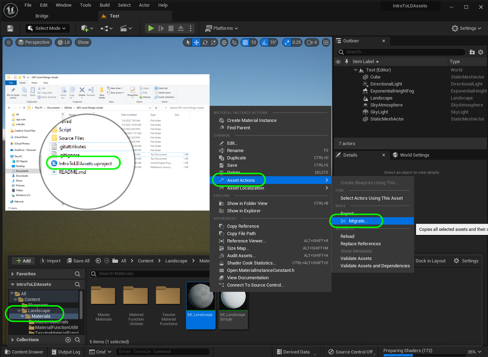

| [previous](../camera-mechanics/README.md#user-content-lock-cameras-and-mechanics)| [home](../README.md#user-content-ue4-intro-to-level-design) | [next](../holodeck-ii/README.md#user-content-setting-up-holodeck-ii)|
|---|---|---|
