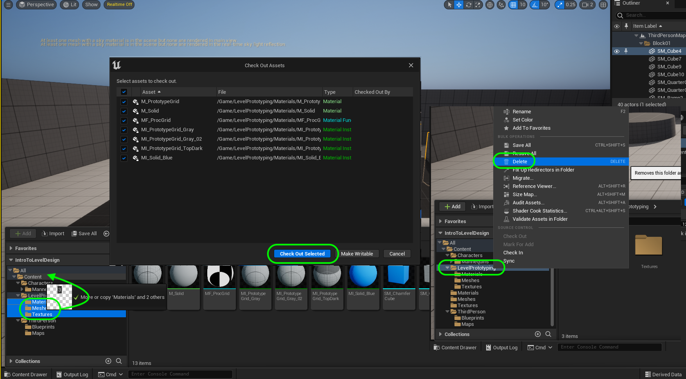
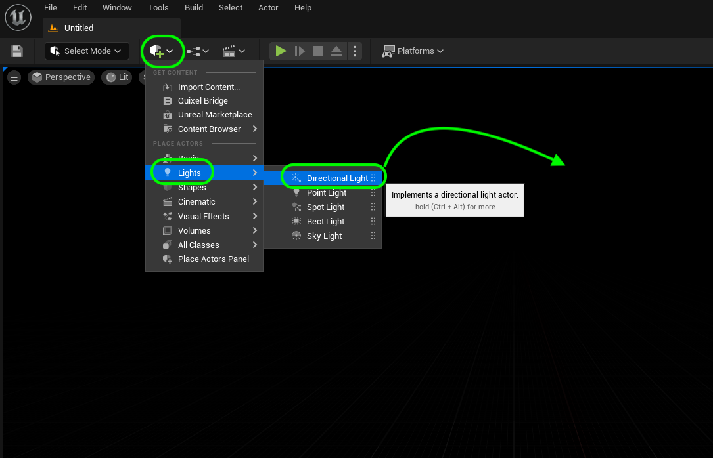
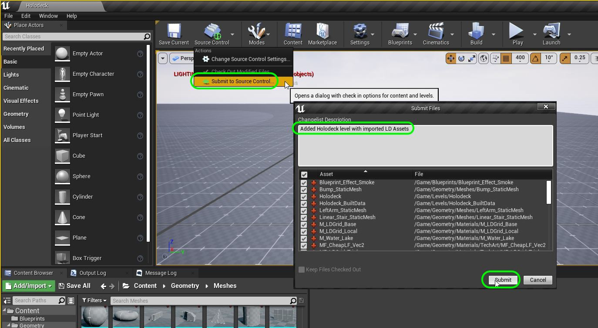

### Setting Up Holodeck

[previous](../camera-mechanics/README.md#user-content-lock-cameras-and-mechanics) • [home](../README.md#user-content-ue4-intro-to-level-design) • [next](../ramp/README.md#user-content-creating-custom-meshes)

Now we normally create a level where we test out all of our mechanics to make sure it works.  This is often refered to as a test level, gym or holodeck all representing a level that is not meant to be played by the user but is used for testing mechanics and assets for gray blocking. We will use this to understand the scale of the objects we need to build to match the mechanics.

 

---

##### `Step 1.`\|`UE5LD`|:small_blue_diamond:

Lets organize the content folder for our project and start a new level. Lets add a playable area to work with that simulates an average game. We have two **Meshes** (geometry) folders.  

Lets start by cleaning up the current folder and removing elements we do not need.  There are two manequins, the old one and the new one.  Right mouse click on the **Mannequin_UE4** folder and select the <kbd>Delete</kbd> button.  Now a very small pop up appears and we press the <kbd>Delete</kbd> button for a second time.

##### `Step 2.`\|`UE5LD`|:small_blue_diamond: :small_blue_diamond: 

It is critical to **NEVER** use the operating system finder to change **ANYTHING** inside the **Content** folder.  This needs to all be done in **Unreal**.  You will most likely break something in your game if you don't head this warning.

Now **Unreal** leaves metatdata and breadcrumbs for moved and deleted files.  It is always best practice when moving files, deleting files or renaming files to finish up by right clicking on the **Content** folder and selecting  **Fix Up Redirectors in Folder**.  This will relink everything and get rid of this meta data.

##### `Step 3.`\|`UE5LD`|:small_blue_diamond: :small_blue_diamond: :small_blue_diamond:

Sometimes a file is referenced and you do not delete all the folders.  You have to sometimes go back and delete them one at a time.

Now it did not delete all my folder. Go back and delete the folders again then right click on the **Content** folder and select  **Fix Up Redirectors in Folder**. Do this until you have all the folders you want removed gone.  You might have to load up a new level (**File | New Level** to accomplish this). You also might have to go to **P4V** and delete any ghost files that are still in the folder (it is OK to delete files that are not entered into source control and are not being used by the game).  This usually means that **Unreal** has lost track of this file and the folder won't delete until it is gone.

https://user-images.githubusercontent.com/5504953/177067308-a38e2c37-06a2-4d9d-8a98-f27d5fa98c06.mp4

##### `Step 4.`\|`UE5LD`|:small_blue_diamond: :small_blue_diamond: :small_blue_diamond: :small_blue_diamond:

 Go to the **Level Prototyping** folder and move the **Materials** and **Meshes** and **Textures** folder to the root **Content** folder. Since this needs to update version control it will ask you the **Check Out Selected**.  What checking out a file does is make sure that no one else in the team can use and alter this file.  It eliminates most occurances of collision and makes sure that only one person can work on a file at a time.  The **Delete** the **Level Prototyping** folder. Finish by  selecting **Fix Up Redirectors in Folder**.

##### `Step 5.`\|`UE5LD`| :small_orange_diamond:

Before we start a gray block level we need to create a test level to understand how our player moves and how high and far to make jumps.  We also want to create ramps for players to run up and down.  To do this we will create a test level just meant to test physics so we can get an understanding of how the player moves.  Select the **File | New Level** and select an **Empty** level and press the <kbd>Create</kbd> butoon.

##### `Step 6.`\|`UE5LD`| :small_orange_diamond: :small_blue_diamond:

Now we need to add a light.  This will be an outdoor scene so lets start with the **Sun**.  This is in game terms a light with no fall off so it runs for infinity.

>The Directional Light simulates light that is being emitted from a source that is infinitely far away. This means that all shadows cast by this light will be parallel, making this the ideal choice for simulating sunlight - [UE5 Manual](https://docs.unrealengine.com/5.0/en-US/directional-lights-in-unreal-engine/)

To find the lights click on the **Place Actors** pull down menu at the top left under the **Tools** menu and select **Light | Directional Light**. Drag one into the room.

##### `Step 7.`\|`UE5LD`| :small_orange_diamond: :small_blue_diamond: :small_blue_diamond:

Now we are in a black world - lets create a sky.  Press the **Place Actors** drop down menu and select **Visual Effects | Sky Atmosphere**.

>The Sky Atmosphere component in Unreal Engine is a physically-based sky and atmosphere-rendering technique. It's flexible enough to create an Earth-like atmosphere with time-of-day featuring sunrise and sunset, or to create extraterrestrial atmospheres of an exotic nature. - [UE5 Manual](https://docs.unrealengine.com/5.0/en-US/sky-atmosphere-component-in-unreal-engine/).

Feel free to read the instructions and tweak any values.

##### `Step 8.`\|`UE5LD`| :small_orange_diamond: :small_blue_diamond: :small_blue_diamond: :small_blue_diamond:

Now there is a special rotational widget that can be used for rotating the light to get different times of day (different angles the sun is position at).  You press the <kbd>Cntrl L</kbd> key to bring up the controller then let go of the <kbd>L</kbd> key while still holding <kbd>Cntrl</kbd>.  You can then move the mouse around and have the sun point at any angle.  I picked one that worked best for me. I then released the <kbd>Cntrl</kbd> key to lock in the position.

https://user-images.githubusercontent.com/5504953/172624138-fdd5d5eb-28ad-4adc-9ada-79f4e447f9e5.mp4

##### `Step 9.`\|`UE5LD`| :small_orange_diamond: :small_blue_diamond: :small_blue_diamond: :small_blue_diamond: :small_blue_diamond:

The third element that works together with the atmosphere and clouds in the [Skylight](https://docs.unrealengine.com/5.0/en-US/sky-lights-in-unreal-engine/).

>The Sky Light captures the distant parts of your level and applies that to the scene as a light. That means the sky's appearance and its lighting/reflections will match, even if your sky is coming from atmosphere, or layered clouds on top of a skybox, or distant mountains. You can also manually specify a cubemap to use. - [UE5 Manual](Skylight](https://docs.unrealengine.com/5.0/en-US/sky-lights-in-unreal-engine/)

##### `Step 10.`\|`UE5LD`| :large_blue_diamond:

The one thing that is missing is visibility in the air.  Normally there is a bit of haze, particles or fog that restricts your viewing distance. The final element that will help bring this scene together is [Exponential Height Fog](https://docs.unrealengine.com/5.0/en-US/exponential-height-fog-in-unreal-engine/).

>Exponential Height Fog creates more density in low places of a map and less density in high places. The transition is smooth, so you never get a hard cutoff as you increase altitude. Exponential Height Fog also provides two fog colors—one for the hemisphere facing the dominant directional light (or straight up if none exists), and another color for the opposite hemisphere. - [UE5 Manual](https://docs.unrealengine.com/5.0/en-US/exponential-height-fog-in-unreal-engine/).

Select **Place Actor | Special Effect | Exponential Height Fog** and drag it into the level.

##### `Step 11.`\|`UE5LD`| :large_blue_diamond: :small_blue_diamond: 

Now lets use a cool landscape as opposed to a flat ground plane like there was in the template level.  We will be using a height map to generate the topology of a landscape.  What is a [height map](https://en.wikipedia.org/wiki/Heightmap)?

>A heightmap contains one channel interpreted as a distance of displacement or "height" from the "floor" of a surface and sometimes visualized as luma of a grayscale image, with black representing minimum height and white representing maximum height. - Wikipedia

##### `Step 12.`\|`UE5LD`| :large_blue_diamond: :small_blue_diamond: :small_blue_diamond: 

Unreal recommends various [height map](https://docs.unrealengine.com/4.27/en-US/BuildingWorlds/Landscape/TechnicalGuide/) dimensions that they support. By default 1 pixel equals 1 meter in UE5 space.  So a `1109` by `1009` pixel image will be (1.009 * 1.009) 1.018081 kilometers squared (or .416 square miles) in size.

##### `Step 13.`\|`UE5LD`| :large_blue_diamond: :small_blue_diamond: :small_blue_diamond:  :small_blue_diamond: 

Not only 'should' it be one of the recommended sizes but it has to be **16 bits** and in **Grayscale** mode for it to work in Unreal correctly.

If it were 8 bits per channel (2 ^ 8) we would only represent 256 different heights.  A 16 bit grayscale (2 ^ 16) gives us 65536 different heights. This makes for much more detailed terrain.

##### `Step 14.`\|`UE5LD`| :large_blue_diamond: :small_blue_diamond: :small_blue_diamond: :small_blue_diamond:  :small_blue_diamond: 

Please note if that you are trying to adjust photoshop files to work that using the **Export** option will always reduce the bit depth to 8 bit.  You need to use **Save** or **Save As** to preserve the bit depth.

##### `Step 15.`\|`UE5LD`| :large_blue_diamond: :small_orange_diamond: 

Download this free height map I downloaded from [moton forge pictures](https://www.motionforgepictures.com/environment-height-maps-free-download/) and adjusted it to the correct format in **Photoshop**.  Download the process file [RollingHillsHeightMap.png](../files/RollingHillsHeightMap.png). Now press the <kbd>Modes</kbd> and switch to **Landscape** mode.

##### `Step 16.`\|`UE5LD`| :large_blue_diamond: :small_orange_diamond:   :small_blue_diamond: 

Press the **Import from File** tab and select the `...` from the **Heightmap from File** and select the **RollingHillsHeightMap.png** we downloaded above.  Press the <kbd>Open</kbd> button.

##### `Step 17.`\|`UE5LD`| :large_blue_diamond: :small_orange_diamond: :small_blue_diamond: :small_blue_diamond:

Press the <kbd>Fix to Data</kbd> button to make sure the settings correspond to the resolution of the map provided.  Then press the <kbd>Import</kbd> button.

##### `Step 19.`\|`UE5LD`| :large_blue_diamond: :small_orange_diamond: :small_blue_diamond: :small_blue_diamond: :small_blue_diamond: :small_blue_diamond:

Now go to [Level Design Assets](https://github.com/maubanel/UE5-Level-Design-Assets) and press the <kbd>Code</kbd> and select **Download Gif**.

Go to **File | Save Current** and call the level `Holodeck` and save it to the **Levels** folder. Press the **Save** button.

So we should end up with the **Holodeck** in the **Levels** folder.

Press **Settings | Project Settings** and change the **Editor Startup Map** and **Game Startup Map** to `Holodeck`",

Press play and notice that it uses the **Default Pawn**.  This is the character that is loaded in the default level. It is a first person fly around view.  This is the default pawn if one is not specified in the **Game Mode** in either **Project Settings** or **World Settings**.

Press **Settings | World Settings**.  Each map allows you to adjust the game mode settings.  There is a special **GameMode** blueprint that we already have included with this template. Go to **GameMode Override** and select `ThirdPersonGameMode`.

Now press play and we should have the character controls we had previously with all of its logic.  Press **Save All** and update Github by **committing** and **pushing** all the changes made. Next up we will lay out the floor and select a custom material.

We will need to use some assets for the level design that will make the process easier.  Go to [UE4-Level-Design-Assets](https://github.com/maubanel/UE4-Level-Design-Assets). Press the green <kbd>Code</kbd> button and select `Open with GitHub Desktop`.

.  

Now select a **Local** folder to temporarilly save the project.  I put mine on my desktop then press the <kbd>Clone</kbd> button.

Select the **Blueprints** and **Geometry** folders and right mouse click and select `Migrate`.  Then press the <kbd>Ok</kbd> button to start the migration. Select the root of the **Content** folder in **Documents | Unreal Projects | Introduction to Level Design | Content**.

Now go back to the **Holodeck** level in **Unreal** and look in the **Content | Geometry | Meshes** folder.  You should see some new static mesheds including **SM_Floor_400x400**.  If you look at it it is 400cm (1 UE4 unit is 1 cm) by 400cm by 20cm.  This is 4 meters by 4 meters by .2 meters.

Delete the old floor that came with the template.  Drag and drop one piece of **SM_Floor_400x400** in the level.  Make sure it is at **Location** `0, 0, 0`. If it is not there is a yellow arrow that you can press to reset it.  Now look this piece of geometry has a special material called **MI_LDGrid_World**. Notice that when you scale the mesh that the grid grows and doesn't scale.

Now this material has a grid on it and it has a grid.  This grid is 1 meter square and gives us a good sense of scale of the level we are working on.  If you move it notice that the grid stays in **World Space** and doesn't move with the geometry.  This allows us to place multiple pieces next to each other without the **Z Fighting** you normally get with two planes at the same level.  This allows you to craft levels without visual side effects.  It is most effective to use this material on the ground.

https://user-images.githubusercontent.com/5504953/127792618-a0178091-50be-4ac0-b07e-4be090dee90e.mp4

To make placing the floor pieces easier we want the grid snap to be at 400 Unreal Units (400 cm or 4 m).  The menu only has **100** and **500**.  

Go to **Edit | Editor Preferences** and type in the search window type `snap` and look for **Decimal Grid Sizes** and on the `500` entry press the arrow and select **Insert**.  Then change this value to `400` and make sure it is between the **100** and **500** value.

Now you can set the snap to **400** in the game as it added this new value!

##### `Step 20.`\|`UE5LD`| :large_blue_diamond: :large_blue_diamond:

Now with the snap set, make a large floor section.  I made mine 40 by 20 floor units (which would be 160 by 80 meters) large.

https://user-images.githubusercontent.com/5504953/127794749-addeda67-6832-433d-8335-3f00f00711ca.mp4

##### `Step 21.`\|`UE5LD`| :large_blue_diamond: :large_blue_diamond: :small_blue_diamond:

Lets organize the **World Outliner**.  Select all the floor pieces and right click and select **Create New Folder**.  Call this folder `Floor`.  Now copy all the other items except for **Player Start** into a `Lighting & Sky` folder.

Adjust the **Player Start** to be on the ground (you can press the <kbd>end</kbd> button so it snaps to the ground) and is in the center of the level.

##### `Step 22.`\|`UE5LD`| :large_blue_diamond: :large_blue_diamond: :small_blue_diamond: :small_blue_diamond:

Now press play and run the game with the simple floor and run around.  You can get a sense with this higher speed how fast we can move through this level.

https://user-images.githubusercontent.com/5504953/127795765-918f0459-897b-425e-81cd-9bd491d92429.mp4

##### `Step 23.`\|`UE5LD`| :large_blue_diamond: :large_blue_diamond: :small_blue_diamond: :small_blue_diamond: :small_blue_diamond:

OK, lets save and update our repository.  Press **File | Save All** in **Unreal**. Press the <kbd>Source Control</kbd> button and select `Submit to Source Control...`. Add a **Commit** message and press the <kbd>Submit</kbd> button.

Open **GitHub Desktop** and press <kbd>Push origin</kbd> to update the server.  If you do not do this it will be saved locally but not on **GitHub**.

We will move on next to adding our first ramp to the game.

| [previous](../camera-mechanics/README.md#user-content-lock-cameras-and-mechanics)| [home](../README.md#user-content-ue4-intro-to-level-design) | [next](../ramp/README.md#user-content-creating-custom-meshes)|
|---|---|---|
