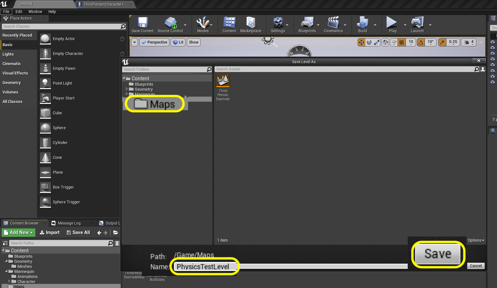

### Setting Up Holodeck

[previous](../camera-mechanics/README.md#user-content-lock-cameras-and-mechanics) • [home](../README.md#user-content-ue4-hello-world) • [next](../readme/README.md#user-content-readmemd-file)

Now we normally create a level where we test out all of our mechanics to make sure it works.  This is often refered to as a test level, gym or holodeck all representing a level that is not meant to be played by the user but is used for testing mechanics and assets for gray blocking. We will use this to understand the scale of the objects we need to build to match the mechanics.

 

---

##### `Step 1.`\|`SUU&G`|:small_blue_diamond:

Lets organize the content folder for our project and start a new level. Lets add a floor to the game. We have two **Meshes** (geometry) folders.  One in the **Third Person** folder and the other in the **Geometry** folder.  Lets move the meshes from **Third Person** to the **Geometry | Meshes** folder.  Then delete the **Third Person** meshes folder.  Force the delete if needed.

https://user-images.githubusercontent.com/5504953/127749234-e5e290c4-14bb-4747-9584-e946d1057300.mp4

##### `Step 2.`\|`FHIU`|:small_blue_diamond: :small_blue_diamond: 

Move the **Blueprints** and **Maps** folder from **ThirdPerson** to the root **Content** folder.  Then delete all the contents of the **Third Person** folder.

https://user-images.githubusercontent.com/5504953/127749304-1a83ba82-e484-431b-8108-dbd9a4ff5403.mp4

##### `Step 3.`\|`SUU&G`|:small_blue_diamond: :small_blue_diamond: :small_blue_diamond:

Before we start a gray block level we need to create a test level to understand how our player moves and how high and far to make jumps.  We also want to create ramps for players to run up and down.  To do this we will create a test level just meant to test physics so we can get an understanding of how the player moves.  Select the **Maps** folder and press **File | New Level**:",

##### `Step 4.`\|`SUU&G`|:small_blue_diamond: :small_blue_diamond: :small_blue_diamond: :small_blue_diamond:

Select the **Default** type of level.

##### `Step 5.`\|`SUU&G`| :small_orange_diamond:

Go to **File | Save Current** and call the level `PhysicsTestLevel` and save it to the **Maps** folder. Press the **Save** button.

##### `Step 6.`\|`SUU&G`| :small_orange_diamond: :small_blue_diamond:

##### `Step 7.`\|`SUU&G`| :small_orange_diamond: :small_blue_diamond: :small_blue_diamond:

##### `Step 8.`\|`SUU&G`| :small_orange_diamond: :small_blue_diamond: :small_blue_diamond: :small_blue_diamond:

##### `Step 9.`\|`SUU&G`| :small_orange_diamond: :small_blue_diamond: :small_blue_diamond: :small_blue_diamond: :small_blue_diamond:

##### `Step 10.`\|`SUU&G`| :large_blue_diamond:

##### `Step 11.`\|`SUU&G`| :large_blue_diamond: :small_blue_diamond: 

##### `Step 12.`\|`SUU&G`| :large_blue_diamond: :small_blue_diamond: :small_blue_diamond: 

##### `Step 13.`\|`SUU&G`| :large_blue_diamond: :small_blue_diamond: :small_blue_diamond:  :small_blue_diamond: 

##### `Step 14.`\|`SUU&G`| :large_blue_diamond: :small_blue_diamond: :small_blue_diamond: :small_blue_diamond:  :small_blue_diamond: 

##### `Step 15.`\|`SUU&G`| :large_blue_diamond: :small_orange_diamond: 

##### `Step 16.`\|`SUU&G`| :large_blue_diamond: :small_orange_diamond:   :small_blue_diamond: 

##### `Step 17.`\|`SUU&G`| :large_blue_diamond: :small_orange_diamond: :small_blue_diamond: :small_blue_diamond:

##### `Step 18.`\|`SUU&G`| :large_blue_diamond: :small_orange_diamond: :small_blue_diamond: :small_blue_diamond: :small_blue_diamond:

##### `Step 19.`\|`SUU&G`| :large_blue_diamond: :small_orange_diamond: :small_blue_diamond: :small_blue_diamond: :small_blue_diamond: :small_blue_diamond:

##### `Step 20.`\|`SUU&G`| :large_blue_diamond: :large_blue_diamond:

##### `Step 21.`\|`SUU&G`| :large_blue_diamond: :large_blue_diamond: :small_blue_diamond:

___

| [previous](../camera-mechanics/README.md#user-content-lock-cameras-and-mechanics)| [home](../README.md#user-content-ue4-hello-world) | [next](../readme/README.md#user-content-readmemd-file)|
|---|---|---|
