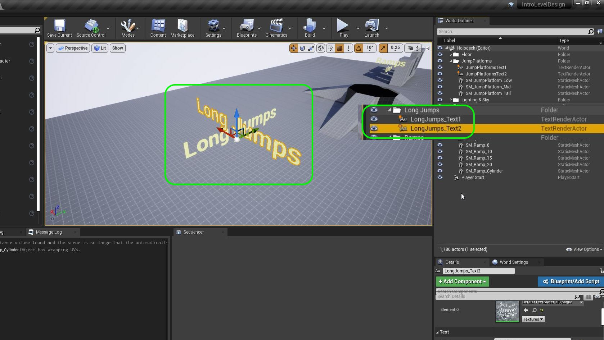
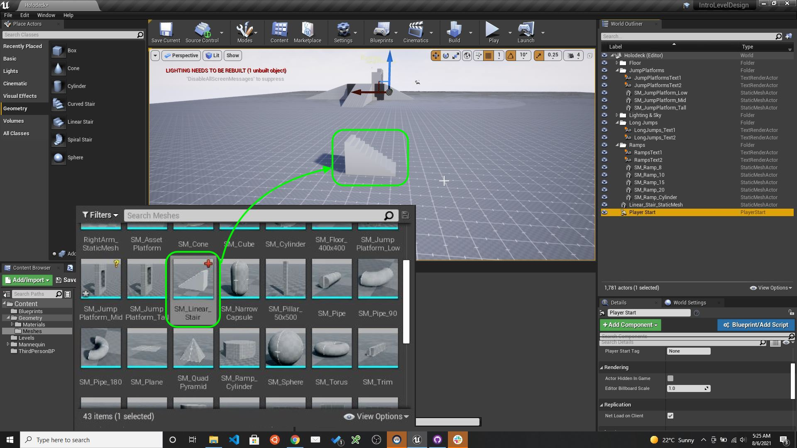
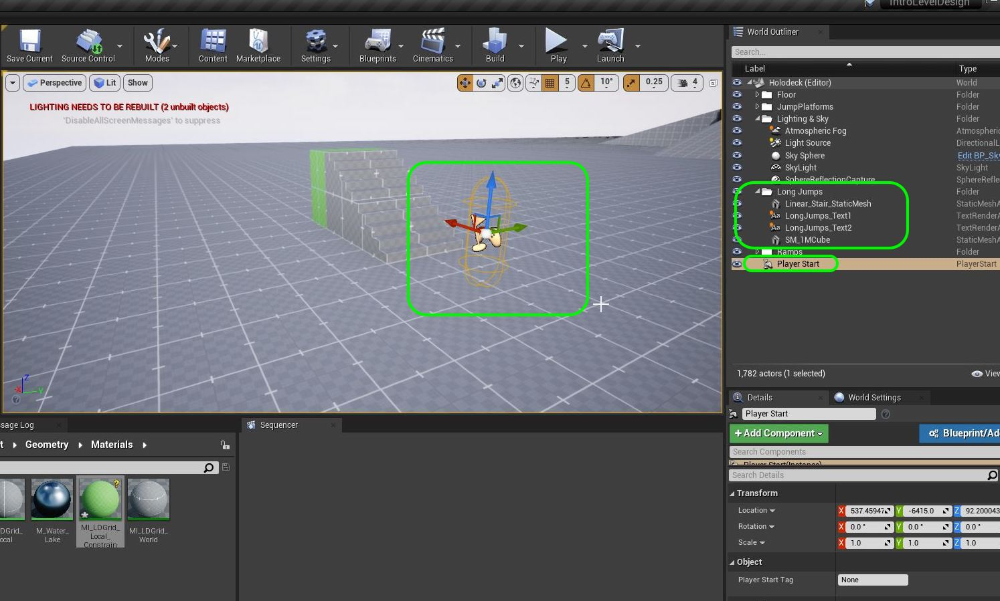

### Long Jump

[previous](../gameplay-scale/README.md#user-content-gameplay--scale-register) • [home](../README.md#user-content-ue4-intro-to-level-design) • [next](../moving-platform/README.md#user-content-moving-platform)

We also want to know how far a player can jump to overcome gaps in buildings or platforms.  How far can a player jump before they land on the ground again? We will look at standing jumps (players jumping from a confined space) and running jumps where players have room to run.  The player is only able to jump forwards so this will always be along the **X** axis locally in player space.

 

---

##### `Step 1.`\|`SUU&G`|:small_blue_diamond:

Lets move to an empty side of the level where you will put the platforms. Duplicate a new title on top of that area and call it `Long Jumps`. Create a new folder called `Jump Ramps` in the **World Outliner** and move the text into it. Rename the text appropriately to `Long Jumps`.

##### `Step 2.`\|`FHIU`|:small_blue_diamond: :small_blue_diamond: 

For a change lets add a staircase instead of a ramp to run onto a flat ramp to jump over.  Add a **Geometry | Meshes | LinearStair_StaticMesh** to the level. Change the name to `SM_LinearStair` to be consistent with the other static meshes naming convention.

##### `Step 3.`\|`SUU&G`|:small_blue_diamond: :small_blue_diamond: :small_blue_diamond:

Rename **1M_Cube** to `SM_1MCube1`. Drag a coyp onto the level.  Now press the <kbd>end</kbd> key to snap the cube to the ground and move it to the back of the staircase.  This looks like it is 2 meters tall by wide.  Go to the **World Outliner** and change the **Scale Z | Y** to `2.0`.  Go to the **Top** and **Side** views and line up the piece perfectly.  Drop the `M_LDGrid_Local` onto the staircase and this cube.  

https://user-images.githubusercontent.com/5504953/128513155-1f7aed10-a90e-4c53-8962-a151cd825e4e.mp4

##### `Step 4.`\|`SUU&G`|:small_blue_diamond: :small_blue_diamond: :small_blue_diamond: :small_blue_diamond:
Lets make a change to the material. Lets color code it to warn the person playing it that there is a specific meaning to this area.  We can use the color green to indicate that the player will be constrained from running in some way.  Maybe there will be a cut scene and when they get to the top of the stairs that the exit will be blocked and all they can do is a standing jump.

Now in gray blocking we can't implement all the mechanics of the level as we are just trying to get a sense of the space.  So we can create materials that indicate **beats** we want.

We will use a material instance to alter the color of the texture.  Right click on **M_LDGrid_Basae** and select `Create Material Instance`.  This will create an **instance** of the material that we can edit certain parameters the creator of the material allows us to. rename it to `MI_LDGrid_Base_Constrain`.

Now double click the material instance and select the **Base Color** and **Line Color** for editing.  Give them both a distinct color that makes them stand out from gray.

https://user-images.githubusercontent.com/5504953/128514344-67818e4b-f304-4c90-a361-f356922ea878.mp4

##### `Step 5.`\|`SUU&G`| :small_orange_diamond:

Organize the **World Outliner** by making sure the two static meshes are in the **Long Jump** folder. Now move the **Player Start** so the red arrow faces the staircase.

##### `Step 6.`\|`SUU&G`| :small_orange_diamond: :small_blue_diamond:

Now do a standing jump while pressing forward (<kbd>up arrow</kbd> or <kbd>W</kbd>) key.  Count the number of tiles the player can cover. I believe mine covered roughly 7 meters.

**Gameplay Register**
|Element | Measure|
|-------------|-------------|
|Single Jump | 200 |
|Double Jump | 324|
|Standing Long Jump | ~700 | 

https://user-images.githubusercontent.com/5504953/128516328-995951fc-83d0-4c31-829e-cdef5918522e.mp4

##### `Step 7.`\|`SUU&G`| :small_orange_diamond: :small_blue_diamond: :small_blue_diamond:

Duplicate the stairs and the platform for the other end of the jump. Place it so that there is a 7 meter gap (7 cubes on the floor tile).

https://user-images.githubusercontent.com/5504953/128517445-057468e1-025f-4b53-bb77-4c71e3f61978.mp4

##### `Step 8.`\|`SUU&G`| :small_orange_diamond: :small_blue_diamond: :small_blue_diamond: :small_blue_diamond:

Run the game and jump.  Test the short jump ramp and make adjustments. I can clear 7 meters. too easily.

https://user-images.githubusercontent.com/5504953/128517612-ccb7673a-6a7e-4946-a36b-67f3e58eb24f.mp4

##### `Step 9.`\|`SUU&G`| :small_orange_diamond: :small_blue_diamond: :small_blue_diamond: :small_blue_diamond: :small_blue_diamond:

Make the necessary adjustments. In my case I am happy with an 8 meter gap (800 uu).

**Gameplay Register**
|Element | Measure|
|-------------|-------------|
|Single Jump | 200 |
|Double Jump | 324|
|Standing Long Jump | 800 | 

https://user-images.githubusercontent.com/5504953/128518129-dec0b276-9338-46dd-a7b3-8ee178c52de3.mp4

##### `Step 10.`\|`SUU&G`| :large_blue_diamond:

Your world outliner should have all ramp objects in the **Jump Ramps** folder names appropriately. Duplicate it to have a copy as a starting point for the next ramp.

Select all brushes for the ramp and create a **Static Mesh** called `SM_LongJump_Standing`. Fix any rendering Selissues or collision issues. Change **Collision Complexity** to `Use Complex As Simple` and adjust the **Light Map Coordinate Index** to `1`, and **Light Map Resolution** to `256`.

##### `Step 11.`\|`SUU&G`| :large_blue_diamond: :small_blue_diamond: 

Take the copy of standing jump ramps and lets make a medium jump.  You should not be able to make this from a standing jump but should be a relatively easy running jump.  Run along the ground and get a good running jump distance. Adjust the distance, update the name of the objects and the jump distance text.

**Gameplay Register**
|Element | Measure|
|-------------|-------------|
|Single Jump | 200 |
|Double Jump | 324|
|Standing Long Jump | 645 | 
|Running Long Single Jump | ~900 |

##### `Step 12.`\|`SUU&G`| :large_blue_diamond: :small_blue_diamond: :small_blue_diamond: 

Make a third jump where you can't make it with a single running jump but need to double jump.  Should be easy to make. Adjust the distance, update the name of the objects and the jump distance text.

**Gameplay Register**
|Element | Measure|
|-------------|-------------|
|Single Jump | 200 |
|Double Jump | 324|
|Standing Long Jump | 645 | 
|Running Long Single Jump | ~900 |
| Running Long Double Jump | ~ 1300 | 

##### `Step 13.`\|`SUU&G`| :large_blue_diamond: :small_blue_diamond: :small_blue_diamond:  :small_blue_diamond: 

Add to GitHub by checking in changes in Unreal and pushing to the server in **GitHub Desktop**.

##### `Step 14.`\|`SUU&G`| :large_blue_diamond: :small_blue_diamond: :small_blue_diamond: :small_blue_diamond:  :small_blue_diamond: 

##### `Step 15.`\|`SUU&G`| :large_blue_diamond: :small_orange_diamond: 

##### `Step 16.`\|`SUU&G`| :large_blue_diamond: :small_orange_diamond:   :small_blue_diamond: 

##### `Step 17.`\|`SUU&G`| :large_blue_diamond: :small_orange_diamond: :small_blue_diamond: :small_blue_diamond:

##### `Step 18.`\|`SUU&G`| :large_blue_diamond: :small_orange_diamond: :small_blue_diamond: :small_blue_diamond: :small_blue_diamond:

##### `Step 19.`\|`SUU&G`| :large_blue_diamond: :small_orange_diamond: :small_blue_diamond: :small_blue_diamond: :small_blue_diamond: :small_blue_diamond:

##### `Step 20.`\|`SUU&G`| :large_blue_diamond: :large_blue_diamond:

##### `Step 21.`\|`SUU&G`| :large_blue_diamond: :large_blue_diamond: :small_blue_diamond:

___

| [previous](../gameplay-scale/README.md#user-content-gameplay--scale-register)| [home](../README.md#user-content-ue4-intro-to-level-design) | [next](../moving-platform/README.md#user-content-moving-platform)|
|---|---|---|
