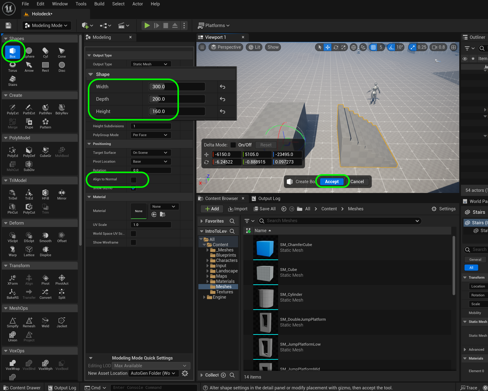

### Long Jump

[previous](../gameplay-scale/README.md#user-content-gameplay--scale-register) • [home](../README.md#user-content-ue4-intro-to-level-design) • [next](../moving-platform/README.md#user-content-moving-platform)

We also want to know how far a player can jump to overcome gaps in buildings or platforms.  How far can a player jump before they land on the ground again? We will look at standing jumps (players jumping from a confined space) and running jumps where players have room to run.  The player is only able to jump forwards so this will always be along the **X** axis locally in player space.

 

---

##### `Step 1.`\|`UE5LD`|:small_blue_diamond:

Lets move to an empty side of the level where you will put the platforms. Duplicate a new title on top of that area and call it `Long Jumps`. Create a new folder called `Jump Ramps` in the **World Outliner** and move the text into it. Rename the text appropriately to `Long Jump Title` and `Long Jump Title2` .

##### `Step 2.`\|`UE5LD`|:small_blue_diamond: :small_blue_diamond: 

For a change lets add a staircase instead of a ramp to run onto a flat ramp to jump over for a long jump.  Enter into **Modeling Mode** and select the **Shapes | Stairs**.  Now adjust the **Width** to be 3 meters wide by setting it to `300` cm.  Now the height will be 8 steps of `20`cm which will be 1.6 meters high. Now make sure you zero out the **Rotations** so they are set to `0`, `0`, `0`. Press the <kbd>Complete</kbd> button.

##### `Step 3.`\|`UE5LD`|:small_blue_diamond: :small_blue_diamond: :small_blue_diamond:

Now lets add a ramp after the to top of stairs so you can get a running jump.  Now add a **Shape | Box** that is a **Width** of `300`, **Depth** of `200` and **Height** of `160`.  Now make sure you zero out the **Rotations** so they are set to `0`, `0`, `0`. Press the <kbd>Complete</kbd> button.

##### `Step 4.`\|`UE5LD`|:small_blue_diamond: :small_blue_diamond: :small_blue_diamond: :small_blue_diamond:

Align the stairs and ramp. In your top down and side/front views make sure they all line up so that the edges are perfectly aligned as if it is one shape. 

##### `Step 5.`\|`UE5LD`| :small_orange_diamond:

In **Modeling Mode** select both the stairs and the ramps.  Select **Mesh Ops | Merge**.  Keep the default settngs.  Notice that it will remove the original two pieces which is what we want, we just need the merged shape.  Now make sure you zero out the **Rotations** so they are set to `0`, `0`, `0`. Press the <kbd>Complete</kbd> button.

##### `Step 6.`\|`UE5LD`| :small_orange_diamond: :small_blue_diamond:

Now select the new merged shape back in **Select Mode**.  Right click and choose **Browse to Asset**. In my case I had some failed attempts so I **Deleted** them.  I then renamed the new mesh to `SM_LongJump` and moved it to the **Meshes** folder.

##### `Step 7.`\|`UE5LD`| :small_orange_diamond: :small_blue_diamond: :small_blue_diamond:

Now make sure the end of the platform matches a line marker on the ground.  We want to count the length in meters a player can jump.  Also rename the object to `LongJump1_Short` and place it in the **Long Jumps** folder in the **World Outliner**.

##### `Step 8.`\|`UE5LD`| :small_orange_diamond: :small_blue_diamond: :small_blue_diamond: :small_blue_diamond:

Now lets move the **Player Start** actor in front of the jump platform so it is facing dead on so we can make a jump.

##### `Step 9.`\|`UE5LD`| :small_orange_diamond: :small_blue_diamond: :small_blue_diamond: :small_blue_diamond: :small_blue_diamond:

Now do a standing jump while pressing forward (<kbd>up arrow</kbd> or <kbd>W</kbd>) key.  Count the number of tiles the player can cover. My player covered roughly 8 meters.

**Gameplay Register**
|Element | Measure|
|-------------|-------------|
|Single Jump | 200 |
|Double Jump | 324|
|Standing Long Jump | ~800 | 

##### `Step 10.`\|`UE5LD`| :large_blue_diamond:

Duplicate the stairs and the platform for the other end of the jump. Place it so that there is a 7 meter gap (7 cubes on the floor tile).

https://user-images.githubusercontent.com/5504953/128517445-057468e1-025f-4b53-bb77-4c71e3f61978.mp4

Run the game and jump.  Test the short jump ramp and make adjustments. I can clear 7 meters. too easily.

https://user-images.githubusercontent.com/5504953/128517612-ccb7673a-6a7e-4946-a36b-67f3e58eb24f.mp4

Make the necessary adjustments. In my case I am happy with an 8 meter gap (800 uu).

**Gameplay Register**
|Element | Measure|
|-------------|-------------|
|Single Jump | 200 |
|Double Jump | 324|
|Standing Long Jump | ~800 | 

https://user-images.githubusercontent.com/5504953/128518129-dec0b276-9338-46dd-a7b3-8ee178c52de3.mp4

Your world outliner should have all ramp objects in the **Jump Ramps** folder names appropriately. 

Duplicate it to have a copy as a starting point for the next ramp. Take the copy of standing jump ramps and lets make a running single jump.  Add another cube with 3 meters to run along before jumping.

You should not be able to make this from a standing jump but should be able to jump with a single running jump (no double jumping).  Run along the ground and get a good running jump distance. Adjust the distance, update the name of the objects and the jump distance text.

Mine ended up being 1100 uu's to make a good single jump distance that you can't make with a standing jump.

**Gameplay Register**
|Element | Measure|
|-------------|-------------|
|Single Jump | 200 |
|Double Jump | 324|
|Standing Long Jump | 1100 | 

https://user-images.githubusercontent.com/5504953/128521104-ff058a28-390d-46d5-9374-c3c3107736f5.mp4

##### `Step 11.`\|`UE5LD`| :large_blue_diamond: :small_blue_diamond: 

Repeat this entire process for a long double jump.  I made the running ramp 6 meters long.  After some trial and error I settled on a 16 meter gap.  This required a very well timed double jump.

**Gameplay Register**
|Element | Measure|
|-------------|-------------|
|Single Jump Height | 200 |
|Double Jump Height | 324|
|Standing Long Jump | 645 | 
|Running Long Single Jump | 1600 |

https://user-images.githubusercontent.com/5504953/128525326-18904bf6-4afb-4f3b-9ee9-5025605cc806.mp4

##### `Step 12.`\|`UE5LD`| :large_blue_diamond: :small_blue_diamond: :small_blue_diamond: 

Add to GitHub by checking in changes in Unreal and pushing to the server in **GitHub Desktop**.

___

| [previous](../gameplay-scale/README.md#user-content-gameplay--scale-register)| [home](../README.md#user-content-ue4-intro-to-level-design) | [next](../moving-platform/README.md#user-content-moving-platform)|
|---|---|---|
