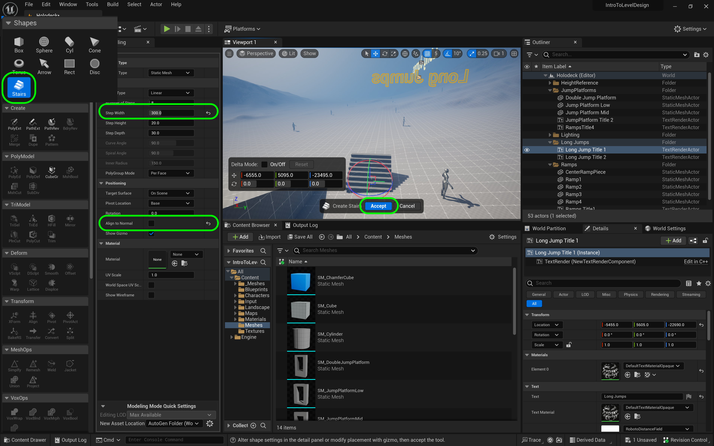
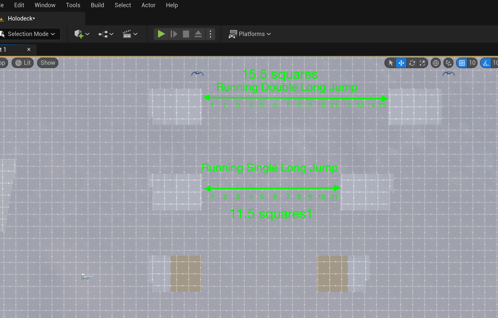

### Long Jump

[previous](../gameplay-scale/README.md#user-content-gameplay--scale-register) • [home](../README.md#user-content-ue4-intro-to-level-design) • [next](../moving-platform/README.md#user-content-moving-platform)

We also want to know how far a player can jump to overcome gaps in buildings or platforms.  How far can a player jump before they land on the ground again? We will look at standing jumps (players jumping from a confined space) and running jumps where players have room to run.  The player is only able to jump forwards so this will always be along the **X** axis locally in player space.

 

---

##### `Step 1.`\|`UE5LD`|:small_blue_diamond:

Lets move to an empty side of the level where you will put the platforms. Duplicate a new title on top of that area and call it `Long Jumps`. Create a new folder called `Jump Ramps` in the **World Outliner** and move the text into it. Rename the text appropriately to `Long Jump Title` and `Long Jump Title2` . Change the **Text** in those titles to `Long Jumps`.

##### `Step 2.`\|`UE5LD`|:small_blue_diamond: :small_blue_diamond: 

For a change lets add a staircase instead of a ramp to run onto a flat ramp to jump over for a long jump.  Enter into **Modeling Mode** and select the **Shapes | Stairs**.  Now adjust the **Width** to be 3 meters wide by setting it to `300` cm.  Now the height will be 8 steps of `20`cm which will be 1.6 meters high. Set **Align to Normal** to `false`. Press the <kbd>Accept</kbd> button.

##### `Step 3.`\|`UE5LD`|:small_blue_diamond: :small_blue_diamond: :small_blue_diamond:

Now lets add a ramp after the to top of stairs so you can get a running jump.  Now add a **Shape | Box** that is a **Width** of `300`, **Depth** of `200` and **Height** of `160`. Set **Align to Normal** to `false`. Press the <kbd>Accept</kbd> button.

##### `Step 4.`\|`UE5LD`|:small_blue_diamond: :small_blue_diamond: :small_blue_diamond: :small_blue_diamond:

Align the stairs and ramp. In your top down and side/front views make sure they all line up so that the edges are perfectly aligned as if it is one shape. 

##### `Step 5.`\|`UE5LD`| :small_orange_diamond:

In **Modeling Mode** select both the stairs and the ramps.  Select **Create | Merge**.  Keep the default settings.  Notice that it will remove the original two pieces which is what we want, we just need the merged shape.  Now make sure you zero out the **Rotations** so they are set to `0`, `0`, `0`. Press the <kbd>Accept</kbd> button.

##### `Step 6.`\|`UE5LD`| :small_orange_diamond: :small_blue_diamond:

Now select the new merged shape back in **Select Mode**.  Right click and choose **Browse to Asset**. In my case I had some failed attempts so I **Deleted** them.  I then renamed the new mesh to `SM_LongJump` and moved it to the **Meshes** folder.

##### `Step 7.`\|`UE5LD`| :small_orange_diamond: :small_blue_diamond: :small_blue_diamond:

Assign `M_LDGrid_Local` material on the jump platform so we can measure the length of it and see it in scale.  

##### `Step 8.`\|`UE5LD`| :small_orange_diamond: :small_blue_diamond: :small_blue_diamond: :small_blue_diamond:

Now make sure the end of the platform matches a line marker on the ground.  We want to count the length in meters a player can jump.  Also rename the object to `LongJump1_Short` and place it in the **Long Jumps** folder in the **World Outliner**.

##### `Step 9.`\|`UE5LD`| :small_orange_diamond: :small_blue_diamond: :small_blue_diamond: :small_blue_diamond: :small_blue_diamond:

Now lets move the **Player Start** actor in front of the jump platform so it is facing dead on so we can make a jump.

##### `Step 10.`\|`UE5LD`| :large_blue_diamond:

Now do a standing jump while pressing forward (<kbd>up arrow</kbd> or <kbd>W</kbd>) key.  Count the number of tiles the player can cover. My player covered roughly 9.5 meters. (The video below shows 8, but the physics have changed in the engine).

**Gameplay Register**
|Element | Measure|
|-------------|-------------|
|Single Jump | 200 |
|Double Jump | 324|
|Standing Long Jump | ~950 | 

https://user-images.githubusercontent.com/5504953/182170440-a4f2a526-232c-45a9-9ce0-9ea74f5cb894.mp4

##### `Step 11.`\|`UE5LD`| :large_blue_diamond: :small_blue_diamond: 

Duplicate the stairs and the platform for the other end of the jump and rotate it 180°. Place it the distance that your player jumps in a single leap. It is easiest to do the placment from the **Top** view. This time mine was 9.5 units (last time when I recorded the above video it was 8). Rename the meshes in the **World Outliner** to match what they are, a short jump.

##### `Step 12.`\|`UE5LD`| :large_blue_diamond: :small_blue_diamond: :small_blue_diamond: 

Run the game and jump.  Test the short jump ramp and make adjustments. I can just clear 9.5 meters perfectly from a standing jump.

https://user-images.githubusercontent.com/5504953/182174672-d14dcdab-427a-44ec-ba3a-e8b7be0e6080.mp4

##### `Step 13.`\|`UE5LD`| :large_blue_diamond: :small_blue_diamond: :small_blue_diamond:  :small_blue_diamond: 

Now on your own calculate a running single jump and running double jump.  I ran up the stairs and jumped as late as possible. In my version I get 11.5 for the single jump and 15.5 in the double jump.

Update the gameplay register.

**Gameplay Register**
|Element | Measure|
|-------------|-------------|
|Single Jump | 200 |
|Double Jump | 324|
|Standing Long Jump | ~800 | 
|Running Single Jump | ~1150 | 
|Running Double Jump | ~1550 | 

##### `Step 14.`\|`UE5LD`| :large_blue_diamond: :small_blue_diamond: :small_blue_diamond: :small_blue_diamond:  :small_blue_diamond: 

Now press the <kbd>Play</kbd> button  and make sure you are happy with the distances.  Tweak them nearer or further to your liking and upcate the **Gameplay Register** accordingly. After some trial and error I adjusted my platform lengths and register to:

**Gameplay Register**
|Element | Measure|
|-------------|-------------|
|Single Jump | 200 |
|Double Jump | 324|
|Standing Long Jump | ~800 | 
|Running Single Jump | ~1000 | 
|Running Double Jump | ~1400 | 

https://user-images.githubusercontent.com/5504953/182212400-91eb85e5-945f-4a97-9e92-1a02a3289874.mp4

##### `Step 15.`\|`UE5LD`| :large_blue_diamond: :small_orange_diamond: 

Select the **File | Save All** then press the <kbd>Source Control</kbd> button and select **Submit Content...**. Update the **Changelist Description** message and with the latest changes. Make sure all the files are correct and press the <kbd>Submit</kbd> button. A confirmation will pop up on the bottom right with a message about a changelist was submitted with a commit number.

##### `Step 16.`\|`UE5LD`| :large_blue_diamond: :small_orange_diamond:   :small_blue_diamond: 

Sometimes not all files get submitted to Unreal especially for files that don't show up in the editor.  It is good practice one you submit in **Unreal** and quit the game to right click on the top most project folder and select **Reconcile Offline Work...**.

This will either give a message saying ther is nothing to reconcile or bring up a tab.  Make sure that these are **NOT** files in the **Intermediate** and **Saved** folders as these should be ignored from the `.p4ignore`.

If the files are in **Content** or **Configuration** then press the <kbd>Reconcile</kbd> button.  Then submit the changes with a message and press the <kbd>Submit</kbd> button.

<!--  -->

| [previous](../gameplay-scale/README.md#user-content-gameplay--scale-register)| [home](../README.md#user-content-ue4-intro-to-level-design) | [next](../moving-platform/README.md#user-content-moving-platform)|
|---|---|---|
