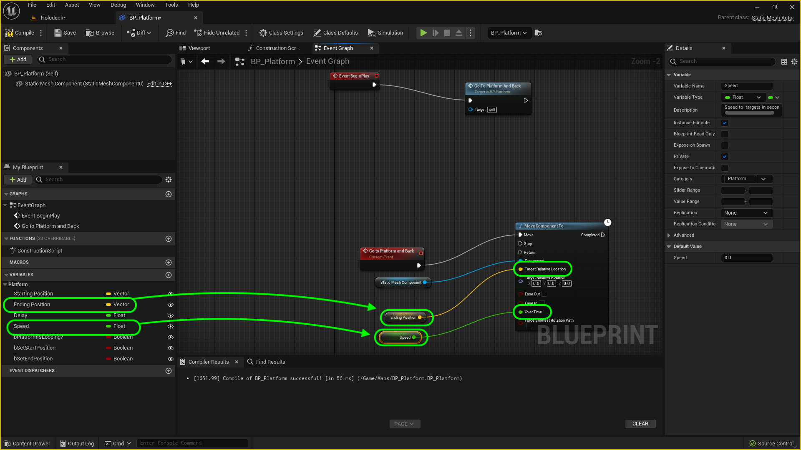

### Moving Platform II

[previous](../moving-platform/README.md#user-content-moving-platform) • [home](../README.md#user-content-ue4-hello-world)

Lets finish up the moving platform so it can go from beginning to end and back.

 

---

##### `Step 1.`\|`UE5LD`|:small_blue_diamond:

Drag a reference to **bSertEndPosition** to the graph and select **Get**.  Right click on the open graph and select another **Branch** node.  Send the output execution pin from the first **Branch Node | False** to the second **Branch Node** input.  This means that if you are not pushing the **Set Starting Position** variable maybe you are pushing the **Set Ending Position**.  Then attach the red output pin of **Set End Position** to the **Branch | Condition** pin.

##### `Step 2.`\|`UE5LD`|:small_blue_diamond: :small_blue_diamond: 

Drag a **Set End Position** node to the graph and select **Set**.  Leave it as `false` (the box right next to the text).  Connect the execuation pin to the **Branch | True** output.  Drag a **Set Ending Position** node and connect it to the output of the previous **Set** node.  Connect the **Return Value** from the **Get Actor Node** to the **Ending Position** pin.

##### `Step 3.`\|`UE5LD`|:small_blue_diamond: :small_blue_diamond: :small_blue_diamond:

We need to add a new event that sends the platform to one location to another. Click on the **Event Graph** tab where we will put the logic to move the platform. .  Right click on the empty graph and lets add a **Add Custom Event** node. Name this event: `Go to Location and Back`. This will be the event that moves the platform back and forth depending on the settings.

##### `Step 4.`\|`UE5LD`|:small_blue_diamond: :small_blue_diamond: :small_blue_diamond: :small_blue_diamond:

We will call the custom event as soon as the game starts.  This is accomplished throught the **Begin Play** event that runs only one time when the game is started.

Remove the **Event Tick** and **Event ActorBeginOverlap** event nodes as we will not use these. Go to **Begin Play** and pull off of the execution pin and call the above custom event  by adding a node to trigger the event we just created **Go to Location and Back**.  This will run this function when you press the **Play** button.  It will run the **Event Begin Play** execution node once.

##### `Step 5.`\|`UE5LD`| :small_orange_diamond:

Right click on the open graph next to the custom event and add a **Move Component To** node.  Connect the execution pin to the **Go to Platform and Back** custom event execution pin.  Drag a reference of the **Static Mesh** component to the graph and attach it to the **Component** node.  This will move the platform mesh in this actor.

##### `Step 6.`\|`UE5LD`| :small_orange_diamond: :small_blue_diamond:

Add a **Get Ending Position** node and put it into the **Target Relative Location** pin.  Connect the output of the **Ending Position** pin to the **Target Relative Location** in the **Move Component To** node.

Add a **Get Speed** node and connect it to the **Over Time** pin in the **Move Component To** node. 

##### `Step 7.`\|`UE5LD`| :small_orange_diamond: :small_blue_diamond: :small_blue_diamond:

Right click on the empty graph and add a **Get Actor Rotation** node. Connect the output of the **Get Actor Rotation** it to the **Target Relative Rotation** node.

##### `Step 8.`\|`UE5LD`| :small_orange_diamond: :small_blue_diamond: :small_blue_diamond: :small_blue_diamond:

Now we need to make sure the platform starts the game at its starting position. In the **Event Begin Play** section add a **Set Actor Location** node.  Drag a copy of the **Get Starting Position** node and connect it to the **New Location** pin.  Now highjack the execution pin from **Event Begin Play** to **Set Actor Location** onto **Go to Platform and Back**.

##### `Step 9.`\|`UE5LD`| :small_orange_diamond: :small_blue_diamond: :small_blue_diamond: :small_blue_diamond: :small_blue_diamond:

Press **Compile** on the blueprint and make sure there are no errors. Go back to the editor and select a starting and ending point for the platform.  Set the **Speed** to `5` seconds.

##### `Step 10.`\|`UE5LD`| :large_blue_diamond:

Press the <kbd>Play</kbd> button and see the platform go from the begining to the end position.

https://user-images.githubusercontent.com/5504953/182253712-6ffb3a80-27ad-401f-8396-eb3550b8a9fc.mp4

##### `Step 11.`\|`UE5LD`| :large_blue_diamond: :small_blue_diamond: 

Now go back to **BP_Platform** to the **Custom Event** section.  Lets add a delay for the platform to start for the first time.  Right click on the open graph and add a **Delay** function node.  Then drag a **Get Delay** variable and connect the output pin the **Duration** pin on the **Delay** node.  Set the **Default** value for the **Delay** variable to `2` seconds. Highjack the execution pins from **Go to Plaform and Back** to **Delay** then to **Move Compent To**.

##### `Step 12.`\|`UE5LD`| :large_blue_diamond: :small_blue_diamond: :small_blue_diamond: 

Press the <kbd>Play</kbd> button and there a short 2 second delay before the platform goes up.

https://user-images.githubusercontent.com/5504953/182275878-8e5e5f22-9acc-40ce-9294-d3a8fed77ac2.mp4

##### `Step 13.`\|`UE5LD`| :large_blue_diamond: :small_blue_diamond: :small_blue_diamond:  :small_blue_diamond: 

##### `Step 14.`\|`UE5LD`| :large_blue_diamond: :small_blue_diamond: :small_blue_diamond: :small_blue_diamond:  :small_blue_diamond: 

##### `Step 15.`\|`UE5LD`| :large_blue_diamond: :small_orange_diamond: 

##### `Step 16.`\|`UE5LD`| :large_blue_diamond: :small_orange_diamond:   :small_blue_diamond: 

##### `Step 17.`\|`UE5LD`| :large_blue_diamond: :small_orange_diamond: :small_blue_diamond: :small_blue_diamond:

##### `Step 18.`\|`UE5LD`| :large_blue_diamond: :small_orange_diamond: :small_blue_diamond: :small_blue_diamond: :small_blue_diamond:

##### `Step 19.`\|`UE5LD`| :large_blue_diamond: :small_orange_diamond: :small_blue_diamond: :small_blue_diamond: :small_blue_diamond: :small_blue_diamond:

##### `Step 20.`\|`UE5LD`| :large_blue_diamond: :large_blue_diamond:

##### `Step 21.`\|`UE5LD`| :large_blue_diamond: :large_blue_diamond: :small_blue_diamond:

https://user-images.githubusercontent.com/5504953/128609875-8979cd30-77ea-4438-a33e-42ca8c8dd6e7.mp4

Add comment `Move Component` to the work done in the blueprint.

Now the actors default to being **Static**. This actor **will not** move.  This means that when you build lighting Unreal bakes in the actor's shadows because it will not move it through physics or through code.  We will be moving this platform so lets set **BP_MovingPlatform | Mobility** from **Static** to **Movable**.  Press **Build | Build Lighting Only** to make this change.

Now lets see if it works.  Set a start and end position for the animation.  Then press play.  Move the platform back to close to the start position. Notice that the platform goes right to the end position when you press play.  why?

https://user-images.githubusercontent.com/5504953/128610218-21d9ff0a-4f23-4577-af41-d7e2bb2f2cfe.mp4

Press **Compile** on the **BP_MovingPlatform** blueprint and go to the editor.  Set the begining and end positions. Now go to both begining and end and you should see the platform go to the beginning and the end. Move the platform away and you should be able to send it back. This way we can tell that if we join two parts of the level that the platform will start and end at the right spot.

https://user-images.githubusercontent.com/5504953/128610999-8d89f913-22cd-4387-bdd2-6dde403dc519.mp4

Select all the nodes that attach to **Move Component** inclusive and copy and paste them.  We will use this copy to return to the starting position from the end position.  Remove the **End Position** node and replace it with a **Get Starting Position** and plug it into the **Target Relative Location**.

Now we want to check to see if we have **Platform is Looping** set to true or not.  If true then we want the platform to go back to the begining and go to the end again.  Drag a copy of **bPlatform Is Looping** and drag off of hte pin and get a **Branch** node. Connect the execution pin from **Move to Component | Completed** that will run when the platform reaches its target to the **Branch** node.

Now we want a potential delay that gives the player time to get onto the platform.  Add a **Delay** node.  Get a **Get Delay** node to the variable we created and plug the output to the **Delay | Duration** pin.  Change the default value of the **Delay** variable to `5.0`.

Plug the output of the **Branch** node to the **Delay** node then onto the second **Move Component To** node which will move it back to the starting position after a delay.

Go to the game window and select the platform.  Make sure **Platform is Looping** is set to `true` and then run the game.  The platform should move to the end postion then back to the start.

https://user-images.githubusercontent.com/5504953/128611053-e9773924-13f8-4602-8f8e-0defe6018979.mp4

Select all the nodes that attach to **Move Component** inclusive and copy and paste them.  We will use this copy to return to the starting position from the end position.  Remove the **End Position** node and replace it with a **Get Starting Position** and plug it into the **Target Relative Location**.

Now we want to check to see if we have **Platform is Looping** set to true or not.  If true then we want the platform to go back to the begining and go to the end again.  Drag a copy of **bPlatform Is Looping** and drag off of the pin and get a **Branch** node. Connect the execution pin from **Move to Component | Completed** that will run when the platform reaches its target to the **Branch** node.

Now we want a potential delay that gives the player time to get onto the platform.  Add a **Delay** node.  Get a **Get Delay** node to the variable we created and plug the output to the **Delay | Duration** pin.  Change the default value of the **Delay** variable to `5.0`.

Plug the output of the **Branch** node to the **Delay** node then onto the second **Move Component To** node which will move it back to the starting position after a delay.

Go to the game window and select the platform.  Make sure **Platform is Looping** is set to `true` and then run the game.  The platform should move to the end postion then back to the start.

https://user-images.githubusercontent.com/5504953/128611591-6c815996-321d-4834-b828-6aad58621d8d.mp4

Now this goes to the end and back once.  We want this to loop endlessly for the entire life of the level.  We do this by adding another delay then calling our own event.  This is a recursive call that will just keep calling itself as long as the level exists.  Copy and paste the **Delay** and **Get Delay** variable nodes and put it after the second **Move Component To**.  Connect the **Completed** to the **Delay** node execution pin. Add a **Go to Location and Back** event node to call oneself. Go to the game and it should loop forever now!

https://user-images.githubusercontent.com/5504953/128611772-5d00eec6-0231-4f86-b93d-cc1469cdd0c5.mp4

Lets save our work by pressing **File | Save All**.  Press the **Source Control | Submit to Source Control** button then enter a message of what you did last.  Press the **Submit** button.  Make sure it is succesful then run **GitHub Desktop**.  Press the **Publish Origin** button.

Now you should have all the components you need to create your own level.  Create p a new level and use what you have learned her to construct a level that you can navigate around.  Take a look at what can be done within a week or so of consistent work.

| `level.design`\|`THE END`| 
| :--- |
| **That's All Folks!** Thanks for sticking around. That's it for this lesson. |

___

<!--  -->

| [previous](../moving-platform/README.md#user-content-moving-platform)| [home](../README.md#user-content-ue4-hello-world) | 
|---|---|
