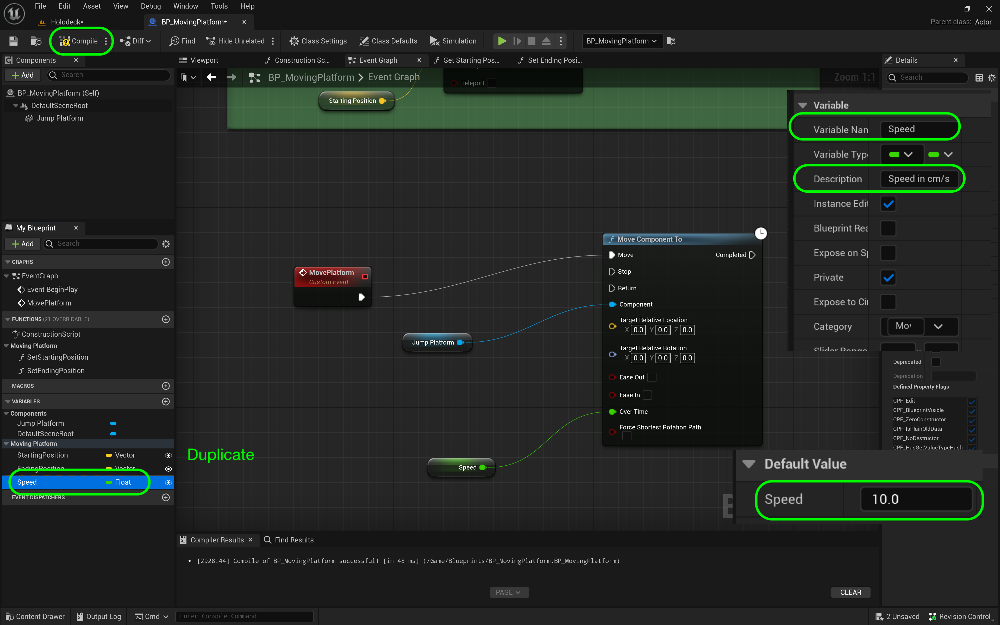

### Moving Platform II

[previous](../moving-platform/README.md#user-content-moving-platform) • [home](../README.md#user-content-ue4-hello-world)

Lets finish up the moving platform so it can go from beginning to end and back.

 

---

##### `Step 1.`\|`UE5LD`|:small_blue_diamond:

We need to add a new event that sends the platform to one location to another. Go back to the  **Event Graph** tab. *Right click* on the empty graph and lets add a **Add Custom Event** node. Name this event: `Move Platform`. This will be the event that moves the platform back and forth depending on the settings.

##### `Step 2.`\|`UE5LD`|:small_blue_diamond: :small_blue_diamond: 

We will call the custom event as soon as the game starts.  This is accomplished throught the **Begin Play** event that runs only one time when the game is started.

Remove the **Event Tick** and **Event ActorBeginOverlap** event nodes as we will not use these. Go to **Begin Play** and pull off of the execution pin and call the above custom event  by adding a node to trigger the event we just created **Move Platform**.  This will run this function when you press the **Play** button.  It will run the **Event Begin Play** execution node once which will call the **Move Platform** custom event.

##### `Step 3.`\|`UE5LD`|:small_blue_diamond: :small_blue_diamond: :small_blue_diamond:

Right click on the open graph next to the custom event and add a **Move Component To** node.  Connect the execution pin of the **Move Platform** custon event to the **Go to Platform and Back** custom event execution pin.  Drag a reference of the **Static Mesh** component to the graph and attach it to the **Component** node.  This will move the platform mesh in this actor. 

##### `Step 4.`\|`UE5LD`|:small_blue_diamond: :small_blue_diamond: :small_blue_diamond: :small_blue_diamond:

Now we need a variable to set the speed the platform moves at in seconds.  Duplicate by right clicking on the  **Delay** variable and selecting **Duplicate**. Call it `Speed` and set it to **Type** `Float`.  Change the descriptiion to `Speed in cn/s`. In Unreal one unit is a centimeter, so our platform will move in cm per second.

##### `Step 5.`\|`UE5LD`| :small_orange_diamond:

Change the name to `Speed` and adjust the tooltip to `Speed to target in seconds`. 

Now we need another function to set the end position. 

Add a third variable that will affect how long the platform waits before it leaves and returns to its two locations.  Call it `Delay` and make it type **Float**.  Set **Private** to `true`, **Instance Editable** to `true`, **Category** to `Platform` and **Description** to `Delay between targets in seconds`.

The platform will do a single trip from beginning to end, unless it is set to looping.  This will have it go and back at infinitum.  Add another Variable called `bPlatform Is Looping?` and make it **Type** `Boolean`.  Set **Instance Editable** to `true`, **Private** to `true`, **Category** to `Platform` and **Tooltip** to `Keep going from starting to ending position and back`

We will need to use a boolean to set the starting and ending location.  Duplicate the previous **Boolean** twice and call it `bSet Start Position` and `bSet End Position` and change the **Description** to `Pressing this sets the start position in world space` and `Pressing this sets the start position in world space`.

Also make sure that the **Starting Position** and **Ending Position** variables are both in the **Platform** group.

Go to the **Construction Script** tab and lets put logic to set the start and end position.  Add a **Branch** node by right clicking on the graph in an empty section and type in **Branch** in the search window.  Press **Select** and you should see a **Branch**.

The branch node takes a boolean (true or false) as an input and will run different execution pins if the value it **True** or **False**. Grab the **bSetStartPosition** boolean and select **Get**.  Drag the output of the **SetStartPosition** node to the **Condition** pin in the **Branch** node. 

Connnect the **Execution** pin from **Construction Script** to the **Branch** node.

Drag a **Set Starting Position** node and now select **Set Starting Position** and connect it to the **True** execution pin from the **Branch** node. Make sure it is set to `false` - it is hard to see but there is a tick box right next to the text in the **Set** node. 

So this means that in the game when we press the **Set Starting Positipon** that it will be false again, and next we will actually set it with the current value in the room.

Add a **Set Starting Position** as a **Set** node.  This sets the position to the current position of the actor in the room. Right click on the open graph and type **Get Actor Location**.

Connect the execution pin from **Set Start Position** to the **Set Starting Position** node.  Then connect the **Return Value** pin to the **Starting Position** pin that stores the current position this actor is in.

Press the compile button in the **Blueprint** then press the <kbd>Play</kbd> button in the level.  Move the **BP_Platform** and press the **Set Starting Position** boolean.  Notice the **Starting Positin** vector now updates with the current position of the object in the room.

https://user-images.githubusercontent.com/5504953/182248453-137c76ae-0cc9-436a-a816-6f7f34656f56.mp4

Drag a reference to **bSertEndPosition** to the graph and select **Get**.  Right click on the open graph and select another **Branch** node.  Send the output execution pin from the first **Branch Node | False** to the second **Branch Node** input.  This means that if you are not pushing the **Set Starting Position** variable maybe you are pushing the **Set Ending Position**.  Then attach the red output pin of **Set End Position** to the **Branch | Condition** pin.

##### `Step 2.`\|`UE5LD`|:small_blue_diamond: :small_blue_diamond: 

Drag a **Set End Position** node to the graph and select **Set**.  Leave it as `false` (the box right next to the text).  Connect the execuation pin to the **Branch | True** output.  Drag a **Set Ending Position** node and connect it to the output of the previous **Set** node.  Connect the **Return Value** from the **Get Actor Node** to the **Ending Position** pin.

##### `Step 3.`\|`UE5LD`|:small_blue_diamond: :small_blue_diamond: :small_blue_diamond:

##### `Step 4.`\|`UE5LD`|:small_blue_diamond: :small_blue_diamond: :small_blue_diamond: :small_blue_diamond:

##### `Step 6.`\|`UE5LD`| :small_orange_diamond: :small_blue_diamond:

Add a **Get Ending Position** node and put it into the **Target Relative Location** pin.  Connect the output of the **Ending Position** pin to the **Target Relative Location** in the **Move Component To** node.

Add a **Get Speed** node and connect it to the **Over Time** pin in the **Move Component To** node. 

##### `Step 7.`\|`UE5LD`| :small_orange_diamond: :small_blue_diamond: :small_blue_diamond:

Right click on the empty graph and add a **Get Actor Rotation** node. Connect the output of the **Get Actor Rotation** it to the **Target Relative Rotation** node.

##### `Step 8.`\|`UE5LD`| :small_orange_diamond: :small_blue_diamond: :small_blue_diamond: :small_blue_diamond:

Now we need to make sure the platform starts the game at its starting position. In the **Event Begin Play** section add a **Set Actor Location** node.  Drag a copy of the **Get Starting Position** node and connect it to the **New Location** pin.  Now highjack the execution pin from **Event Begin Play** to **Set Actor Location** onto **Go to Platform and Back**.

##### `Step 9.`\|`UE5LD`| :small_orange_diamond: :small_blue_diamond: :small_blue_diamond: :small_blue_diamond: :small_blue_diamond:

Press **Compile** on the blueprint and make sure there are no errors. Go back to the editor and select a starting and ending point for the platform.  Set the **Speed** to `5` seconds.

##### `Step 10.`\|`UE5LD`| :large_blue_diamond:

Press the <kbd>Play</kbd> button and see the platform go from the begining to the end position.

https://user-images.githubusercontent.com/5504953/182253712-6ffb3a80-27ad-401f-8396-eb3550b8a9fc.mp4

##### `Step 11.`\|`UE5LD`| :large_blue_diamond: :small_blue_diamond: 

Now go back to **BP_Platform** to the **Custom Event** section.  Lets add a delay for the platform to start for the first time.  Right click on the open graph and add a **Delay** function node.  Then drag a **Get Delay** variable and connect the output pin the **Duration** pin on the **Delay** node.  Set the **Default** value for the **Delay** variable to `2` seconds. Highjack the execution pins from **Go to Plaform and Back** to **Delay** then to **Move Compent To**.

##### `Step 12.`\|`UE5LD`| :large_blue_diamond: :small_blue_diamond: :small_blue_diamond: 

Press the <kbd>Play</kbd> button and there a short 2 second delay before the platform goes up.

https://user-images.githubusercontent.com/5504953/182275878-8e5e5f22-9acc-40ce-9294-d3a8fed77ac2.mp4

##### `Step 13.`\|`UE5LD`| :large_blue_diamond: :small_blue_diamond: :small_blue_diamond:  :small_blue_diamond: 

Now we need to go back and forth if looping is turned on.  Drag a **Get Platform is Looping** onto the graph.  Drag the output pin and select a **Branch** node.  Connect the execution pin from **Move Component To** to the **Branch** node.

##### `Step 14.`\|`UE5LD`| :large_blue_diamond: :small_blue_diamond: :small_blue_diamond: :small_blue_diamond:  :small_blue_diamond: 

Now copy and paste all the nodes attached to **Move Components To** and the **Delay** nodes and paset them after the **Branch** node added above.  Connect the execution pin from the **Branch** node to the **Delay** node.

##### `Step 15.`\|`UE5LD`| :large_blue_diamond: :small_orange_diamond: 

Now delete the **Ending Position** node and replace it with a **Get Starting Position**.  We want the platform to go from the end back to the begining. Attach it to **Target Relative Location**.

##### `Step 16.`\|`UE5LD`| :large_blue_diamond: :small_orange_diamond:   :small_blue_diamond: 

Go back to the editor and select **BP_Platform**.  Set **Platform is Looping?** to `true`.

##### `Step 17.`\|`UE5LD`| :large_blue_diamond: :small_orange_diamond: :small_blue_diamond: :small_blue_diamond:

Press the <kbd>Play</kbd> button and now the platform goes to its destination and back. But it doesn't loop it stops there.

https://user-images.githubusercontent.com/5504953/182278019-9e2b0096-bd62-4972-9c5b-94fe877d12f8.mp4

##### `Step 18.`\|`UE5LD`| :large_blue_diamond: :small_orange_diamond: :small_blue_diamond: :small_blue_diamond: :small_blue_diamond:

Now we need to loop, so all we need to do is recurse this custom event.  We add a **Get Delay** variable and a **Delay** function node. Attach the execution pin from the **Move Component To | Completed** node to the **Delay Node**.  Add a call back to **Go to Plaform and Back** custom event and attach the execution pin.

##### `Step 19.`\|`UE5LD`| :large_blue_diamond: :small_orange_diamond: :small_blue_diamond: :small_blue_diamond: :small_blue_diamond: :small_blue_diamond:

Press the <kbd>Play</kbd> button and now we have the final functionality of the platform as it loops endlessly.  We will end it here for this walk through.  Now go build a diller platforming level!

https://user-images.githubusercontent.com/5504953/182279129-bc0f98b6-85ca-4ad1-8b01-715f6ce35007.mp4

##### `Step 20.`\|`UE5LD`| :large_blue_diamond: :large_blue_diamond:

Select the **File | Save All** then press the <kbd>Source Control</kbd> button and select **Submit Content**.  If you are prompted, select **Check Out** for all items that are not checked out of source control. Update the **Changelist Description** message and with the latest changes. Make sure all the files are correct and press the <kbd>Submit</kbd> button. A confirmation will pop up on the bottom right with a message about a changelist was submitted with a commit number.

| `level.design`\|`THE END`| 
| :--- |
| **That's All Folks!** Thanks for sticking around. That's it for this lesson. |

___

<!--  -->

| [previous](../moving-platform/README.md#user-content-moving-platform)| [home](../README.md#user-content-ue4-hello-world) | 
|---|---|
