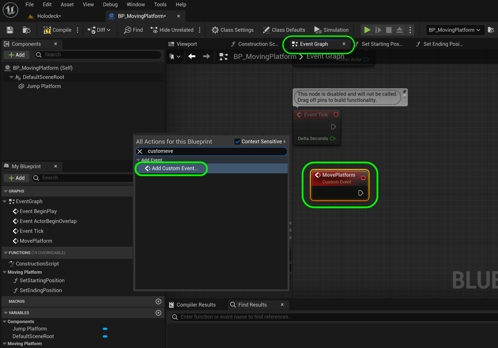
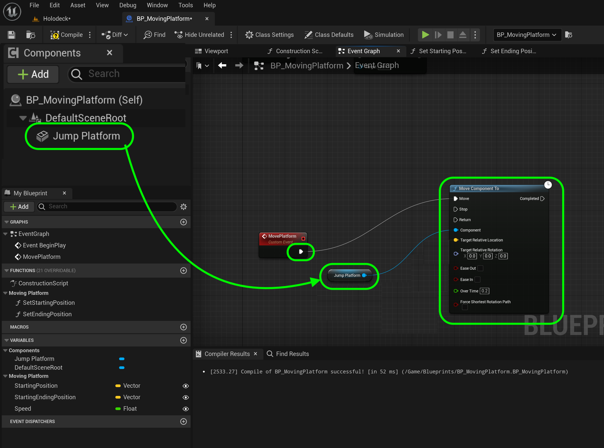
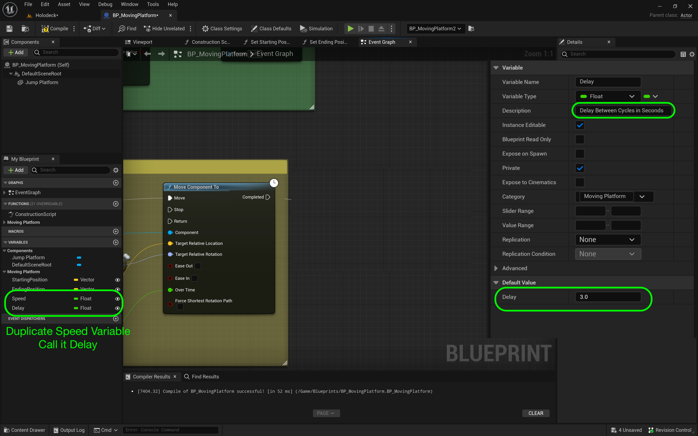
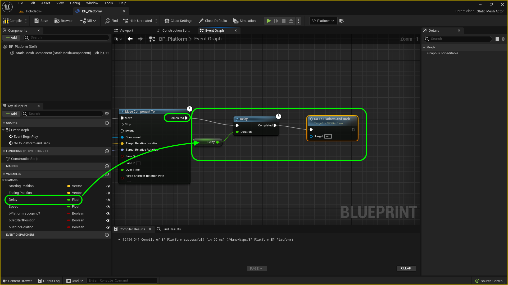

### Moving Platform II

[previous](../moving-platform/README.md#user-content-moving-platform) • [home](../README.md#user-content-ue4-hello-world)

Lets finish up the moving platform so it can go from beginning to end and back.

 

---

##### `Step 1.`\|`UE5LD`|:small_blue_diamond:

We need to add a new event that sends the platform to one location to another. Go back to the  **Event Graph** tab. *Right click* on the empty graph and lets add a **Add Custom Event** node. Name this event: `Move Platform`. This will be the event that moves the platform back and forth depending on the settings.

##### `Step 2.`\|`UE5LD`|:small_blue_diamond: :small_blue_diamond: 

We will call the custom event as soon as the game starts.  This is accomplished throught the **Begin Play** event that runs only one time when the game is started.

Remove the **Event Tick** and **Event ActorBeginOverlap** event nodes as we will not use these. Go to **Begin Play** and pull off of the execution pin and call the above custom event  by adding a node to trigger the event we just created **Move Platform**.  This will run this function when you press the **Play** button.  It will run the **Event Begin Play** execution node once which will call the **Move Platform** custom event.

##### `Step 3.`\|`UE5LD`|:small_blue_diamond: :small_blue_diamond: :small_blue_diamond:

Right click on the open graph next to the custom event and add a **Move Component To** node.  Connect the execution pin of the **Move Platform** custon event to the **Go to Platform and Back** custom event execution pin.  Drag a reference of the **Static Mesh** component to the graph and attach it to the **Component** node.  This will move the platform mesh in this actor. 

##### `Step 4.`\|`UE5LD`|:small_blue_diamond: :small_blue_diamond: :small_blue_diamond: :small_blue_diamond:

Now we need a variable to set the speed the platform moves at in seconds.  Duplicate by right clicking on the  **EndingPosition** variable and selecting **Duplicate**. Call it `Speed` and set it to **Type** `Float` (a single fractional number).  Change the descriptiion to `Speed in cm/s`. In Unreal one unit is a centimeter, so our platform will move in cm per second.

##### `Step 5.`\|`UE5LD`| :small_orange_diamond:

Now our locations in the game are in world space.  Our **Move Component To** node is looking for a *Target Relative Location*.  It is beyond the scope of this walk through to get into the conversion but it is quite simple vector arithmetic.

Drag a **Get Ending Positoin** and **Get Starting Position** getter for the two vector variables.  Add a **Subtraction (-)** node and subtract the starting position from the ending position.  Connect the output of this subtraction to the **Move Component To | Target Relative Location** pin.

##### `Step 6.`\|`UE5LD`| :small_orange_diamond: :small_blue_diamond:

Select all the nodes connected to **Move Platform** then press the <kbd>C</kbd> key to add a comment around the nodes.  Add a comment at the top `Move Platform From Starting to End Platforms`.  Press the color picker and give the comment box a translucent color.  This will allow you to drag the comment box and all the nodes will move with it making it easier to keep a clean node chart.

https://github.com/maubanel/UE5-Level-Design/assets/5504953/304d0380-f4a6-4960-ad67-b8c71f5ce070

##### `Step 7.`\|`UE5LD`| :small_orange_diamond: :small_blue_diamond: :small_blue_diamond:

Now we want the platform to start at the begining of when the game is started. So drag a **Get | Starting Position** and right click and add a **Set Actor Location** node.  Connect the output of the **Starting Position** pin and attach it to the **Set Actor Location | New Location** node.  Highjack the execution pins to put it before we call **Move Platform**. This ensures that the actor's component is actually in its starting position.

##### `Step 8.`\|`UE5LD`| :small_orange_diamond: :small_blue_diamond: :small_blue_diamond: :small_blue_diamond:

Now select all the nodes around **Begin Play** and press the <kbd>C</kbd> key.  Add a title at the top `Resets Platform's Starting Location then Starts Moving`.  If it doesn't animate at all check to see that your **StartingPosition** and **EndingPosition** are correct. 

##### `Step 9.`\|`UE5LD`| :small_orange_diamond: :small_blue_diamond: :small_blue_diamond: :small_blue_diamond: :small_blue_diamond:

Now we don't want the static mesh to rotate if you did rotate it inside the blueprint component.  We would want it to stay at it's local relative rotation. Pull off of the **Jump Platform** pin and select **Get Relative Rotation** and connect the output piin from this node to **Target Relative Rotation**.

##### `Step 10.`\|`UE5LD`| :large_blue_diamond:

Now when you press the <kbd>Play</kbd> button you will see that the platform moves from the begining to the end position.

https://github.com/maubanel/UE5-Level-Design/assets/5504953/b1c1eb6c-6cc5-4d3c-a7fc-249d58e83f08

##### `Step 11.`\|`UE5LD`| :large_blue_diamond: :small_blue_diamond: 

Now one thing I don't like is that there is no time to jump on the platform it moves right away. Lets add a delay so there is a pause giving the player time to jump on or off the platform. *Right click* on the **Speed** variable and select **Duplicate**.  Call this new **Float** `Delay` and change the **Description** to `Delay Between Cycles in Seconds` and the **Default Value** to `3.0`. So it will wait three seconds to start.

##### `Step 12.`\|`UE5LD`| :large_blue_diamond: :small_blue_diamond: :small_blue_diamond: 

Drage the **Delay** variable onto the event graph right after the **Move Platform** node.  **Get** the variable.  Add a **Delay** node (different from your delay veraible) then plug the output of the **Delay** variable pin to the input of the **Delay** node method. Highjack the execution pin and put the **Delay** node between **Move Platform** and **Move Component To**.

##### `Step 13.`\|`UE5LD`| :large_blue_diamond: :small_blue_diamond: :small_blue_diamond:  :small_blue_diamond: 

Press the <kbd>Play</kbd> button and notice there is a 3 second delay before the node moves to the end position so you have time to jump.

https://github.com/maubanel/UE5-Level-Design/assets/5504953/86b1bb17-80da-4cc2-b1fa-9bdef1cb17ff

##### `Step 14.`\|`UE5LD`| :large_blue_diamond: :small_blue_diamond: :small_blue_diamond: :small_blue_diamond:  :small_blue_diamond: 

Now we need to go back to the begining position of the static mesh.  So in **Begin Play** add some space to the right and grab a reference to the **Jump Platform** component.  Drag off of the **Jump Platform** pihn and select **Get Relative Location**.  Right click on the output of the **Relative Location** pihn and select **Promote to Variable**.  This way we will save our original relative starting position (not related to the world position we set).

##### `Step 15.`\|`UE5LD`| :large_blue_diamond: :small_orange_diamond: 

This new variable is of the correct type as we created from a pin that has an inherit type of **Vector** (three floats).  Call it `Relative Location` and add a **Description** of `Save original location of component in local space`.  Change it to **Private** and put it in group **Moving Platform**.  Now we do NOT want to make it instance editable as it will always go back to where it was set in the static mesh **local** space inside this blueprint regardless of where you place it in the level.

##### `Step 16.`\|`UE5LD`| :large_blue_diamond: :small_orange_diamond:   :small_blue_diamond: 

Now lets delay when it reaches the top.  So add another **Get Delay** node and another **Delay** function.  Connect it to the

##### `Step 17.`\|`UE5LD`| :large_blue_diamond: :small_orange_diamond: :small_blue_diamond: :small_blue_diamond:

Press the <kbd>Play</kbd> button and now the platform goes to its destination and back. But it doesn't loop it stops there.

https://user-images.githubusercontent.com/5504953/182278019-9e2b0096-bd62-4972-9c5b-94fe877d12f8.mp4

##### `Step 18.`\|`UE5LD`| :large_blue_diamond: :small_orange_diamond: :small_blue_diamond: :small_blue_diamond: :small_blue_diamond:

Now we need to loop, so all we need to do is recurse this custom event.  We add a **Get Delay** variable and a **Delay** function node. Attach the execution pin from the **Move Component To | Completed** node to the **Delay Node**.  Add a call back to **Go to Plaform and Back** custom event and attach the execution pin.

##### `Step 19.`\|`UE5LD`| :large_blue_diamond: :small_orange_diamond: :small_blue_diamond: :small_blue_diamond: :small_blue_diamond: :small_blue_diamond:

Press the <kbd>Play</kbd> button and now we have the final functionality of the platform as it loops endlessly.  We will end it here for this walk through.  Now go build a diller platforming level!

https://user-images.githubusercontent.com/5504953/182279129-bc0f98b6-85ca-4ad1-8b01-715f6ce35007.mp4

##### `Step 20.`\|`UE5LD`| :large_blue_diamond: :large_blue_diamond:

Select the **File | Save All** then press the <kbd>Source Control</kbd> button and select **Submit Content**.  If you are prompted, select **Check Out** for all items that are not checked out of source control. Update the **Changelist Description** message and with the latest changes. Make sure all the files are correct and press the <kbd>Submit</kbd> button. A confirmation will pop up on the bottom right with a message about a changelist was submitted with a commit number.

| `level.design`\|`THE END`| 
| :--- |
| **That's All Folks!** Thanks for sticking around. That's it for this lesson. |

___

<!--  -->

| [previous](../moving-platform/README.md#user-content-moving-platform)| [home](../README.md#user-content-ue4-hello-world) | 
|---|---|
