### Moving Platform

[previous](../long-jump/README.md#user-content-long-jump) • [home](../README.md#user-content-ue4-intro-to-level-design) • [next](../readme/README.md#user-content-readmemd-file)

Now a level will not be interesting unless we can allow you to exploit vertical height to make more interesting levels.  We need a moving platform that can get the player around the level!  Lets create a simple blueprint that allows us to have a moving platform that we can use in a variety of scenarios.

 

---

##### `Step 1.`\|`SUU&G`|:small_blue_diamond:

Copy the jump ramps title by select both actors then **Alt** dragging a copy to the right.  Call this new title `MovingPlatformText1` & `MovingPlatformText2`.  Add a folder called `Moving Platform`. Change the text to `Moving Platform` in both titles as well.  Give yourself room to place a single moving platform under the title.

Now we can select both text actors and right click and select **Group**.  This means that all actors will move at the same time and you only need to select a single actor in the group.  It moves the origin widget to the average of all the group' scombined origins.

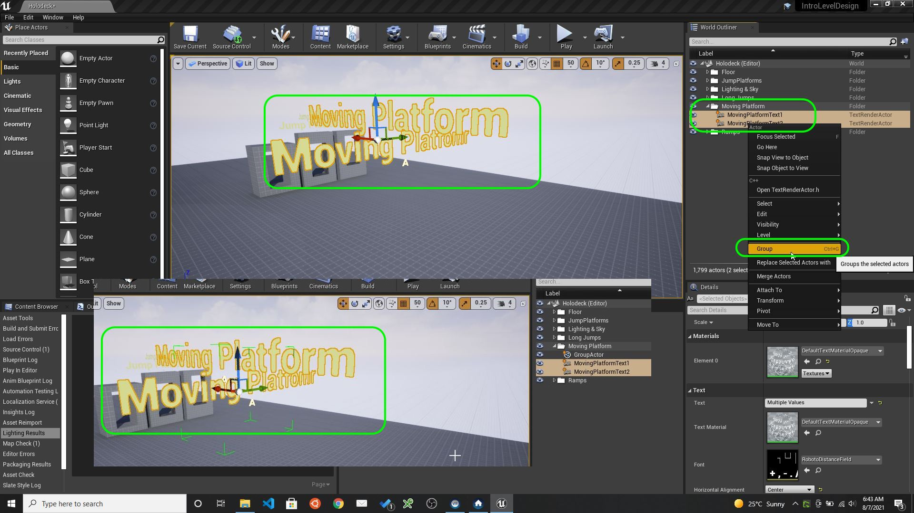

##### `Step 2.`\|`FHIU`|:small_blue_diamond: :small_blue_diamond: 

AddSMPlatformAsset

Now we have  perfect mesh for this platform. Add **SM_AssetPlatform** under the newly created text.

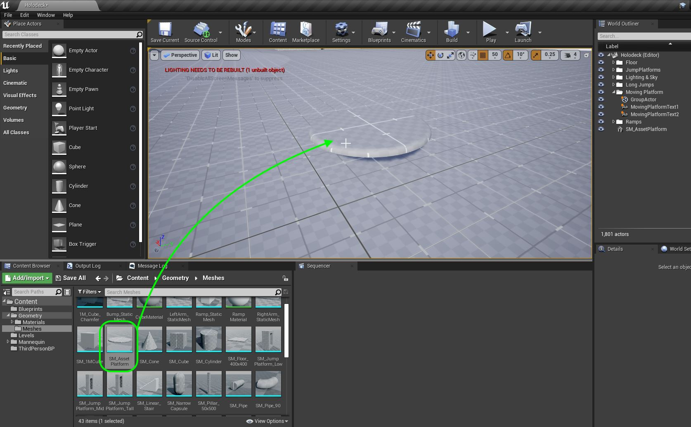

##### `Step 3.`\|`SUU&G`|:small_blue_diamond: :small_blue_diamond: :small_blue_diamond:

Move the **PlayerStart** actor next to the platform with the red arrow pointing at it.

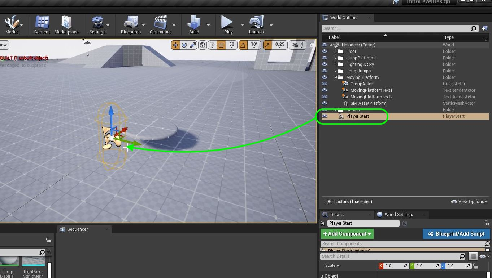

##### `Step 4.`\|`SUU&G`|:small_blue_diamond: :small_blue_diamond: :small_blue_diamond: :small_blue_diamond:

Run the game and you will notice that there is no collision on the platform.

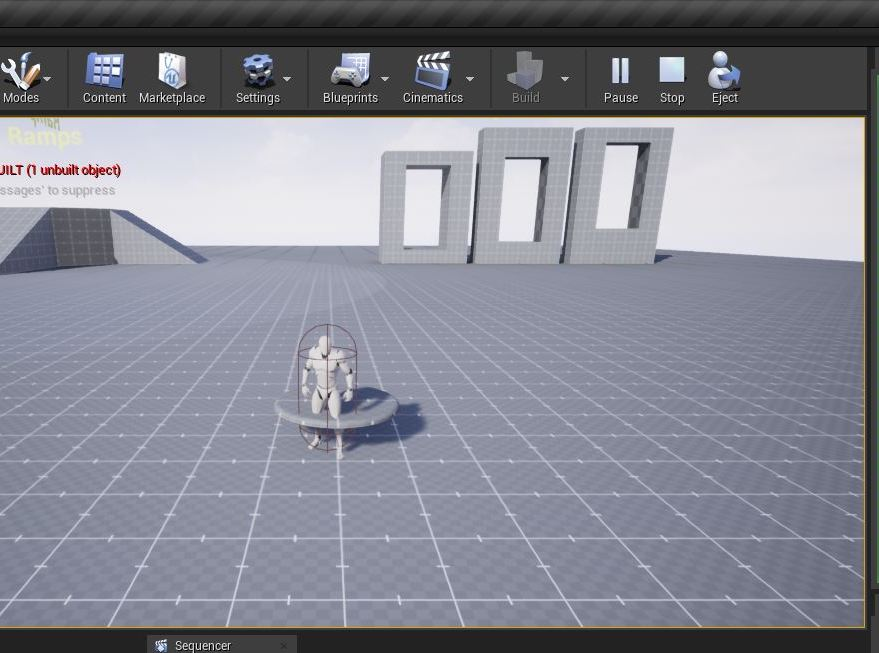

##### `Step 5.`\|`SUU&G`| :small_orange_diamond:

Now double click **SM_AssetPlatform** you just created.  It does not have a collision volume when you do this.  Now we don't want to use complex as simple as this has over 2,000 vertices.  The polygons are unecessarilly dense for a collision and this will have an impact to our framerate.

Lets press the **Collision** drop down and select `Add 26DOP Simplified Collision`.  For our gray box purpose this will suffice. Press the <kbd>Save</kbd> button.

##### `Step 6.`\|`SUU&G`| :small_orange_diamond: :small_blue_diamond:

Move **SM_AssetPlatform** into the **Moving Platforms** folder.  Play the game and make sure you are happy with the collision volume you made:

https://user-images.githubusercontent.com/5504953/128603049-46f3b7fa-ecae-4b15-9487-00ba2c69fb85.mp4

##### `Step 7.`\|`SUU&G`| :small_orange_diamond: :small_blue_diamond: :small_blue_diamond:

Now we don't want to create a single platform in this level.  We want to create a game actor that we can use multiple times in multiple levels.  In Unity these are called **Prefabs**, in Unreal these are **blueprints**.  

Go back to the **World Outliner** and and select **SM_AssetPlatform**.  You will see a button **Blueprint/Add Script**.  Highlight the platform and press the <kbd>Blueprint/Add Script</kbd> button.  Name the blueprint `BP_Platform` and keep the default **New Subclass**. Press the <kbd>Select</kbd> button.

move it to the **Blueprints** folder. I like docking the blueprint next to the editor if I am on a single monitor.

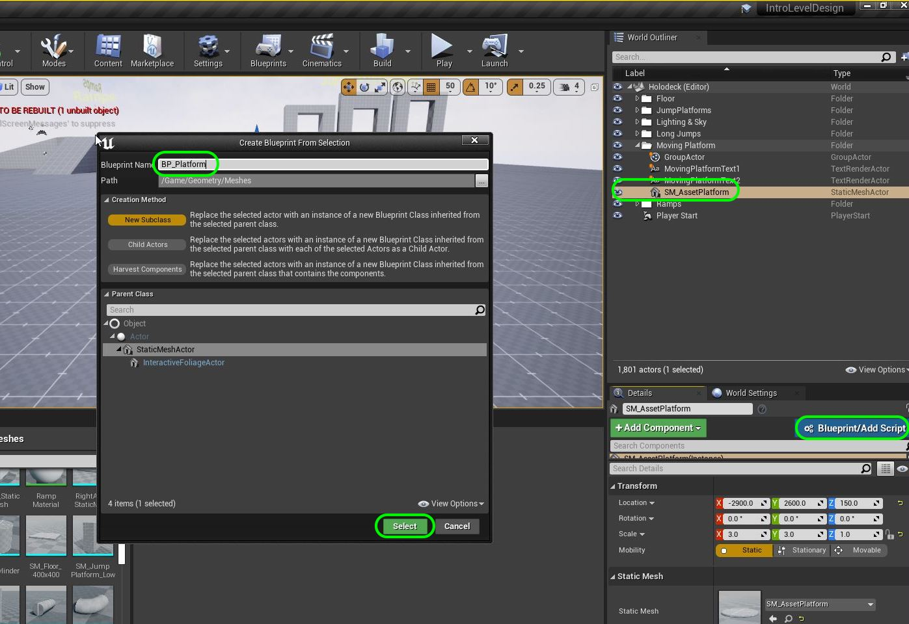

##### `Step 8.`\|`SUU&G`| :small_orange_diamond: :small_blue_diamond: :small_blue_diamond: :small_blue_diamond:

We need to locations for the platform to move **From** and to move **To**.  We will just be translating the object and are not rotating or scaling it.  So we need an **X**, **Y**, **Z** float to store the location.  There is a data structure called a **Vector** available to us in Unreal.  It holds the three floats we need. We need to create a Variable to store it.

Make sure you are in the **Event Graph** tab.  Press the **+** button next to **Variable** and create a new Variable called `Starting Position` of type **Vector** and make it **Private** and **Instance Editable**.  Put it in **Category** `Platform` and give it a **Tooltip** of `Starting location of platform`.

We set **Private** to `true` as we want to default Variables to private to this object.  We would need to make it public if we wanted another actor to access the data. In this case we don't need to do this.  If you don't know, make the variable private.

The **Instance Editable** allows us to adjust this value in the game window to tune while playing the game.  This allows us to edit it in the game editor without going back to the blueprint.

https://user-images.githubusercontent.com/5504953/128603375-e80ab2e8-13dc-4b3f-adc9-e2efb98f1b8e.mp4

##### `Step 9.`\|`SUU&G`| :small_orange_diamond: :small_blue_diamond: :small_blue_diamond: :small_blue_diamond: :small_blue_diamond:

Duplicate the **Starting Position** variable and call it `End Position` and change the tooltip to `End location of platform`.

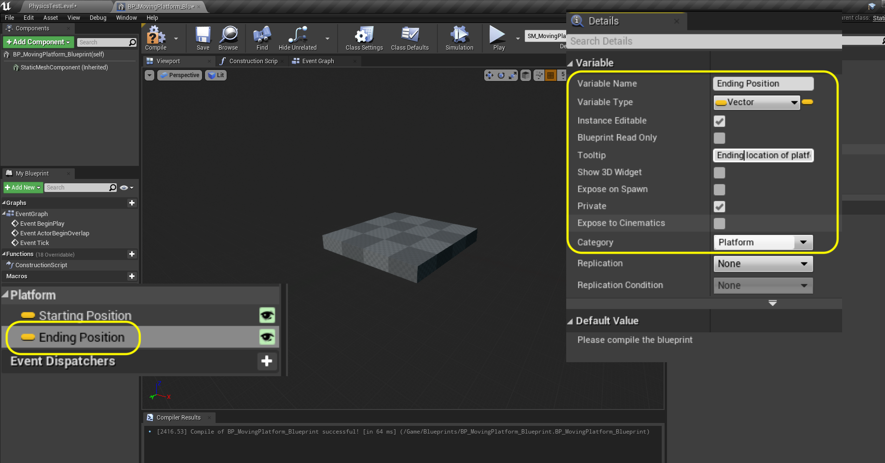

##### `Step 10.`\|`SUU&G`| :large_blue_diamond:

Add a third variable that will affect how long the platform waits before it leaves and returns to its two locations.  Call it `Delay` and make it type **Float**.  Set **Private** to `true`, **Instance Editable** to `true`, **Category** to `Platform` and **Tooltip** to `Delay between targets in seconds`.

https://user-images.githubusercontent.com/5504953/128603680-6da7ee1f-fffd-466a-a97b-25e52ae87c09.mp4

##### `Step 11.`\|`SUU&G`| :large_blue_diamond: :small_blue_diamond: 

Now we need a variable to set the speed the platform moves at in seconds.  Duplicate by right clicking on the  **Delay** variable and selecting **Duplicate**.

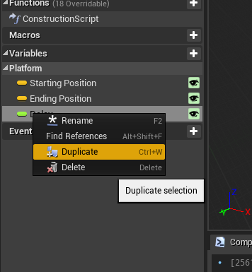

##### `Step 12.`\|`SUU&G`| :large_blue_diamond: :small_blue_diamond: :small_blue_diamond: 

Change the name to `Speed` and adjust the tooltip to `Speed to target in seconds`. 

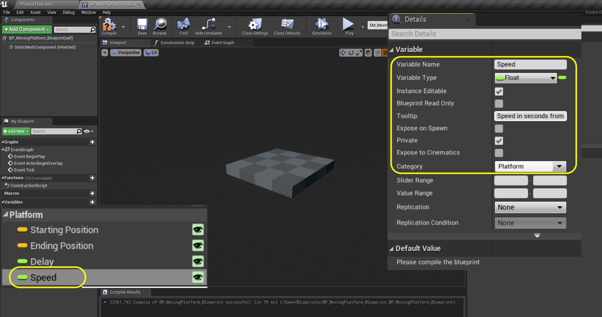

##### `Step 13.`\|`SUU&G`| :large_blue_diamond: :small_blue_diamond: :small_blue_diamond:  :small_blue_diamond: 

The platform will do a single trip from beginning to end, unless it is set to looping.  This will have it go and back at infinitum.  Add another Variable called `bPlatform Is Looping?` and make it **Type** `Boolean`.  Set **Instance Editable** to `true`, **Private** to `true`, **Category** to `Platform` and **Tooltip** to `Keep going from starting to ending position and back`

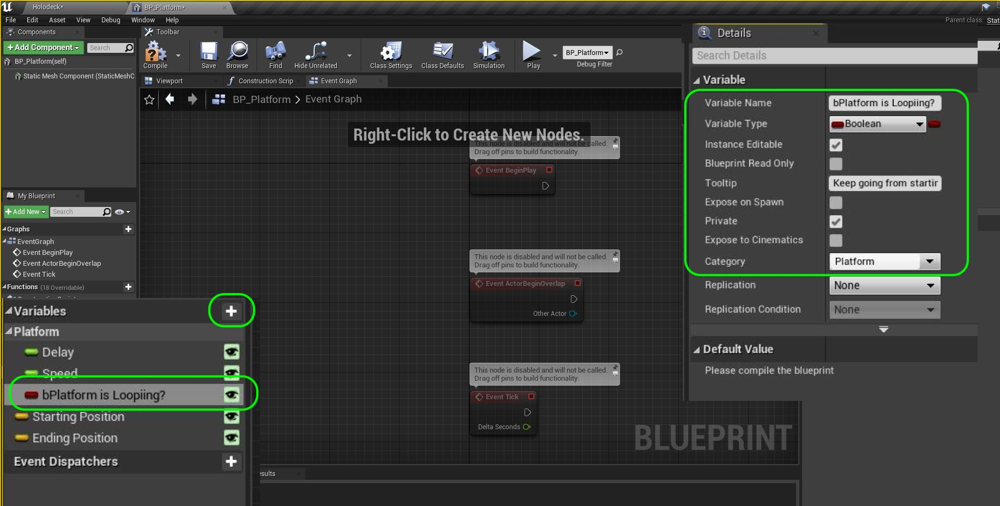

##### `Step 14.`\|`SUU&G`| :large_blue_diamond: :small_blue_diamond: :small_blue_diamond: :small_blue_diamond:  :small_blue_diamond: 

Now since the consruction script runs anytime you make a change in the object in the level we can use this to do things like set the starting and end position of the platform.  We will use a boolean to set a variable then reset the boolean to its previous state.  Duplicate the previous **Boolean** and call it `bSet Start Position` and change the **Tooltip** to `Pressing this sets the start position in world space`.

Also make sure that the **Starting Position** and **Ending Position** variables are both in the **Platform** group.

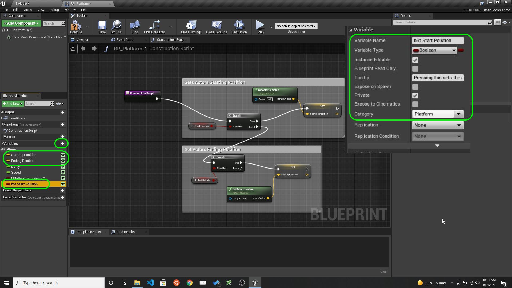

##### `Step 15.`\|`SUU&G`| :large_blue_diamond: :small_orange_diamond: 

Dupicate this Variable and call it `bSet End Position` and change the **Tooltip** to `Pressing this sets end position in world space`.

##### `Step 16.`\|`SUU&G`| :large_blue_diamond: :small_orange_diamond:   :small_blue_diamond: 

Go to the **Construction Script** tab and lets put logic to set the start and end position.  Add a **Branch** node by right clicking on the graph in an empty section and type in **Branch** in the search window.  Press **Select** and you should see a **Branch**.

The branch node takes a boolean (true or false) as an input and will run different execution pins if the value it **True** or **False**. Grab the **bSetStartPosition** boolean and select **Get**.  Drag the output of hte **SetStartPoistion** node to the **Condition** pin in the **Branch** node.

https://user-images.githubusercontent.com/5504953/128607910-26934174-3cff-4c77-bda5-642714e4549d.mp4

##### `Step 17.`\|`SUU&G`| :large_blue_diamond: :small_orange_diamond: :small_blue_diamond: :small_blue_diamond:

Drag a **Set Starting Position** node and now select a **Setter** and connect it to the **True** execution pin from the **Branch** node. Add a **Set bSet Start Position** node and make sure it is set to `false`.  Add a **Get Actor Location** node and connect the output pin to the **Set Starting Position** node.  This sets the position to the current position of the actor in the room. Select all the nodes and press **C** to add comments and add `Set Starting Position of Actor in Level`.

https://user-images.githubusercontent.com/5504953/128608633-26f0639a-8fda-4344-bc30-3ed842d2211d.mp4

##### `Step 18.`\|`SUU&G`| :large_blue_diamond: :small_orange_diamond: :small_blue_diamond: :small_blue_diamond: :small_blue_diamond:

Add another **Branch** node then connect the execution pin from the **False** execution pin from the previous **Branch** node.  So if the player doesn't press the **Set Start Position** then we need to check to see if they are pressing the **Set End Position**.  Drag the **Get bSet End Position** variable and connect it to the **Branch | Condition** pin. Drag and add a **Set bSet End Position** to reset the second destination boolean. Make sure it is set to `false`. Add a **Set Ending Postion** varibale to the graph. Drag a Connect the execution pins from the **Set Ending Position** node to the **Set bSet End Position** node. Add a **Get Actor Location** node and connect it to the **Ending Position** pin. With the mouse drag with left button pressed and highlight all the nodes and press the **C** button and add a comment `Set Start and End Location of Platform`. Press the **Compile** button and you should see a green checkmark.  If there is a red X correct the error as the blueprint will not run.

https://user-images.githubusercontent.com/5504953/128609018-c9af3276-e29b-498f-abb8-b03a3af7b67d.mp4

##### `Step 19.`\|`SUU&G`| :large_blue_diamond: :small_orange_diamond: :small_blue_diamond: :small_blue_diamond: :small_blue_diamond: :small_blue_diamond:

Now lets test our work to see what this does.  First clean up our **World Outliner** and make sure all objects are named and in the appropriate folders. Go to the game window. Adjust the starting position for the platform and press the **Set Start Position** box in the **Details** panel.  Notice that the **Starting Position** vector updates with the current location.  Then move the platform and set the **Set End Position** and notice that it updates the **Ending Position** variable.  It should look like this:

##### `Step 20.`\|`SUU&G`| :large_blue_diamond: :large_blue_diamond:

##### `Step 21.`\|`SUU&G`| :large_blue_diamond: :large_blue_diamond: :small_blue_diamond:

We need to add a new event that sends the platform to one location to another. Click on the **Event Graph** tab where we will put the logic to move the platform. .  Right click on the empty graph and lets add a **Add Custom Event** node. Name this event: `Go To Location And Back`.

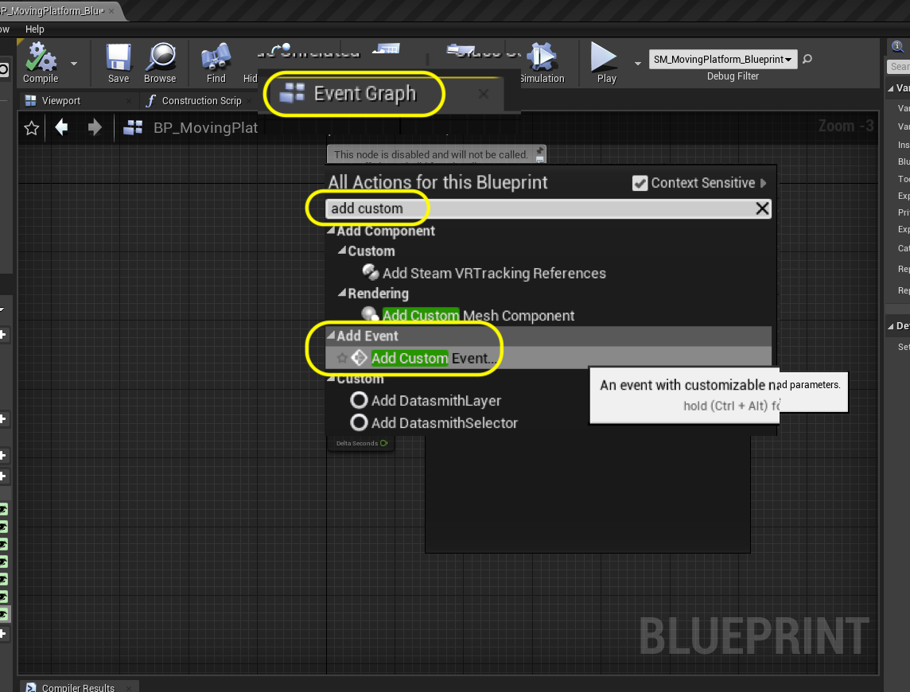

##### `Step 22.`\|`SUU&G`| :large_blue_diamond: :large_blue_diamond: :small_blue_diamond: :small_blue_diamond:

Remove the **Event Tick** and **Event ActorBeginOverlap** event nodes as we will not use these. Go to **Begin Play** and pull off of the execution pin and call the above custom event  by adding a node to trigger the event we just created **Go To Location And Back**.  This will run this function when you press the **Play** button.  It will run the **Event Begin Play** execution node once.

##### `Step 23.`\|`SUU&G`| :large_blue_diamond: :large_blue_diamond: :small_blue_diamond: :small_blue_diamond: :small_blue_diamond:

Pull off of the **GetToLocationAndBack** node's execution pin and add a **Move Component To** node. Drag a reference of the **Static Mesh Component** from the **Component** section onto the graph.  Attach its output to the **Component** input pin on the **Move Component To** node. Add a **Get End Position** node and put it into the **Target Relative Location** pin.  Connect the output of the **Ending Position** pin to the **Target Relative Location** in the **Move Component To** node.

Add a **Get Speed** node and connect it to the **Over Time** pin in the **Move Component To** node. Right click on the empty graph and add a **Get Actor Rotation** node. Connect the output of the **Get Actor Rotation** it to the **Target Relative Rotation** node.

##### `Step 24.`\|`SUU&G`| :large_blue_diamond: :large_blue_diamond: :small_blue_diamond: :small_blue_diamond: :small_blue_diamond: :small_blue_diamond:

Add comment `Move Component` to the work done in the blueprint.

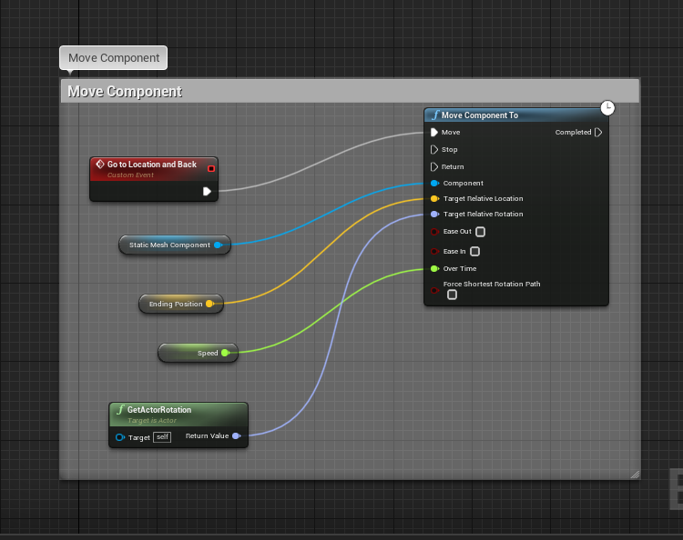

##### `Step 25.`\|`SUU&G`| :large_blue_diamond: :large_blue_diamond: :small_orange_diamond:

Now the actors default to being **Static**. This means that when you build lighting Unreal bakes in the actor's shadows because it doesn't expect it to move.  We will be moving this platform so lets set **BP_MovingPlatform | Mobility** from **Static** to **Movable**.  Press **Build | Build Lighting Only** to make this change.

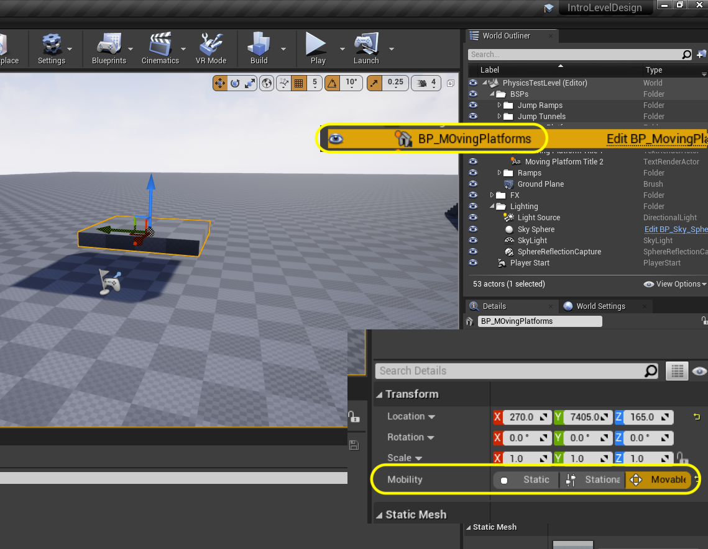

##### `Step 26.`\|`SUU&G`| :large_blue_diamond: :large_blue_diamond: :small_orange_diamond: :small_blue_diamond:

Now the actors default to being **Static**. This means that when you build lighting Unreal bakes in the actor's shadows because it doesn't expect it to move.  We will be moving this platform so lets set **BP_MovingPlatform | Mobility** from **Static** to **Movable**.  Press **Build | Build Lighting Only** to make this change.

##### `Step 27.`\|`SUU&G`| :large_blue_diamond: :large_blue_diamond: :small_orange_diamond: :small_blue_diamond: :small_blue_diamond:

Now lets see if it works.  Set a start and end position for the animation.  Then press play.  Notice that the platform goes right to the end position when you press play.  why?

##### `Step 28.`\|`SUU&G`| :large_blue_diamond: :large_blue_diamond: :small_orange_diamond: :small_blue_diamond: :small_blue_diamond: :small_blue_diamond:

Basically we are not resetting the actor to the begining before starting. Also, our **Speed** is set to **0** seconds which would make it go there with no animation.Open up **BP_MovingPlatform** and go to the **Event Graph** tab.  Add a **Get Starting Location** node. Pull off the pin and add a **Set Actor Location** node.  This will reset the actor to the starting postion of the platform.  Add it between the **Event Begin Play** and **Go to Locatiion and Back** nodes.  Add a comment `Set Actor Location Then Call Animation Event`.  Change the default **Speed** variable from **0** to `3`.

Test the game again and you should see that it goes from point A to point B.

##### `Step 28.`\|`SUU&G`| :large_blue_diamond: :large_blue_diamond: :small_orange_diamond: :small_blue_diamond: :small_blue_diamond: :small_blue_diamond:

Lets add the ability to move the platform between the start and end positions so we can test them in game.  Go to **BP_MovingPlatform** and add a **boolean** variable called `bGoToStartPosition` and makes ure it is set to **Private** and **Instance Editable** are both set to true.  Make sure **Category** is set to `Platform`. Add a **Tooltip** `Return to starting position`. Duplicate this variable and call it `bGoToEndPosition` and change the **Tooltip** to 'Return to ending position`.

Go to **Contruction Script** tab and pull from the **False** execution pin of the last **Branch** node. Add another **Branch** node.  Drag a **Get bGoToStartPosition** and drop it on the graph. Plug it into the **Condition** pin in the **Branch** node.  Pull from the **True** execution pin and select **Set Actor Location** node. Drag a **Get Starting Position** node and plug it into the **New Location** pin in the **Set Actor Location**.

Pull off of the exectution pin exit of **Set Actor Location** and select **Set Go to Start Position.  Select all the nodes and add a comment by pressing the **C** key and enter `Move to Starting Position of Platform`.

##### `Step 29.`\|`SUU&G`| :large_blue_diamond: :large_blue_diamond: :small_orange_diamond: :small_blue_diamond: :small_blue_diamond: :small_blue_diamond: :small_blue_diamond:

Repeat the above for going to the end position but with the **Go To End Position** and **Ending Position** nodes.

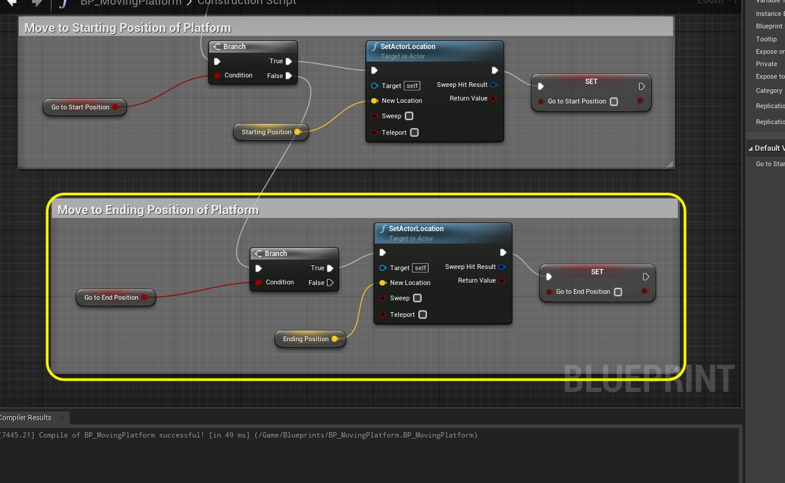

##### `Step 30.`\|`SUU&G`| :large_blue_diamond: :large_blue_diamond: :large_blue_diamond:

Press **Compile** on the **BP_MovingPlatform** blueprint and go to the editor.  Set the begining and end positions. Now go to both begining and end and you should see the paltform go to the beginning and the end.

##### `Step 31.`\|`SUU&G`| :large_blue_diamond: :large_blue_diamond: :large_blue_diamond: :small_blue_diamond:

Press **Compile** on the **BP_MovingPlatform** blueprint and go to the editor.  Set the begining and end positions. Now go to both begining and end and you should see the paltform go to the beginning and the end.

##### `Step 32.`\|`SUU&G`| :large_blue_diamond: :large_blue_diamond: :large_blue_diamond: :small_blue_diamond: :small_blue_diamond:

Select all the nodes that attach to **Move Component** inclusive and copy and paste them.  We will use this copy to return to the starting position from the end position.  Remove the **End Position** node and replace it with a **Get Starting Position** and plug it into the **Target Relative Location**.

Now we want to check to see if we have **Platform is Looping** set to true or not.  If true then we want the platform to go back to the begining and go to the end again.  Drag a copy of **bPlatform Is Looping** and drag off of hte pin and get a **Branch** node. Connect the execution pin from **Move to Component | Completed** that will run when the platform reaches its target to the **Branch** node.

Now we want a potential delay that gives the player time to get onto the platform.  Add a **Delay** node.  Get a **Get Delay** node to the variable we created and plug the output to the **Delay | Duration** pin.  Change the default value of the **Delay** variable to `5.0`.

Plug the output of the **Branch** node to the **Delay** node then onto the second **Move Component To** node which will move it back to the starting position after a delay.\n\nGo to the game window and select the platform.  Make sure **Platform is Looping** is set to `true` and then run the game.  The platform should move to the end postion then back to the start.

##### `Step 33.`\|`SUU&G`| :large_blue_diamond: :large_blue_diamond: :large_blue_diamond: :small_blue_diamond: :small_blue_diamond: :small_blue_diamond:

Now this goes to the end and back once.  We want this to loop endlessly for the entire life of the level.  We do this by adding another delay then calling our own event.  This is a recursive call that will just keep calling itself as long as the level exists.  Copy and paste the **Delay** and **Get Delay** variable nodes and put it after the second **Move Component To**.  Connect the **Completed** to the **Delay** node execution pin. Add a **Go to Location and Back** event node to call oneself. Go to the game and it should loop forever now!

##### `Step 34.`\|`SUU&G`| :large_blue_diamond: :large_blue_diamond: :large_blue_diamond: :small_blue_diamond: :small_blue_diamond: :small_blue_diamond: :small_blue_diamond:

Lets save our work by pressing **File | Save All**.  Press the **Source Control | Submit to Source Control** button then enter a message of what you did last.  Press the **Submit** button.  Make sure it is succesful then run **GitHub Desktop**.  Press the **Publish Origin** button.

Now you should have all the components you need to create your own level.  Create p a new level and use what you have learned her to construct a level that you can navigate around.  Take a look at what can be done within a week or so of consistent work.

| `level.design`\|`THE END`| 
| :--- |
| **That's All Folks!** Thanks for sticking around. That's it for this lesson. |

___

| [previous](../long-jump/README.md#user-content-long-jump)| [home](../README.md#user-content-ue4-intro-to-level-design) | [next](../readme/README.md#user-content-readmemd-file)|
|---|---|---|
