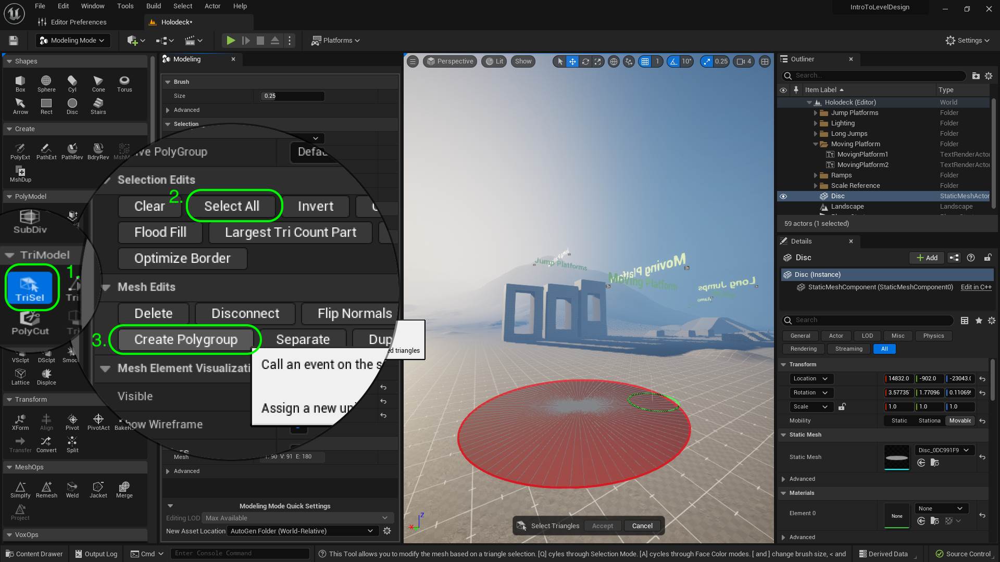
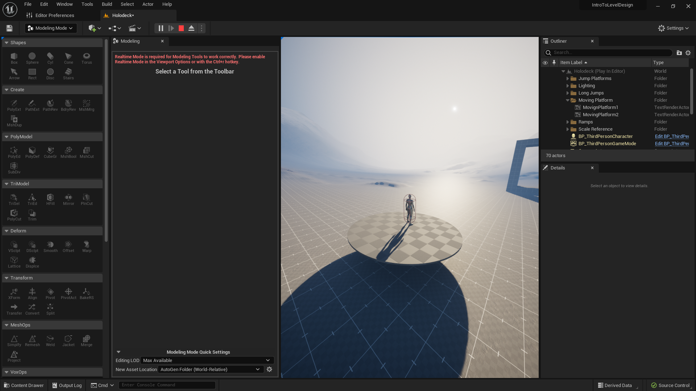
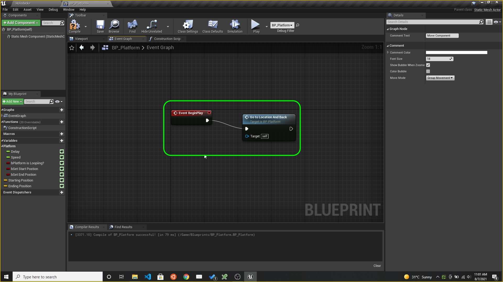
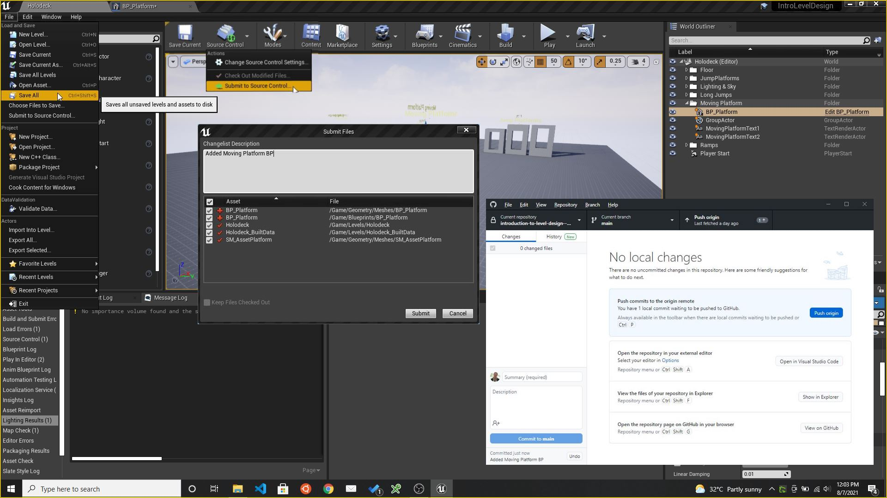

### Moving Platform

[previous](../long-jump/README.md#user-content-long-jump) • [home](../README.md#user-content-ue4-intro-to-level-design) • [next](../readme/README.md#user-content-readmemd-file)

Now a level will not be interesting unless we can allow you to exploit vertical height to make more interesting levels.  We need a moving platform that can get the player around the level!  Lets create a simple blueprint that allows us to have a moving platform that we can use in a variety of scenarios.

 

---

##### `Step 1.`\|`UE5LD`|:small_blue_diamond:

Copy the jump ramps title by select both actors then **Alt** dragging a copy to the right.  Call this new title `MovingPlatform1` & `MovingPlatform2`.  Add a folder called `Moving Platform`. 

##### `Step 2.`\|`UE5LD`|:small_blue_diamond: :small_blue_diamond: 

AddSMPlatformAsset

Go back to **Modeling Mode** and select a **Shapes | Disc**.  Set the **Radius** to `300` and **Radius Slices** to `90`. Place it in the level and make sure the **Rotations** are all set to `0`, `0`, `0`. Press the <kbd>Complete</kbd> button.

##### `Step 3.`\|`UE5LD`|:small_blue_diamond: :small_blue_diamond: :small_blue_diamond:

Select **Tri Model | TriSel** button and press **Select All**.  Then press **Create Polygroup** so we can set a single group out of all the triangles.

##### `Step 4.`\|`UE5LD`|:small_blue_diamond: :small_blue_diamond: :small_blue_diamond: :small_blue_diamond:

Now you can select **PolyModel | PolyEd** and select **Extrude**.  Now give the platform some depth and press the <kbd>Accept</kbd> button.

##### `Step 5.`\|`UE5LD`| :small_orange_diamond:

Move the **PlayerStart** actor next to the platform with the red arrow pointing at it.

##### `Step 6.`\|`UE5LD`| :small_orange_diamond: :small_blue_diamond:

Run the game and you can jump on the platform.  Make any changes you see fit, but I am happy with mine! I see a red error and switch back to **Select Mode**.

##### `Step 7.`\|`UE5LD`| :small_orange_diamond: :small_blue_diamond: :small_blue_diamond:

Now we don't want to create a single platform in this level.  We want to create a game actor that we can use multiple times in multiple levels.  In Unity these are called **Prefabs**, in Unreal we use **Blueprints**.  

Add a **Content | Blueprints** folder. Go back to the **World Outliner** and and select **Disc** you made.  You will see a button **Blueprint/Add Script**.  Highlight the platform and press the <kbd>Blueprint/Add Script</kbd> button.  Name the blueprint `BP_Platform` and keep the default **New Subclass**. Put it in the new **Blueprints** folder. Press the <kbd>Select</kbd> button. 

##### `Step 8.`\|`UE5LD`| :small_orange_diamond: :small_blue_diamond: :small_blue_diamond: :small_blue_diamond:

I like docking the blueprint next to the editor if I am on a single monitor. Put the **BP_Platform** actor in the **Moving Platform** folder to join the titles.

##### `Step 9.`\|`UE5LD`| :small_orange_diamond: :small_blue_diamond: :small_blue_diamond: :small_blue_diamond: :small_blue_diamond:

Rename the mesh to `SM_Platform` and move it to the **Meshes** folder.  Delete any extraneous meshes you might have created to make it.

##### `Step 10.`\|`UE5LD`| :large_blue_diamond:

We need to locations for the platform to move **From** and to move **To**.  We will just be translating the object and are not rotating or scaling it.  So we need an **X**, **Y**, **Z** float to store the location.  There is a data structure called a **Vector** available to us in Unreal.  It is a **struct** that holds the three floats we need. We need to create a Variable to store it.

Press the **+** button next to **Variable** and create a new Variable called `Starting Position` of type **Vector** and make it **Private** and **Instance Editable**.  Put it in **Category** `Platform` (since this category doesn't exist you will have type over the existing one to creat it) and give it a **Description** of `Starting location of platform`.

We set **Private** to `true` as we want to default Variables to private to this object.  We would need to make it public if we wanted another actor to access the data. In this case we don't need to do this.  If you don't know, make the variable private.

The **Instance Editable** allows us to adjust this value in the game window to tune while playing the game.  This allows us to edit it in the game editor without going back to the blueprint.

We set a description as it allows us to get a tooltip when we highlight the variable, cool!

##### `Step 11.`\|`UE5LD`| :large_blue_diamond: :small_blue_diamond: 

Duplicate the **Starting Position** variable and call it `Ending Position` and change the tooltip to `Ending location of platform`.

##### `Step 12.`\|`UE5LD`| :large_blue_diamond: :small_blue_diamond: :small_blue_diamond: 

Add a third variable that will affect how long the platform waits before it leaves and returns to its two locations.  Call it `Delay` and make it type **Float**.  Set **Private** to `true`, **Instance Editable** to `true`, **Category** to `Platform` and **Description** to `Delay between targets in seconds`.

##### `Step 13.`\|`UE5LD`| :large_blue_diamond: :small_blue_diamond: :small_blue_diamond:  :small_blue_diamond: 

Now we need a variable to set the speed the platform moves at in seconds.  Duplicate by right clicking on the  **Delay** variable and selecting **Duplicate**.

Change the name to `Speed` and adjust the tooltip to `Speed to target in seconds`. 

##### `Step 14.`\|`UE5LD`| :large_blue_diamond: :small_blue_diamond: :small_blue_diamond: :small_blue_diamond:  :small_blue_diamond: 

The platform will do a single trip from beginning to end, unless it is set to looping.  This will have it go and back at infinitum.  Add another Variable called `bPlatform Is Looping?` and make it **Type** `Boolean`.  Set **Instance Editable** to `true`, **Private** to `true`, **Category** to `Platform` and **Tooltip** to `Keep going from starting to ending position and back`

##### `Step 15.`\|`UE5LD`| :large_blue_diamond: :small_orange_diamond: 

We will need to use a boolean to set the starting and ending location.  Duplicate the previous **Boolean** twice and call it `bSet Start Position` and `bSet End Position` and change the **Description** to `Pressing this sets the start position in world space` and `Pressing this sets the start position in world space`.

Also make sure that the **Starting Position** and **Ending Position** variables are both in the **Platform** group.

##### `Step 16.`\|`UE5LD`| :large_blue_diamond: :small_orange_diamond:   :small_blue_diamond: 

Go to the **Construction Script** tab and lets put logic to set the start and end position.  Add a **Branch** node by right clicking on the graph in an empty section and type in **Branch** in the search window.  Press **Select** and you should see a **Branch**.

The branch node takes a boolean (true or false) as an input and will run different execution pins if the value it **True** or **False**. Grab the **bSetStartPosition** boolean and select **Get**.  Drag the output of the **SetStartPosition** node to the **Condition** pin in the **Branch** node. 

Connnect the **Execution** pin from **Construction Script** to the **Branch** node.

##### `Step 17.`\|`UE5LD`| :large_blue_diamond: :small_orange_diamond: :small_blue_diamond: :small_blue_diamond:

Drag a **Set Starting Position** node and now select **Set Starting Position** and connect it to the **True** execution pin from the **Branch** node. Make sure it is set to `false` - it is hard to see but there is a tick box right next to the text in the **Set** node. 

So this means that in the game when we press the **Set Starting Positipon** that it will be false again, and next we will actually set it with the current value in the room.

##### `Step 18.`\|`UE5LD`| :large_blue_diamond: :small_orange_diamond: :small_blue_diamond: :small_blue_diamond: :small_blue_diamond:

Add a **Set Starting Position** as a **Set** node.  This sets the position to the current position of the actor in the room. Right click on the open graph and type **Get Actor Location**.

##### `Step 19.`\|`UE5LD`| :large_blue_diamond: :small_orange_diamond: :small_blue_diamond: :small_blue_diamond: :small_blue_diamond: :small_blue_diamond:

Connect the execution pin from **Set Start Position** to the **Set Starting Position** node.  Then connect the **Return Value** pin to the **Starting Position** pin that stores the current position this actor is in.

##### `Step 20.`\|`UE5LD`| :large_blue_diamond: :large_blue_diamond:

Press the compile button in the **Blueprint** then press the <kbd>Play</kbd> button in the level.  Move the **BP_Platform** and press the **Set Starting Position** boolean.  Notice the **Starting Positin** vector now updates with the current position of the object in the room.

https://user-images.githubusercontent.com/5504953/182248453-137c76ae-0cc9-436a-a816-6f7f34656f56.mp4

##### `Step 21.`\|`UE5LD`| :large_blue_diamond: :large_blue_diamond: :small_blue_diamond:

Add another **Branch** node then connect the execution pin from the **False** execution pin from the previous **Branch** node.  So if the player doesn't press the **Set Start Position** then we need to check to see if they are pressing the **Set End Position**.  Drag the **Get bSet End Position** variable and connect it to the **Branch | Condition** pin. Drag and add a **Set bSet End Position** to reset the second destination boolean. Make sure it is set to `false`. Add a **Set Ending Postion** varibale to the graph. Drag a Connect the execution pins from the **Set Ending Position** node to the **Set bSet End Position** node. Add a **Get Actor Location** node and connect it to the **Ending Position** pin. With the mouse drag with left button pressed and highlight all the nodes and press the **C** button and add a comment `Set Start and End Location of Platform`. Press the **Compile** button and you should see a green checkmark.  If there is a red X correct the error as the blueprint will not run.

https://user-images.githubusercontent.com/5504953/128609018-c9af3276-e29b-498f-abb8-b03a3af7b67d.mp4

Now lets test our work to see what this does.  First clean up our **World Outliner** and make sure all objects are named and in the appropriate folders. Go to the game window. Adjust the starting position for the platform and press the **Set Start Position** box in the **Details** panel.  Notice that the **Starting Position** vector updates with the current location.  Then **move** the platform up a few meters and set the **Set End Position** and notice that it updates the **Ending Position** variable.  It should look like this:

https://user-images.githubusercontent.com/5504953/128609437-f3c2f011-0091-4694-ae88-ebe4685af1ab.mp4

We need to add a new event that sends the platform to one location to another. Click on the **Event Graph** tab where we will put the logic to move the platform. .  Right click on the empty graph and lets add a **Add Custom Event** node. Name this event: `Go To Location And Back`.

Remove the **Event Tick** and **Event ActorBeginOverlap** event nodes as we will not use these. Go to **Begin Play** and pull off of the execution pin and call the above custom event  by adding a node to trigger the event we just created **Go To Location And Back**.  This will run this function when you press the **Play** button.  It will run the **Event Begin Play** execution node once.

##### `Step 22.`\|`UE5LD`| :large_blue_diamond: :large_blue_diamond: :small_blue_diamond: :small_blue_diamond:

Pull off of the **GetToLocationAndBack** node's execution pin and add a **Move Component To** node. Drag a reference of the **Static Mesh Component** from the **Component** section onto the graph.  Attach its output to the **Component** input pin on the **Move Component To** node. Add a **Get End Position** node and put it into the **Target Relative Location** pin.  Connect the output of the **Ending Position** pin to the **Target Relative Location** in the **Move Component To** node.

Add a **Get Speed** node and connect it to the **Over Time** pin in the **Move Component To** node. Right click on the empty graph and add a **Get Actor Rotation** node. Connect the output of the **Get Actor Rotation** it to the **Target Relative Rotation** node.

https://user-images.githubusercontent.com/5504953/128609875-8979cd30-77ea-4438-a33e-42ca8c8dd6e7.mp4

##### `Step 23.`\|`UE5LD`| :large_blue_diamond: :large_blue_diamond: :small_blue_diamond: :small_blue_diamond: :small_blue_diamond:

Add comment `Move Component` to the work done in the blueprint.

##### `Step 24.`\|`UE5LD`| :large_blue_diamond: :large_blue_diamond: :small_blue_diamond: :small_blue_diamond: :small_blue_diamond: :small_blue_diamond:

Now the actors default to being **Static**. This actor **will not** move.  This means that when you build lighting Unreal bakes in the actor's shadows because it will not move it through physics or through code.  We will be moving this platform so lets set **BP_MovingPlatform | Mobility** from **Static** to **Movable**.  Press **Build | Build Lighting Only** to make this change.

##### `Step 25.`\|`UE5LD`| :large_blue_diamond: :large_blue_diamond: :small_orange_diamond:

Now lets see if it works.  Set a start and end position for the animation.  Then press play.  Move the platform back to close to the start position. Notice that the platform goes right to the end position when you press play.  why?

https://user-images.githubusercontent.com/5504953/128610218-21d9ff0a-4f23-4577-af41-d7e2bb2f2cfe.mp4

##### `Step 26.`\|`UE5LD`| :large_blue_diamond: :large_blue_diamond: :small_orange_diamond: :small_blue_diamond:

Basically we are not resetting the actor to the begining before starting. Also, our **Speed** is set to **0** seconds which would make it go there with no animation.Open up **BP_MovingPlatform** and go to the **Event Graph** tab.  Add a **Get Starting Location** node. Pull off the pin and add a **Set Actor Location** node.  This will reset the actor to the starting postion of the platform.  Add it between the **Event Begin Play** and **Go to Locatiion and Back** nodes.  Add a comment `Set Actor Location Then Call Animation Event`.  Change the default **Speed** variable from **0** to `5`. Press the **Compile** button.

Move the platform away from its start position.  Press the **Play** button and you will see it jump to the start position and move to the end position over 5 seconds.

https://user-images.githubusercontent.com/5504953/128610390-8fcf1ad3-76c3-4198-9b06-18d5d9b92d19.mp4

##### `Step 27.`\|`UE5LD`| :large_blue_diamond: :large_blue_diamond: :small_orange_diamond: :small_blue_diamond: :small_blue_diamond:

Lets add the ability to move the platform between the start and end positions so we can test them in game.  Go to **BP_MovingPlatform** and add a **boolean** variable called `bGoToStartPosition` and makes ure it is set to **Private** and **Instance Editable** are both set to true.  Make sure **Category** is set to `Platform`. Add a **Tooltip** `Return to starting position`. Duplicate this variable and call it `bGoToEndPosition` and change the **Tooltip** to 'Return to ending position`.

Go to **Contruction Script** tab and pull from the **False** execution pin of the last **Branch** node. Add another **Branch** node.  Drag a **Get bGoToStartPosition** and drop it on the graph. Plug it into the **Condition** pin in the **Branch** node.  Pull from the **True** execution pin and select **Set Actor Location** node. Drag a **Get Starting Position** node and plug it into the **New Location** pin in the **Set Actor Location**.

Woops we forgot to reset the boolean back to false.  Add a **bGoToStartPosition** and set it to false.  Put it before the **Set Actor Location** event.

Pull off of the exectution pin exit of **Set Actor Location** and select **Set Go to Start Position.  Select all the nodes and add a comment by pressing the **C** key and enter `Move to Starting Position of Platform`.

Repeat the above for going to the end position but with the **Go To End Position** and **Ending Position** nodes. I copied and pasted and changed the variables for the end.

Press **Compile** on the **BP_MovingPlatform** blueprint and go to the editor.  Set the begining and end positions. Now go to both begining and end and you should see the platform go to the beginning and the end. Move the platform away and you should be able to send it back. This way we can tell that if we join two parts of the level that the platform will start and end at the right spot.

https://user-images.githubusercontent.com/5504953/128610999-8d89f913-22cd-4387-bdd2-6dde403dc519.mp4

##### `Step 28.`\|`UE5LD`| :large_blue_diamond: :large_blue_diamond: :small_orange_diamond: :small_blue_diamond: :small_blue_diamond: :small_blue_diamond:

Select all the nodes that attach to **Move Component** inclusive and copy and paste them.  We will use this copy to return to the starting position from the end position.  Remove the **End Position** node and replace it with a **Get Starting Position** and plug it into the **Target Relative Location**.

Now we want to check to see if we have **Platform is Looping** set to true or not.  If true then we want the platform to go back to the begining and go to the end again.  Drag a copy of **bPlatform Is Looping** and drag off of hte pin and get a **Branch** node. Connect the execution pin from **Move to Component | Completed** that will run when the platform reaches its target to the **Branch** node.

Now we want a potential delay that gives the player time to get onto the platform.  Add a **Delay** node.  Get a **Get Delay** node to the variable we created and plug the output to the **Delay | Duration** pin.  Change the default value of the **Delay** variable to `5.0`.

Plug the output of the **Branch** node to the **Delay** node then onto the second **Move Component To** node which will move it back to the starting position after a delay.

Go to the game window and select the platform.  Make sure **Platform is Looping** is set to `true` and then run the game.  The platform should move to the end postion then back to the start.

https://user-images.githubusercontent.com/5504953/128611053-e9773924-13f8-4602-8f8e-0defe6018979.mp4

##### `Step 29.`\|`UE5LD`| :large_blue_diamond: :large_blue_diamond: :small_orange_diamond: :small_blue_diamond: :small_blue_diamond: :small_blue_diamond: :small_blue_diamond:

Select all the nodes that attach to **Move Component** inclusive and copy and paste them.  We will use this copy to return to the starting position from the end position.  Remove the **End Position** node and replace it with a **Get Starting Position** and plug it into the **Target Relative Location**.

Now we want to check to see if we have **Platform is Looping** set to true or not.  If true then we want the platform to go back to the begining and go to the end again.  Drag a copy of **bPlatform Is Looping** and drag off of the pin and get a **Branch** node. Connect the execution pin from **Move to Component | Completed** that will run when the platform reaches its target to the **Branch** node.

Now we want a potential delay that gives the player time to get onto the platform.  Add a **Delay** node.  Get a **Get Delay** node to the variable we created and plug the output to the **Delay | Duration** pin.  Change the default value of the **Delay** variable to `5.0`.

Plug the output of the **Branch** node to the **Delay** node then onto the second **Move Component To** node which will move it back to the starting position after a delay.

Go to the game window and select the platform.  Make sure **Platform is Looping** is set to `true` and then run the game.  The platform should move to the end postion then back to the start.

https://user-images.githubusercontent.com/5504953/128611591-6c815996-321d-4834-b828-6aad58621d8d.mp4

##### `Step 30.`\|`UE5LD`| :large_blue_diamond: :large_blue_diamond: :large_blue_diamond:

Now this goes to the end and back once.  We want this to loop endlessly for the entire life of the level.  We do this by adding another delay then calling our own event.  This is a recursive call that will just keep calling itself as long as the level exists.  Copy and paste the **Delay** and **Get Delay** variable nodes and put it after the second **Move Component To**.  Connect the **Completed** to the **Delay** node execution pin. Add a **Go to Location and Back** event node to call oneself. Go to the game and it should loop forever now!

https://user-images.githubusercontent.com/5504953/128611772-5d00eec6-0231-4f86-b93d-cc1469cdd0c5.mp4

##### `Step 31.`\|`UE5LD`| :large_blue_diamond: :large_blue_diamond: :large_blue_diamond: :small_blue_diamond:

Lets save our work by pressing **File | Save All**.  Press the **Source Control | Submit to Source Control** button then enter a message of what you did last.  Press the **Submit** button.  Make sure it is succesful then run **GitHub Desktop**.  Press the **Publish Origin** button.

Now you should have all the components you need to create your own level.  Create p a new level and use what you have learned her to construct a level that you can navigate around.  Take a look at what can be done within a week or so of consistent work.

| `level.design`\|`THE END`| 
| :--- |
| **That's All Folks!** Thanks for sticking around. That's it for this lesson. |
___

<!--  -->

| [previous](../long-jump/README.md#user-content-long-jump)| [home](../README.md#user-content-ue4-intro-to-level-design) | [next](../readme/README.md#user-content-readmemd-file)|
|---|---|---|
