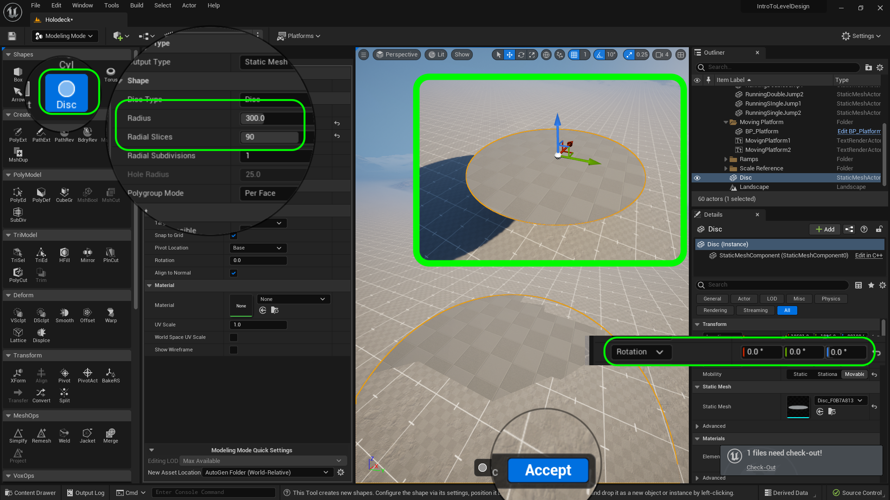
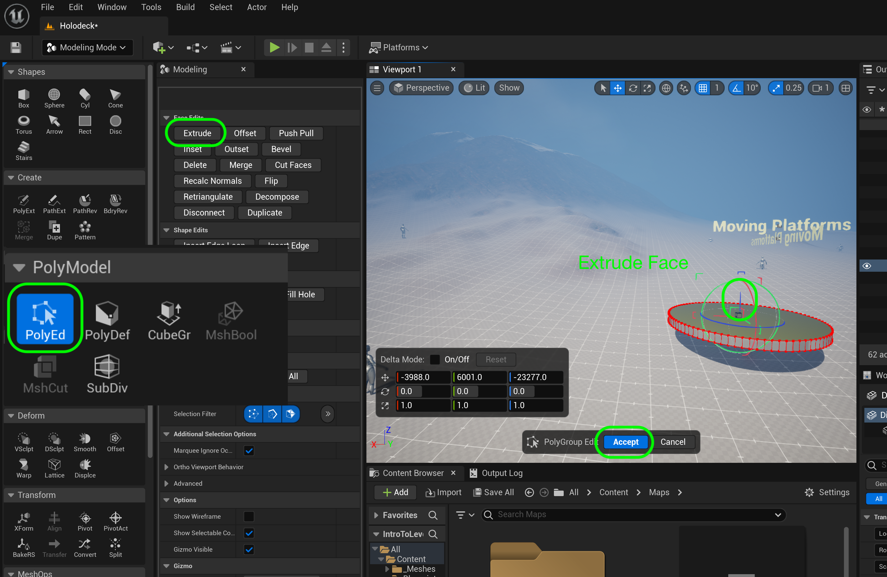

### Moving Platform

[previous](../long-jump/README.md#user-content-long-jump) • [home](../README.md#user-content-ue4-intro-to-level-design) • [next](../moving-platform-ii/README.md#user-content-moving-platform-ii)

Now a level will not be interesting unless we can allow you to exploit vertical height to make more interesting levels.  We need a moving platform that can get the player around the level!  Lets create a simple blueprint that allows us to have a moving platform that we can use in a variety of scenarios.

 

---

##### `Step 1.`\|`UE5LD`|:small_blue_diamond:

Copy the jump ramps title by select both actors then **Alt** dragging a copy to the right.  Call this new title `MovingPlatform1` & `MovingPlatform2`.  Add a folder called `Moving Platform`. 

##### `Step 2.`\|`UE5LD`|:small_blue_diamond: :small_blue_diamond: 

AddSMPlatformAsset

Go back to **Modeling Mode** and select a **Shapes | Disc**.  Set the **Radius** to `300` and **Radius Slices** to `90`. Place it in the level and make sure the **Rotations** are all set to `0`, `0`, `0`. Press the <kbd>Complete</kbd> button.

##### `Step 3.`\|`UE5LD`|:small_blue_diamond: :small_blue_diamond: :small_blue_diamond:

Now you can select **PolyModel | PolyEd** and select **Extrude**.  Now give the platform some depth and press the <kbd>Accept</kbd> button.

##### `Step 4.`\|`UE5LD`|:small_blue_diamond: :small_blue_diamond: :small_blue_diamond: :small_blue_diamond:

Another way of adding a material is to drag it on the static mesh.  Drag and drop **MD_LDGrid_Local** on the disc to give it the scaled material.

##### `Step 5.`\|`UE5LD`| :small_orange_diamond:

Move the **PlayerStart** actor next to the platform with the red arrow pointing at it. Now rename the disc to `SM_MovingPlatform` and drag it into the **Meshes** folder. Then rename the platform and move it into the correct folder in the **World Outliner**.

##### `Step 6.`\|`UE5LD`| :small_orange_diamond: :small_blue_diamond:

Return to **Selection Mode** and run the game and you can jump on the platform.  Make any changes you see fit, but I am happy with mine! 

https://github.com/maubanel/UE5-Level-Design/assets/5504953/3e171c6d-7bdf-4be4-b5c6-1ae68b98cfcd

##### `Step 7.`\|`UE5LD`| :small_orange_diamond: :small_blue_diamond: :small_blue_diamond:

Now we don't want to create a single platform in this level.  We want to create a game actor that we can use multiple times in multiple levels.  In Unity these are called **Prefabs**, in Unreal we use **Blueprints**.  

Go to the **Blueprints** folder and *right click* in an open area and add a **Blueprint Class**. select . Now select an **Actor** blueprint (this is the base class for any object to appear in a level). Call this new **Blueprint** `BP_MovingPlatform`.

##### `Step 8.`\|`UE5LD`| :small_orange_diamond: :small_blue_diamond: :small_blue_diamond: :small_blue_diamond:

Now open up **BP_MovingPlatforms**.  Sometimes when you open a blueprint you get just a partial display of the variables.  All you need to do is press the **Open Full Blueprint Editor**.  Now go to the **Viewport** tab and press the **+ Add** component button.  Select a **Static Mesh** component and rename it to `Jump Platform`.

##### `Step 9.`\|`UE5LD`| :small_orange_diamond: :small_blue_diamond: :small_blue_diamond: :small_blue_diamond: :small_blue_diamond:

Assign the **LD_Grid_Local** material to **Element 0** so we can see the nice measurement grid on the sattic mesh.

##### `Step 10.`\|`UE5LD`| :large_blue_diamond:

I like docking the blueprint next to the editor if I am on a single monitor. Put the **BP_Platform** actor in the **Moving Platform** folder to join the titles.

##### `Step 11.`\|`UE5LD`| :large_blue_diamond: :small_blue_diamond: 

We need to locations for the platform to move **From** and to move **To**.  We will just be translating the object and are not rotating or scaling it.  So we need an **X**, **Y**, **Z** float to store the location.  There is a data structure called a **Vector** available to us in Unreal.  It is a **struct** that holds the three floats we need. We need to create a Variable to store it.

Press the **+** button next to **Variable** and create a new Variable called `StartingPosition` of type **Vector** and make it **Private** and **Instance Editable**.  Put it in **Category** `Moving Platform` (since this category doesn't exist you will have type over the existing one to creat it) and give it a **Description** of `Starting location of the platform`.

We set **Private** to `true` as we want to default Variables to private to this object.  We would need to make it public if we wanted another actor to access the data. In this case we don't need to do this.  If you don't know, make the variable private.

The **Instance Editable** allows us to adjust this value in the game window to tune while playing the game.  This allows us to edit it in the game editor without going back to the blueprint.

We set a description as it allows us to get a tooltip when we highlight the variable in any place of the editor, cool!

##### `Step 12.`\|`UE5LD`| :large_blue_diamond: :small_blue_diamond: :small_blue_diamond: 

Now we want to be able to place the platform in the level and set this starting position.  We will create a function to make this easier to do.  A function is like a factory, it will do a job for us and give us something back.  Press the **+** plus button next to **Functions** and call it **Set Start Position**.  This will open up another graph to program the logic for this function.

Drag and drop the **Starting Position** variable and we want to read it so select **Get**.  Right clik on the open graph and select **Get Actor Location**.  This will allow us to access the current location of the platform and save it as the starting position!

##### `Step 13.`\|`UE5LD`| :large_blue_diamond: :small_blue_diamond: :small_blue_diamond:  :small_blue_diamond: 

Now lets finish up this function.  

finishUpFunction

##### `Step 14.`\|`UE5LD`| :large_blue_diamond: :small_blue_diamond: :small_blue_diamond: :small_blue_diamond:  :small_blue_diamond: 

Duplicate the **Starting Position** variable and call it `Ending Position` and change the tooltip to `Ending location of platform`.

Add a third variable that will affect how long the platform waits before it leaves and returns to its two locations.  Call it `Delay` and make it type **Float**.  Set **Private** to `true`, **Instance Editable** to `true`, **Category** to `Platform` and **Description** to `Delay between targets in seconds`.

Now we need a variable to set the speed the platform moves at in seconds.  Duplicate by right clicking on the  **Delay** variable and selecting **Duplicate**.

Change the name to `Speed` and adjust the tooltip to `Speed to target in seconds`. 

The platform will do a single trip from beginning to end, unless it is set to looping.  This will have it go and back at infinitum.  Add another Variable called `bPlatform Is Looping?` and make it **Type** `Boolean`.  Set **Instance Editable** to `true`, **Private** to `true`, **Category** to `Platform` and **Tooltip** to `Keep going from starting to ending position and back`

##### `Step 15.`\|`UE5LD`| :large_blue_diamond: :small_orange_diamond: 

We will need to use a boolean to set the starting and ending location.  Duplicate the previous **Boolean** twice and call it `bSet Start Position` and `bSet End Position` and change the **Description** to `Pressing this sets the start position in world space` and `Pressing this sets the start position in world space`.

Also make sure that the **Starting Position** and **Ending Position** variables are both in the **Platform** group.

##### `Step 16.`\|`UE5LD`| :large_blue_diamond: :small_orange_diamond:   :small_blue_diamond: 

Go to the **Construction Script** tab and lets put logic to set the start and end position.  Add a **Branch** node by right clicking on the graph in an empty section and type in **Branch** in the search window.  Press **Select** and you should see a **Branch**.

The branch node takes a boolean (true or false) as an input and will run different execution pins if the value it **True** or **False**. Grab the **bSetStartPosition** boolean and select **Get**.  Drag the output of the **SetStartPosition** node to the **Condition** pin in the **Branch** node. 

Connnect the **Execution** pin from **Construction Script** to the **Branch** node.

##### `Step 17.`\|`UE5LD`| :large_blue_diamond: :small_orange_diamond: :small_blue_diamond: :small_blue_diamond:

Drag a **Set Starting Position** node and now select **Set Starting Position** and connect it to the **True** execution pin from the **Branch** node. Make sure it is set to `false` - it is hard to see but there is a tick box right next to the text in the **Set** node. 

So this means that in the game when we press the **Set Starting Positipon** that it will be false again, and next we will actually set it with the current value in the room.

##### `Step 18.`\|`UE5LD`| :large_blue_diamond: :small_orange_diamond: :small_blue_diamond: :small_blue_diamond: :small_blue_diamond:

Add a **Set Starting Position** as a **Set** node.  This sets the position to the current position of the actor in the room. Right click on the open graph and type **Get Actor Location**.

##### `Step 19.`\|`UE5LD`| :large_blue_diamond: :small_orange_diamond: :small_blue_diamond: :small_blue_diamond: :small_blue_diamond: :small_blue_diamond:

Connect the execution pin from **Set Start Position** to the **Set Starting Position** node.  Then connect the **Return Value** pin to the **Starting Position** pin that stores the current position this actor is in.

##### `Step 20.`\|`UE5LD`| :large_blue_diamond: :large_blue_diamond:

Press the compile button in the **Blueprint** then press the <kbd>Play</kbd> button in the level.  Move the **BP_Platform** and press the **Set Starting Position** boolean.  Notice the **Starting Positin** vector now updates with the current position of the object in the room.

https://user-images.githubusercontent.com/5504953/182248453-137c76ae-0cc9-436a-a816-6f7f34656f56.mp4

<!--  -->

| [previous](../long-jump/README.md#user-content-long-jump)| [home](../README.md#user-content-ue4-intro-to-level-design) | [next](../moving-platform-ii/README.md#user-content-moving-platform-ii)|
|---|---|---|
