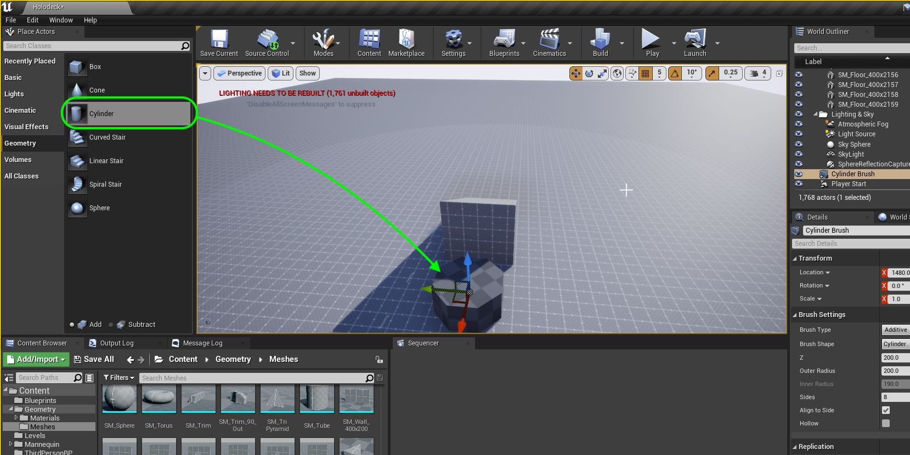
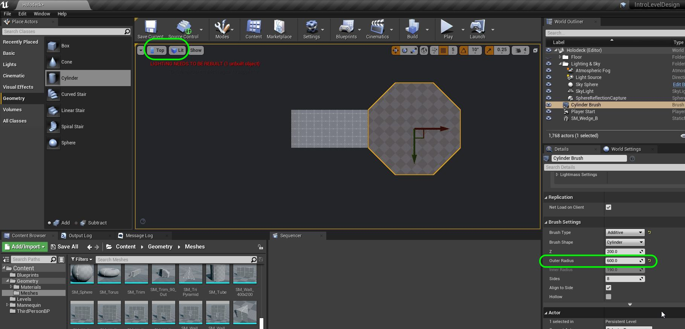
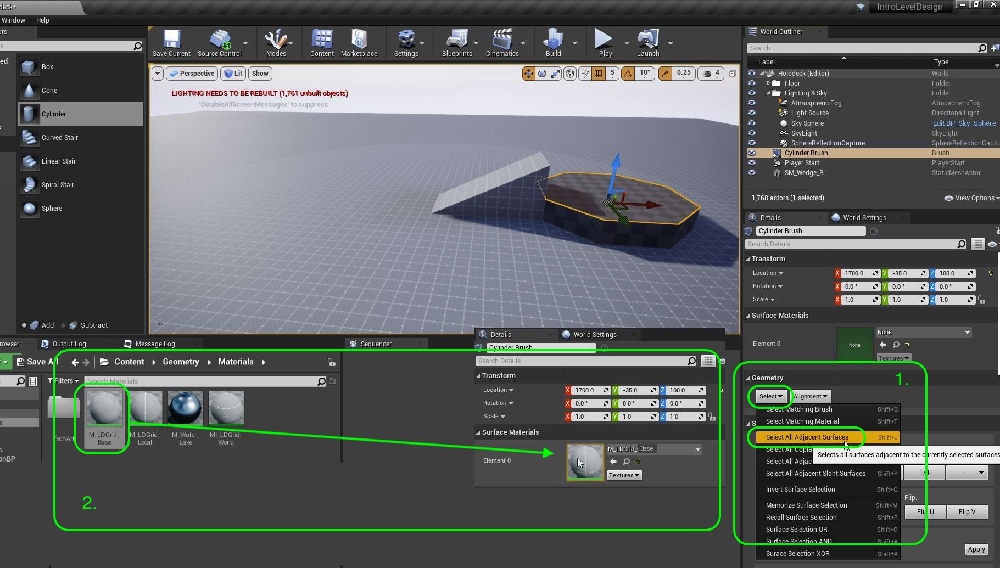
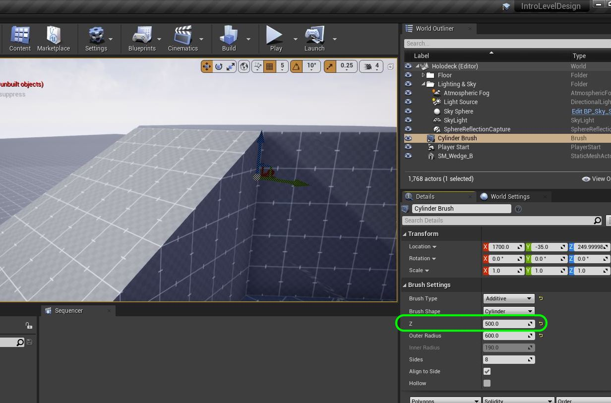

### Creating Custom Meshes

[previous](../holodeck/README.md#user-content-setting-up-holodeck) • [home](../README.md#user-content-ue4-hello-world) • [next](../readme/README.md#user-content-readmemd-file)

We have provided a set of basic shapes that you can use to block out a level.  Now each design will have custom requirements where one of these shapes will not work. We would like to create another shape but don't want to go to another software package to create it.

Unreal gives us a way of creating a simple mesh in engine. Lets look at how can we can do this.

In this game I envision a bunch of ramps that the player can run up and down.  Lets build 4 ramps of different lengths and steepness so that we can give it a test run

 

---

##### `Step 1.`\|`SUU&G`|:small_blue_diamond:

Now lets add a ramp to run up and down and see how it feels.  It looks like **Content | Geometry | Meshes | SM_Wedge_B** will work as a ramp.  Drag it into the level and place and rotate it in front of the player start.  Remember that the **Red** or **X** axis is forward in Unreal. To get it to snap to the ground press the <btn>end</btn> button on the keyboard.

##### `Step 2.`\|`FHIU`|:small_blue_diamond: :small_blue_diamond: 

Run the game and you will see that the ramp is way too small and too steep to climb.  The player can not traverse it.  Lets fix this.

##### `Step 3.`\|`SUU&G`|:small_blue_diamond: :small_blue_diamond: :small_blue_diamond:

Now lets adjust the scale of the ramp.  Change the **Scale X** to `10.0`, **Scale Y** and **Scale Z** to `5.0`. This will make the ramp longer and shorter and hopefully the player can climb it.

##### `Step 4.`\|`SUU&G`|:small_blue_diamond: :small_blue_diamond: :small_blue_diamond: :small_blue_diamond:

Run the game and run up and down the ramp. I am happy with these settings.

https://user-images.githubusercontent.com/5504953/127868743-810ccfed-6592-46d4-8e58-509b8083ed21.mp4

##### `Step 5.`\|`SUU&G`| :small_orange_diamond:

Now this static mesh has a different grid material.  It is **MI_LDGrid_Local** which is different than the material we have on the floor.  On the floor the grid stays in world space and doesn't move with the actor.  In the **MI_LDGrid_Local** materail the grid moves with the static mesh in local space.  We will use this for all meshes we add to our floor plane.  Also, when you scale it the material keeps the 1 meter by 1 meter reference.

https://user-images.githubusercontent.com/5504953/127868139-d13a3926-b00b-415d-92de-797a435411ae.mp4

| `geometry.brushes`\|`Introduction To Level Design`| 
| :--- |
| :floppy_disk: &nbsp;&nbsp;"*Geometry Brushes are the most basic tool for level construction in Unreal. Conceptually, it is best to think of a Geometry Brush as filling in and carving out volumes of space in your level. Previously, Geometry Brushes were used as the primary building block in level design. Now, however, that role has been passed on to Static Meshes, which are far more efficient. However, Geometry Brushes can still be useful in the early stages of a product for rapid prototyping of levels and objects, as well as for level construction by those who do not have access to 3D modeling tools. This document goes over the use of Geometry Brushes and how they can utilized in your levels.  In general, you can think of Geometry Brushes as a way to create basic shapes for use in your level design process, either as permanent fixtures or as something temporary to test with while your artists finish creating final meshes.*" - [Unreal Engine Documentation](https://docs.unrealengine.com/4.26/en-US/Basics/Actors/Brushes/) |

##### `Step 6.`\|`SUU&G`| :small_orange_diamond: :small_blue_diamond:

So in a pinch we can use a geometry brush to create a static mesh without having to learn another software package. We want a cylinder in the middle of 4 ramps to act as a platform to connect them. Go to **Geometry | Cylinder** and drag on in front of the ramp.

##### `Step 7.`\|`SUU&G`| :small_orange_diamond: :small_blue_diamond: :small_blue_diamond:

Now we can move to **Top** view and change it to **Lit** mode so we can make the radius so that then column thickness matches the ramp thickness.  If found that a value for the **Brush Settings | Outer Radius** of `600` matches the width nicely.

##### `Step 8.`\|`SUU&G`| :small_orange_diamond: :small_blue_diamond: :small_blue_diamond: :small_blue_diamond:

Now we can add materials to brushes just like we can to static meshes.  The problem is that each face is a separate material.  This means we have to select all the faces first.

Go to **Geometry | Select | Select All Adjacent Surfaces** to select all faces on the model.  Then drag **MI_LDGrid_Base** to the model.  The local one cannot be used as it is only for static meshes. 

##### `Step 9.`\|`SUU&G`| :small_orange_diamond: :small_blue_diamond: :small_blue_diamond: :small_blue_diamond: :small_blue_diamond:

Now we need to make the column as tall as the ramp. We can use the **Geometry | Z** setting and make it ``.  Remember that it scales from the middle so the column could be buried under the ground.  Raise it and press the <btn>end</btn> key to place it back on the ground.

##### `Step 10.`\|`SUU&G`| :large_blue_diamond:

##### `Step 11.`\|`SUU&G`| :large_blue_diamond: :small_blue_diamond: 

##### `Step 12.`\|`SUU&G`| :large_blue_diamond: :small_blue_diamond: :small_blue_diamond: 

##### `Step 13.`\|`SUU&G`| :large_blue_diamond: :small_blue_diamond: :small_blue_diamond:  :small_blue_diamond: 

##### `Step 14.`\|`SUU&G`| :large_blue_diamond: :small_blue_diamond: :small_blue_diamond: :small_blue_diamond:  :small_blue_diamond: 

##### `Step 15.`\|`SUU&G`| :large_blue_diamond: :small_orange_diamond: 

##### `Step 16.`\|`SUU&G`| :large_blue_diamond: :small_orange_diamond:   :small_blue_diamond: 

##### `Step 17.`\|`SUU&G`| :large_blue_diamond: :small_orange_diamond: :small_blue_diamond: :small_blue_diamond:

##### `Step 18.`\|`SUU&G`| :large_blue_diamond: :small_orange_diamond: :small_blue_diamond: :small_blue_diamond: :small_blue_diamond:

##### `Step 19.`\|`SUU&G`| :large_blue_diamond: :small_orange_diamond: :small_blue_diamond: :small_blue_diamond: :small_blue_diamond: :small_blue_diamond:

##### `Step 20.`\|`SUU&G`| :large_blue_diamond: :large_blue_diamond:

##### `Step 21.`\|`SUU&G`| :large_blue_diamond: :large_blue_diamond: :small_blue_diamond:

___

| [previous](../holodeck/README.md#user-content-setting-up-holodeck)| [home](../README.md#user-content-ue4-hello-world) | [next](../readme/README.md#user-content-readmemd-file)|
|---|---|---|
