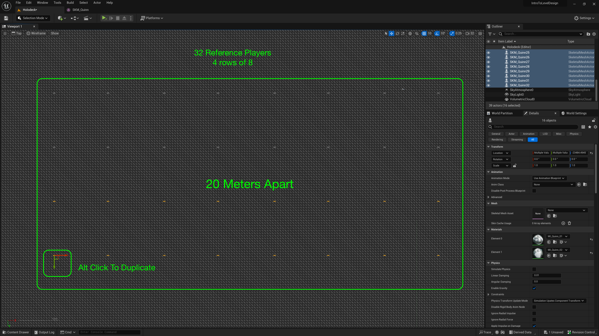
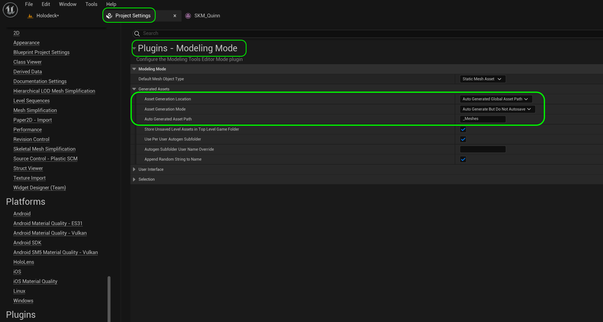
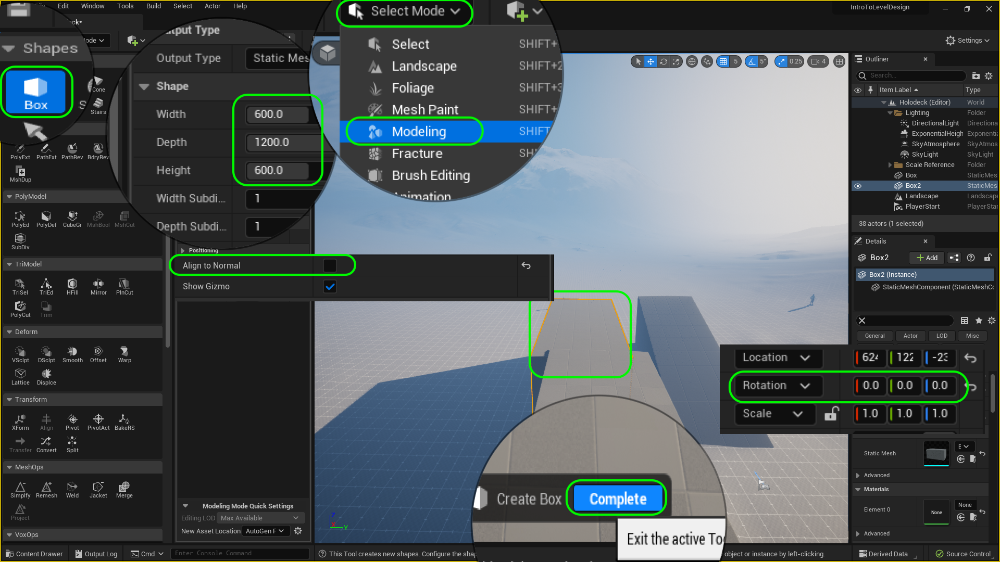

### Creating Custom Meshes

[previous](../holodeck-ii/README.md#user-content-setting-up-holodeck-ii) • [home](../README.md#user-content-ue4-intro-to-level-design) • [next](../ramps2/README.md#user-content-finish-remaining-3-ramps)

Unreal 5 now officially gives us the ability to create custom static meshes in engine.

In this game I envision a bunch of ramps that the player can run up and down.  Lets build 4 ramps of different lengths and steepness so that we can give it a test run

 

---

##### `Step 1.`\|`SUU&G`|:small_blue_diamond:

Now it is always a good idea to populate the area we are working in with a scale reference.  In this case I think the player is a good sense of size and scale.  Now our character is a skeletal mesh and includes polygons, physics as well as a skeleton.  We only need the mesh.

Double click **Content | Character | Meshes | SKM_Quinn** (SKM_ is short for Skeltal Mesh) and press the <kbd>Make Static Mesh</kbd> button.  Call this mesh `SM_ReferencePose` and put it in the **Meshes** folder.  Press the <kbd>Save</kbd> button.

##### `Step 2.`\|`FHIU`|:small_blue_diamond: :small_blue_diamond: 

Drag the newly created **SM_Reference_Pose** into the center flat part of the map around where you placed the **Player Start** actor.

##### `Step 3.`\|`SUU&G`|:small_blue_diamond: :small_blue_diamond: :small_blue_diamond:

Now <kbd>Alt Click</kbd> on the arrow and duplicate the player 32 times.  Create a group of them `20` meters apart (20 squares).  Fill up a large area with 4 rows of 8.

##### `Step 4.`\|`SUU&G`|:small_blue_diamond: :small_blue_diamond: :small_blue_diamond: :small_blue_diamond:

Now press **Play** and run around.  Notice that the ground is not flat so some are floating and some are inside the ground.  Select all the players in the menu and raise them way up in the air.  Press the <kbd>End</kbd> key and this will drop all of them to the closest point on the ground even if they are all at different heights. Now press **Play** again and all the players should be in the correct **Z** position.

https://user-images.githubusercontent.com/5504953/178083375-0baba2c1-d888-4c6d-9575-1e630aaf6a45.mp4

##### `Step 5.`\|`SUU&G`| :small_orange_diamond:

Now we want the geometry that we create to sit in a scratch folder.  I like to save the geometry to the same folder every time. Go to **Edit | Project Settings | Plugins | Modeling Mode** and adjust the **Asset Generation Location** to `Auto Generated Global Asset Path` and the **Auto Generated Asset Path** to `_MarcMeshes` (you can use your own name or anything else that is indicative that this is your working scratch folder). We will be moving these to the **Static Meshes** folder when they are done.

##### `Step 6.`\|`SUU&G`| :small_orange_diamond: :small_blue_diamond:

Now lets add a ramp for the player to run on.  We will do this but editing a basic shape using the **UE5** modeling tools.  Press **Select Mode** and `Modeling`. Now press the **Shape | Box** section on the left.  Make the box `600` cm in **Width** and **Height** (6 meters or 19.6 feet) and `1500` cm (15 meters or 49.2 feet) in **Depth**. Left click the new box to the level and press the <kbd>Complete</kbd> button. 

Now the game tries to place the object to the best of its abilities and often rotates it.  It is **VERY IMPORTANT** to reset the **Rotation** so that is it `0`, `0`, `0` on **X**, **Y** and **Z**.

##### `Step 7.`\|`SUU&G`| :small_orange_diamond: :small_blue_diamond: :small_blue_diamond:

Now to create a ramp we will need to lower one of the polygon edges.  Go to **Poly Model | PolyEdit** mode and select the top edge.  It brings up a **Gizmo** so that you can pull the blue line downwards.  Be careful not to leave an edge or bring it too low.  Zoom in and make it overlap the bottom edge.  If it skips over the ideal location then you need to adjust how much the movement snaps to.  When you are happy press the <kbd>Accept</kbd> button. 

Place the model in the level in front of the player start and so that the ramp is fully on the ground.  You might have to go underground a big so that no piece is floating as the ground is not perfectly flat.

https://user-images.githubusercontent.com/5504953/178083387-f020827a-fcfc-4fb8-97f0-7ba1d2e0e13a.mp4

##### `Step 8.`\|`SUU&G`| :small_orange_diamond: :small_blue_diamond: :small_blue_diamond: :small_blue_diamond:

Now lets test our work.  Go to **Select Mode** and choose `Select`.  Now press the <kbd>Play</kbd> button and run up and down the ramp.  In my case everything works as planned.

https://user-images.githubusercontent.com/5504953/178083401-ec85ae61-5423-4f0a-af33-a1f983251f3c.mp4

##### `Step 9.`\|`SUU&G`| :small_orange_diamond: :small_blue_diamond: :small_blue_diamond: :small_blue_diamond: :small_blue_diamond:

Now lets create a second ramp that is a `45%` slope.  We will go back to **Modeling Mode** and select a **Cube** that is  `600`cm in **Width** and **Height** and `1200`cm in **Depth**. Now the game tries to place the object to the best of its abilities and often rotates it.  It is **VERY IMPORTANT** to reset the **Rotation** so that is it `0`, `0`, `0` on **X**, **Y** and **Z**.

##### `Step 10.`\|`SUU&G`| :large_blue_diamond:

Go back to **Poly Model | Poly Edit** and drag the **edge** down to make another ramp.  Zoom in to get the edges to align perfectly.  Press the <kbd>Accept</kbd> button.

##### `Step 11.`\|`SUU&G`| :large_blue_diamond: :small_blue_diamond: 

Make sure the ramps are at the same height. We will be lining four of them up facing each other and building a 600 unit platform in the middle.  So make sure the **Locatin | Z** values are the same. 

##### `Step 12.`\|`SUU&G`| :large_blue_diamond: :small_blue_diamond: :small_blue_diamond: 

If the model is not orthoganal while you are editing in world space you will skew the geometry. The best way to check for this is to go into **Top** view and switch the rendering to **Wireframe**.  You should see only 4 edges.  If you see overlapping edges you have warped the geometry and you should start over again.

##### `Step 13.`\|`SUU&G`| :large_blue_diamond: :small_blue_diamond: :small_blue_diamond:  :small_blue_diamond: 

Now move over one of the ramps that you are happy with the position and line up with the grid lines.  Grid snapping will work in your favor if the ramps are aligned with the grid.  You can adjust them later when you have them perfectly lined up.

##### `Step 14.`\|`SUU&G`| :large_blue_diamond: :small_blue_diamond: :small_blue_diamond: :small_blue_diamond:  :small_blue_diamond: 

Now grab the second ramp and place them edge to edge.  We want them all to line up around a 6 by 6 grid in the center.

##### `Step 15.`\|`SUU&G`| :large_blue_diamond: :small_orange_diamond: 

Select both ramps and change the **Material** to `M_LDGrid_Local`.

##### `Step 16.`\|`SUU&G`| :large_blue_diamond: :small_orange_diamond:   :small_blue_diamond: 

This gives us the same 1 meter grid on the object.  The grid on the ground is in world space so that if we make any changes to the ground the grid lines stay in place.  The **M_LDGrid_Local** are in local space so that they will be relative to the object that you are contorlling.

##### `Step 17.`\|`SUU&G`| :large_blue_diamond: :small_orange_diamond: :small_blue_diamond: :small_blue_diamond:

What makes this material unique and useful for level design is that no matter how much we scale or change the model the material stays as 1 meter squares.  This allows us to make adjustments in engine to get things right but always have a proper scale representation that is so important to maintaining scale.

https://user-images.githubusercontent.com/5504953/178083430-eb1429a8-94e3-46ba-97f7-31875ab3b9a8.mp4

##### `Step 18.`\|`SUU&G`| :large_blue_diamond: :small_orange_diamond: :small_blue_diamond: :small_blue_diamond: :small_blue_diamond:

Lets add a third ramp.  This time we will make it a more interesting shape and not just a straight ramp.  The tools allow us to make more complex shapes.  Go back to **Modeling Mode** and select another **Box** that is `600` cm in **Width** and **Height** but a full `2000` cm in **Depth**.  After placing it in the level press the <kbd>Complete</kbd> button.  Change the **Material** to `M_LDGrid_Local`. Make sure you set **ALL** rotations to `0`.

##### `Step 19.`\|`SUU&G`| :large_blue_diamond: :small_orange_diamond: :small_blue_diamond: :small_blue_diamond: :small_blue_diamond: :small_blue_diamond:

Now we need to add more polygons to the faces so we can have a curved ramp rather than a single surface made with two triangles.  Go to **Poly Model | Poly Edit** and go to **Shape Edits | Insert Edge Loop**.  This will allow you to click along the long edge and a a loop and subdivide our ramp every 2 meters (2 squares in the material).  Lock in the changes by pressing the <kbd>Accept</kbd> button. Now go back to **Poly Model | Poly Edit** mode and adjust the edges so that we get a nice S loop in the ramp.  Press the <kbd>Accept</kbd> button.

https://user-images.githubusercontent.com/5504953/178083448-a8920371-50e6-4f5f-8de3-822d0aef0158.mp4

##### `Step 20.`\|`SUU&G`| :large_blue_diamond: :large_blue_diamond:

Now that we have completed it we need to put it with the other ramps so that they touch at the corners.  Make sure the **Z** heights are the same, then go into **Top** view in **Polygon** viewer to line them up perfectly.

##### `Step 21.`\|`UE5LD`| :large_blue_diamond: :large_blue_diamond: :small_blue_diamond:

Now play the game and run up and down the new curved ramp!

https://user-images.githubusercontent.com/5504953/178085499-15b378f3-4a52-4803-83fa-24292c6d5ee5.mp4

<!--  -->

| [previous](../holodeck-ii/README.md#user-content-setting-up-holodeck-ii)| [home](../README.md#user-content-ue4-intro-to-level-design) | [next](../ramps2/README.md#user-content-finish-remaining-3-ramps)|
|---|---|---|
