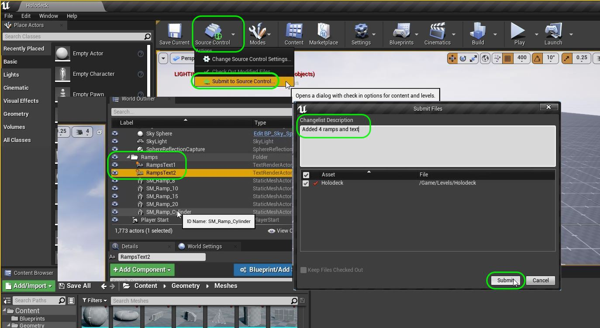
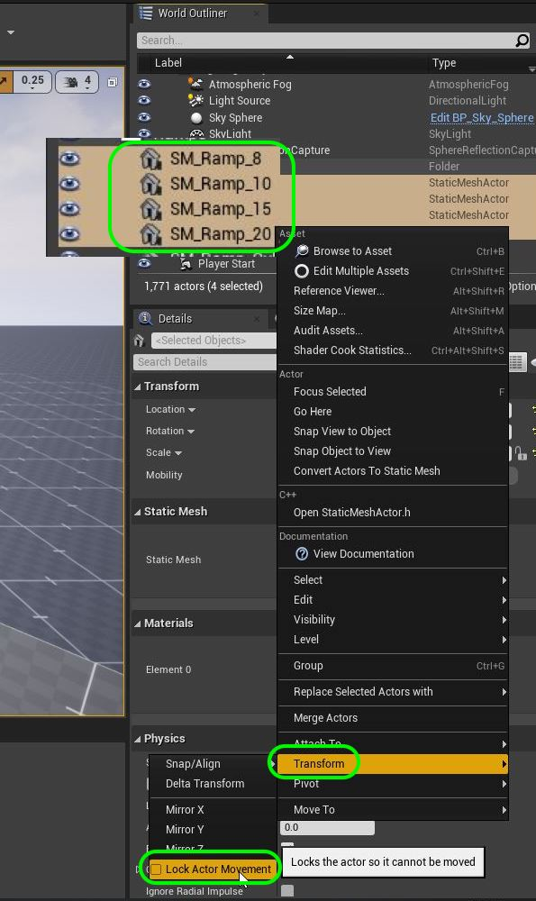
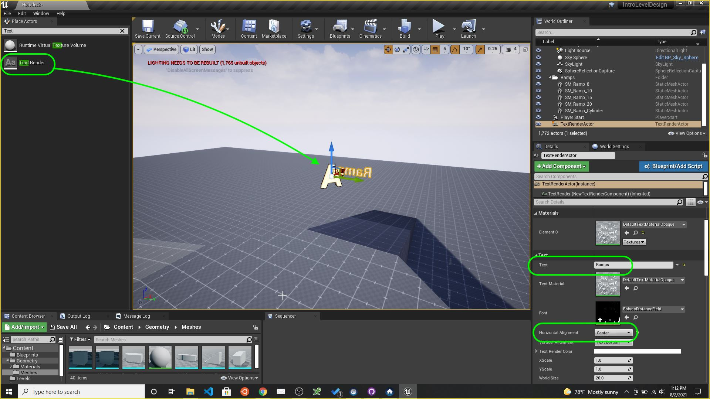

### Finish Remaining Ramp

[previous](../ramp/README.md#user-content-creating-custom-meshes) • [home](../README.md#user-content-ue4-intro-to-level-design) • [next](../double-jump/README.md#user-content-double-jumping)

Lets create the final ramp to complete the four touching ramps.  We will then add a center column that the player can run over.  We will have different angles that we would like to use in our final level. This is just a testbed to make sure that the game plays as we want given these different factors. 

 

---

##### `Step 1.`\|`SUU&G`|:small_blue_diamond:

| `lock.meshes`\|`Introduction To Level Design`| 
| :--- |
| :floppy_disk: &nbsp;&nbsp; Now when we are happy with our level design so far.  Our floor and our ramp and cylinder work the way I want.  Now there is a way in Unreal to lock these static meshes so they don't accidentally move.  It is very easy to accidentally move pieces out of position so this is a good precautionary measure. |

Select all the floor meshes (you can't just select the folder) and right click and press **Transform | Lock Actor Movement**.  Now when you go to move a floor piece it has a red slash and cannot be moved.  This can of course be deselected so you can move these meshe(s) again.

Create a folder called **Ramps** and place the ramp and cylinder in it.  Rename those objects so that they make sense to you.  Also, repeat locking the actor movement for these to static meshes as well if you are happy with them.

OK, lets save and update our repository.  Press **File | Save All** in **Unreal**. Press the <kbd>Source Control</kbd> button and select `Submit to Source Control...`. Add a **Commit** message and press the <kbd>Submit</kbd> button.

Open **GitHub Desktop** and press <kbd>Push origin</kbd> to update the server.  If you do not do this it will be saved locally but not on **GitHub**.

We will move on next to adding our first ramp to the game.

Unlock the ramps transform movement and move <btn>alt</btn> click on the widget and make a duplicate and rotate it around to other side. Use your views to line up exactly in place.  You can also use <btn>End</btn> to make it stick to the ground if you moved it along the Z axis by accident.

https://user-images.githubusercontent.com/5504953/127900627-d2023450-bba7-4461-af79-9691440a7ee8.mp4

##### `Step 2.`\|`FHIU`|:small_blue_diamond: :small_blue_diamond: 

The reason we build test levels is to confirm that our interactions and cameras work.  It is devlishly hard to get a 3-D camera to work without occlusion in busy levels (or not so busy levels). Test the game and make sure you can run up and down both ramps without getting hung up on a ledge. Also make sure the camera sees the player correctly going up and over the ridge.  Make changes to the camera if necessary.  I am happy with mine.

https://user-images.githubusercontent.com/5504953/127901204-ce6047d1-74d8-4719-b4e6-106feed194c1.mp4

##### `Step 3.`\|`SUU&G`|:small_blue_diamond: :small_blue_diamond: :small_blue_diamond:

Go back to the game and now lets make the ramp a different slope.  Lets make it less steep.  Select the second ramp and change the **X** Static Mesh Scale and make it `15`.  Reposition the mesh back into place.

https://user-images.githubusercontent.com/5504953/127902011-7c375442-8faa-45f1-b8d2-bc4bf8894f14.mp4

##### `Step 4.`\|`SUU&G`|:small_blue_diamond: :small_blue_diamond: :small_blue_diamond: :small_blue_diamond:

Now lets duplicate the final two ramps and rotate them 90 degrees into position.  Make the lenght on one `8` and the other `15`.

https://user-images.githubusercontent.com/5504953/127903077-5d5d8cde-12e8-4e70-81a5-20c1e386c46a.mp4

##### `Step 5.`\|`SUU&G`| :small_orange_diamond:

Run the game and test the ramps out.  Again, look for issues with the camera.  In a later tutorial we will adjust the player angle and speed based on the ramp.

https://user-images.githubusercontent.com/5504953/127903749-18c1504a-0e4e-46db-bbae-917d0a9691b0.mp4

##### `Step 6.`\|`SUU&G`| :small_orange_diamond: :small_blue_diamond:

Renamethe ramps with a postfix indicating the different scalesz along **X**. Freeze the transforms on the ramps to properly organize the **World Outliner**.

##### `Step 7.`\|`SUU&G`| :small_orange_diamond: :small_blue_diamond: :small_blue_diamond:

Type `Text Render` in the modes panel to add a 2-D text to add on top of the ramps to identify it from afar.  Type in as the **Text** field: `Ramps`. Change the **Horizontal Alignment** to `Center`. Move it to ontop of the ramp.

##### `Step 8.`\|`SUU&G`| :small_orange_diamond: :small_blue_diamond: :small_blue_diamond: :small_blue_diamond:

Make it really big and place it on top of the ramp. Set the **World Size** to `258` and readjust the position.  Pick a color so that it constrasts nicely with the sky. Now we want to see if from most parts of the level so duplicate the text render and rotate it 90 degrees so you can see the text from all angles (as the text is not 3-D). Raise one so they don't occlude each other and run the game to test whether they get in the way.  They shouldn't mess with the player movement.  When you are happy rename these text render components to `Ramps Title 1` and `Ramps Title 2` and lock their transforms.

https://user-images.githubusercontent.com/5504953/128019875-39f769c8-b0a2-49bd-aa18-13dce32bc4b2.mp4

##### `Step 9.`\|`SUU&G`| :small_orange_diamond: :small_blue_diamond: :small_blue_diamond: :small_blue_diamond: :small_blue_diamond:

Rename the text actors in the **World Outlinder** and move them to the ramps folder.

Now it is time to save and update the repository.  Press **File | Save All** in **Unreal**. Press the <kbd>Source Control</kbd> button and select `Submit to Source Control...`. Add a **Commit** message and press the <kbd>Submit</kbd> button.

Open **GitHub Desktop** and press <kbd>Push origin</kbd> to update the server.  If you do not do this it will be saved locally but not on **GitHub**.

We will move on next to adding our first ramp to the game.

___

| [previous](../ramp/README.md#user-content-creating-custom-meshes)| [home](../README.md#user-content-ue4-intro-to-level-design) | [next](../double-jump/README.md#user-content-double-jumping)|
|---|---|---|
