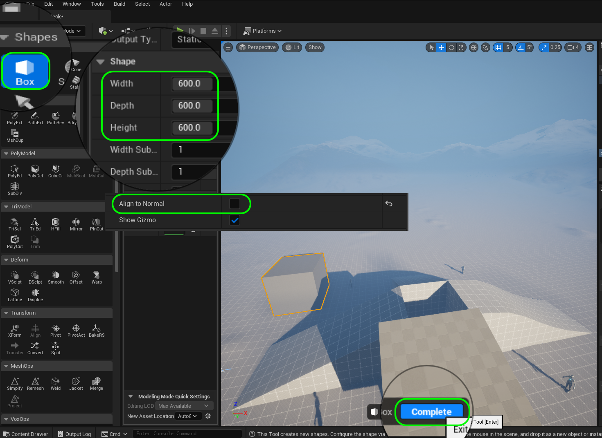

### Finish Remaining Ramp

[previous](../ramp/README.md#user-content-creating-custom-meshes) • [home](../README.md#user-content-ue4-intro-to-level-design) • [next](../double-jump/README.md#user-content-double-jumping)

Lets create the final ramp to complete the four touching ramps.  We will then add a center column that the player can run over.  We will have different angles that we would like to use in our final level. This is just a testbed to make sure that the game plays as we want given these different factors. 

 

---

##### `Step 1.`\|`SUU&G`|:small_blue_diamond:

Now we need to add more polygons to the faces so we can have a curved ramp rather than a single surface made with two triangles.  Go to **Poly Model | Poly Edit** and go to **Shape Edits | Insert Edge Loop**.  This will allow you to click along the long edge and a a loop and subdivide our ramp every 2 meters (2 squares in the material).  Lock in the changes by pressing the <kbd>Accept</kbd> button. Now go back to **Poly Model | Poly Edit** mode and adjust the edges so that we get a nice S loop in the ramp.  Press the <kbd>Accept</kbd> button.

https://user-images.githubusercontent.com/5504953/178083448-a8920371-50e6-4f5f-8de3-822d0aef0158.mp4

##### `Step 2.`\|`FHIU`|:small_blue_diamond: :small_blue_diamond: 

Now that we have completed it we need to put it with the other ramps so that they touch at the corners.  Make sure the **Z** heights are the same, then go into **Top** view in **Polygon** viewer to line them up perfectly.

##### `Step 3.`\|`SUU&G`|:small_blue_diamond: :small_blue_diamond: :small_blue_diamond:

Now play the game and run up and down the new curved ramp!

https://user-images.githubusercontent.com/5504953/178085499-15b378f3-4a52-4803-83fa-24292c6d5ee5.mp4

##### `Step 4.`\|`SUU&G`|:small_blue_diamond: :small_blue_diamond: :small_blue_diamond: :small_blue_diamond:

Create a fourth ramp on your own.  Try being creative with the design! Then make sure it lines up in the las slot.  You should now have a perfect 600 unit hole inbetween the four ramps!

##### `Step 5.`\|`SUU&G`| :small_orange_diamond:

Now play the game and you should have 4 ramps with a 600 cm square cube gap in the center.  Make sure the heights are the same and the corners are joined at the diagonals.  You should not see light leaking through in the engine.

https://user-images.githubusercontent.com/5504953/178107459-6a4ad523-b5ed-4c59-97ad-14101f7835c8.mp4

##### `Step 6.`\|`SUU&G`| :small_orange_diamond: :small_blue_diamond:

Now that we are happy with the ramps lets do some housecleaning.  Go to the **World Outliner** and give each piece a descriptive name.  I named mine `Ramp1`, `Ramp2`, `Ramp3`, `Ramp4`.

##### `Step 7.`\|`SUU&G`| :small_orange_diamond: :small_blue_diamond: :small_blue_diamond:

Now lets fill the center gap so the player can run over it.  Create another **Box** that is `600` cm ins size in **Width**, **Depth** and **Height**.  Make sure that **Align to Normal** is `false`. Press the <kbd>Accept</kbd> button.

##### `Step 8.`\|`SUU&G`| :small_orange_diamond: :small_blue_diamond: :small_blue_diamond: :small_blue_diamond:

Assign the **M_LDGrid_Local** material to the new model.  Make sure the **Rotations** are set to `0` on all axis.  Put this shape in the center to fill the hole between the four ramps.  Be precise and get everything to line up!

##### `Step 9.`\|`UE5LD`| :small_orange_diamond: :small_blue_diamond: :small_blue_diamond: :small_blue_diamond: :small_blue_diamond:

Now play the game and run around.  There should be no gaps in the ramp and the player shoudl run smoothly over the surface.  If there are any physics issues make final adjustments to your geometry now.

https://user-images.githubusercontent.com/5504953/178108011-95b0a1b8-5e5e-488d-bb0e-64ee94e48242.mp4

##### `Step 10.`\|`UE5LD`| :large_blue_diamond:

Rename the file in the **World Outliner** and call this new block: `CenterRampPiece`. Highlight all the ramp pieces and select **Move To | Create New Folder** called `Ramps`.

##### `Step 11.`\|`UE5LD`| :large_blue_diamond: :small_blue_diamond: 

Now lets go to the folder we created to hold the models we were creating.  Delete any failed ones that you did not use.  Mine was located in **_Meshes | Mauby**. I renamed them to `SM_UndulatingRamp`, `SM_ShortRamp`, `SM_RampCenterBlock`, `SM_MediumRamp`, and `SM_LongRamp`. You may need to check out the files to make changes, which is fine! Now move these 5 ramps to your **Meshes** folder.

##### `Step 12.`\|`UE5LD`| :large_blue_diamond: :small_blue_diamond: :small_blue_diamond: 

Type `Text Render` in the **Add Actors** menue to add a 2-D text to add on top of the ramps to identify it from afar.  Type in as the **Text** field: `Ramps`. Change the **Horizontal Alignment** to `Center`. Move it to ontop of the ramp.

##### `Step 13.`\|`UE5LD`| :large_blue_diamond: :small_blue_diamond: :small_blue_diamond:  :small_blue_diamond: 

Make it really big and place it on top of the ramp. Set the **World Size** to `258` and readjust the position.  Pick a color so that it constrasts nicely with the sky. Now we want to see if from most parts of the level so duplicate the text render and rotate it 90 degrees so you can see the text from all angles (as the text is not 3-D). Raise one so they don't occlude each other and run the game to test whether they get in the way.  They shouldn't mess with the player movement.  When you are happy rename these text render components to `Ramps Title 1` and `Ramps Title 2` and lock their transforms.

https://user-images.githubusercontent.com/5504953/128019875-39f769c8-b0a2-49bd-aa18-13dce32bc4b2.mp4

##### `Step 14.`\|`UE5LD`| :large_blue_diamond: :small_blue_diamond: :small_blue_diamond: :small_blue_diamond:  :small_blue_diamond: 

Move the ramps so they don't overlap the height reference actors you have placed.  I moved mine so that the players surrounded the ramp.

##### `Step 15.`\|`UE5LD`| :large_blue_diamond: :small_orange_diamond: 

Now adjust the **Player Start** to start in fron to of the ramp, and make sure they player is facing the ramp (white arrow).

##### `Step 16.`\|`UE5LD`| :large_blue_diamond: :small_orange_diamond:   :small_blue_diamond: 

Select all ramps when they are positioned properly, select all ramps and right click choosing **Transform | Lock Actor Movement**.

##### `Step 17.`\|`UE5LD`| :large_blue_diamond: :small_orange_diamond: :small_blue_diamond: :small_blue_diamond:

Select the **File | Save All** then press the <kbd>Source Control</kbd> button and select **Source Control...**. Enter a **Changelist Description** and then press <kbd>Submit Content</kbd>. Update the **Changelist Description** message and with the latest changes. Make sure all the files are correct and press the <kbd>Submit</kbd> button. A confirmation will pop up on the bottom right with a message about a changelist was submitted with a commit number.

##### `Step 18.`\|`UE5LD`| :large_blue_diamond: :small_orange_diamond: :small_blue_diamond: :small_blue_diamond: :small_blue_diamond:

Sometimes not all files get submitted to Unreal especially for files that don't show up in the editor.  It is good practice one you submit in **Unreal** and quit the game to right click on the top most project folder and select **Reconcile Offline Work...**.

This will either give a message saying ther is nothing to reconcile or bring up a tab.  Make sure that these are **NOT** files in the **Intermediate** and **Saved** folders as these should be ignored from the `.p4ignore`.

If the files are in **Content** or **Configuration** then press the <kbd>Reconcile</kbd> button.  Then submit the changes with a message and press the <kbd>Submit</kbd> button.

<!--  -->

| [previous](../ramp/README.md#user-content-creating-custom-meshes)| [home](../README.md#user-content-ue4-intro-to-level-design) | [next](../double-jump/README.md#user-content-double-jumping)|
|---|---|---|
