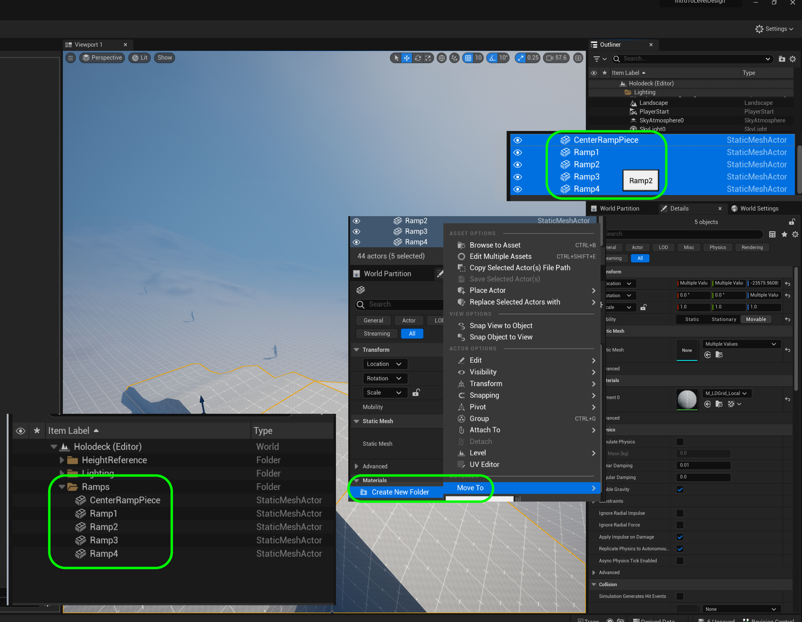
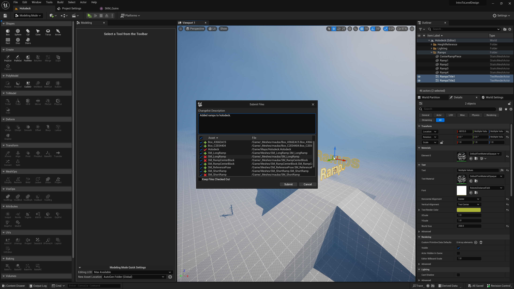

### Finish Remaining Ramp

[previous](../ramp/README.md#user-content-creating-custom-meshes) • [home](../README.md#user-content-ue4-intro-to-level-design) • [next](../double-jump/README.md#user-content-double-jumping)

Lets create the final ramp to complete the four touching ramps.  We will then add a center column that the player can run over.  We will have different angles that we would like to use in our final level. This is just a testbed to make sure that the game plays as we want given these different factors. 

 

---

##### `Step 1.`\|`SUU&G`|:small_blue_diamond:

Create a fourth ramp on your own.  Try being creative with the design! Then make sure it lines up in the las slot.  You should now have a perfect 600 unit hole inbetween the four ramps!

##### `Step 2.`\|`FHIU`|:small_blue_diamond: :small_blue_diamond: 

Now play the game and you should have 4 ramps with a 600 cm square cube gap in the center.  Make sure the heights are the same and the corners are joined at the diagonals.  You should not see light leaking through in the engine.

https://user-images.githubusercontent.com/5504953/178107459-6a4ad523-b5ed-4c59-97ad-14101f7835c8.mp4

##### `Step 3.`\|`SUU&G`|:small_blue_diamond: :small_blue_diamond: :small_blue_diamond:

Now lets fill the center gap so the player can run over it.  Create another **Box** that is `600` cm ins size in **Width**, **Depth** and **Height**.  Press the <kbd>Complete</kbd> button.

##### `Step 4.`\|`SUU&G`|:small_blue_diamond: :small_blue_diamond: :small_blue_diamond: :small_blue_diamond:

Assign the **M_LDGrid_Local** material to the new model.  Make sure the **Rotations** are set to `0` on all axis.  Put this shape in the center to fill the hole between the four ramps.  Be precise and get everything to line up!

##### `Step 5.`\|`SUU&G`| :small_orange_diamond:

Now play the game and run around.  There should be no gaps in the ramp and the player shoudl run smoothly over the surface.  If there are any physics issues make final adjustments to your geometry now.

https://user-images.githubusercontent.com/5504953/178108011-95b0a1b8-5e5e-488d-bb0e-64ee94e48242.mp4

##### `Step 6.`\|`SUU&G`| :small_orange_diamond: :small_blue_diamond:

Now that we are happy with the ramps lets do some housecleaning.  Go to the **Outliner** and give each piece a descriptive name.  I named mine `CenterBlock`, `MidSizeRamp`, `ShortRamp`, `UndulatingRamp` and `CurvedRamp`.

##### `Step 7.`\|`SUU&G`| :small_orange_diamond: :small_blue_diamond: :small_blue_diamond:

Create a new folder in the **Outlinder** called `Ramps` and place the 5 objects in there.  Create another folder called `Lighting` and put all the remaining actors in there except for **Player Start** and **Landscape**.

| `lock.meshes`\|`Introduction To Level Design`| 
| :--- |
| :floppy_disk: &nbsp;&nbsp; Now when we are happy with our level design so far.  Our floor and our ramp and center cube work the way we want.  Now there is a way in Unreal to lock these static meshes so they don't accidentally move.  It is very easy to accidentally move pieces out of position so this is a good precautionary measure. It is also easy to accidentally select the landscape while trying to pick an actor on it.  This stops accidentaly movement and allows you to focus on the new elements you are adding to the level.|

##### `Step 8.`\|`SUU&G`| :small_orange_diamond: :small_blue_diamond: :small_blue_diamond: :small_blue_diamond:

Select all the ramps and right click and press **Transform | Lock Actor Movement**.  Now when you go to move a ramp it has no gizmo and cannot be moved.  This can of course be undone so you can move these meshe(s) again.

##### `Step 9.`\|`UE5LD`| :small_orange_diamond: :small_blue_diamond: :small_blue_diamond: :small_blue_diamond: :small_blue_diamond:

Repeat this for the **Landscape**.  This way you will not accidentally make changes to the landscape and it will make it easier to select objects within it without accidentally selecting the landscape itself.

##### `Step 10.`\|`UE5LD`| :large_blue_diamond:

Now when you run the game and select these objects you will notice that there is no gizmo for translation, scale or rotation on the ramps or landscapes.  But for other objects we did not lock we can still edit and move them.

https://user-images.githubusercontent.com/5504953/178108978-23d406ac-3d0c-45ed-920d-0263627c233b.mp4

##### `Step 11.`\|`UE5LD`| :large_blue_diamond: :small_blue_diamond: 

Now lets go to the folder we created to hold the models we were creating.  Delete the ones that we did not use (if you start over and don't delete the modles it will keep them all).  Mine was located in **_MarcMeshes | Mauby**. I renamed them to `SM_UndulatingRamp`, `SM_ShortRamp`, `SM_RampCenterBlock`, `SM_MidSizeRamp`, and `SM_CurvedRamp`. You may need to check out the files to make changes, which is fine!

##### `Step 12.`\|`UE5LD`| :large_blue_diamond: :small_blue_diamond: :small_blue_diamond: 

Now move these 5 ramps to your meshes folder.

##### `Step 13.`\|`UE5LD`| :large_blue_diamond: :small_blue_diamond: :small_blue_diamond:  :small_blue_diamond: 

Type `Text Render` in the **Add Actors** menue to add a 2-D text to add on top of the ramps to identify it from afar.  Type in as the **Text** field: `Ramps`. Change the **Horizontal Alignment** to `Center`. Move it to ontop of the ramp.

##### `Step 14.`\|`UE5LD`| :large_blue_diamond: :small_blue_diamond: :small_blue_diamond: :small_blue_diamond:  :small_blue_diamond: 

Make it really big and place it on top of the ramp. Set the **World Size** to `258` and readjust the position.  Pick a color so that it constrasts nicely with the sky. Now we want to see if from most parts of the level so duplicate the text render and rotate it 90 degrees so you can see the text from all angles (as the text is not 3-D). Raise one so they don't occlude each other and run the game to test whether they get in the way.  They shouldn't mess with the player movement.  When you are happy rename these text render components to `Ramps Title 1` and `Ramps Title 2` and lock their transforms.

https://user-images.githubusercontent.com/5504953/128019875-39f769c8-b0a2-49bd-aa18-13dce32bc4b2.mp4

##### `Step 15.`\|`UE5LD`| :large_blue_diamond: :small_orange_diamond: 

Select the **File | Save All** then press the <kbd>Source Control</kbd> button and select **Source Control...**. Enter a **Changelist Description** and then press <kbd>Submit Content</kbd>. Update the **Changelist Description** message and with the latest changes. Make sure all the files are correct and press the <kbd>Submit</kbd> button. A confirmation will pop up on the bottom right with a message about a changelist was submitted with a commit number.

<!--  -->

| [previous](../ramp/README.md#user-content-creating-custom-meshes)| [home](../README.md#user-content-ue4-intro-to-level-design) | [next](../double-jump/README.md#user-content-double-jumping)|
|---|---|---|
