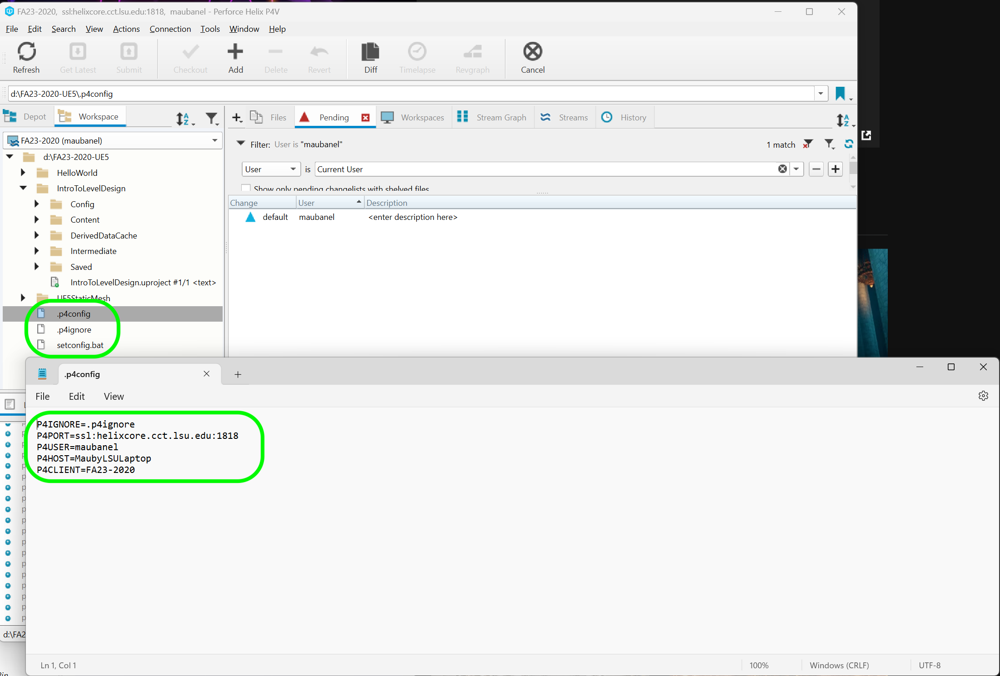
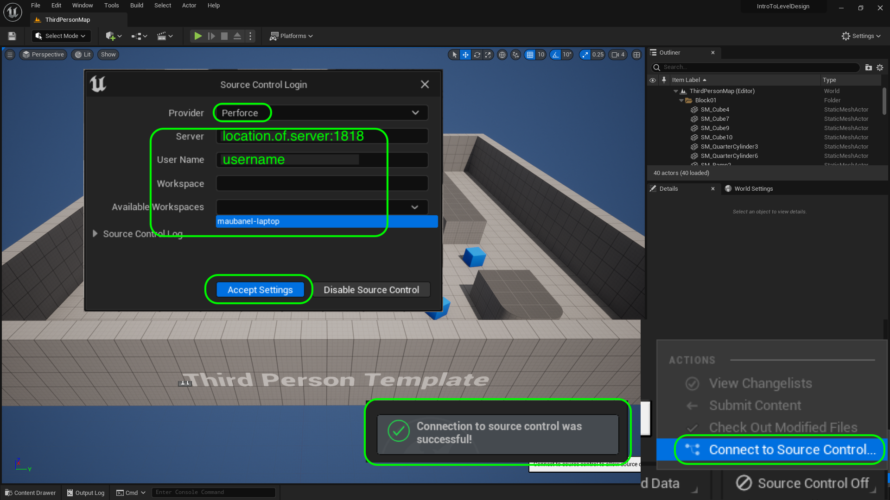

### Setting up Unreal & Github

[home](../README.md#user-content-ue4-intro-to-level-design) • [next](../camera-mechanics/README.md#user-content-lock-cameras-and-mechanics)

We will be using Unreal's third person template as a starting point for our 3-D platforming game we will be using for level design.  This will give us all we need for a basic character that we can control with some tweaks to make it to our liking.  Lets start by creating a project in Unreal then using **Perforce** to store our work.

 

---

##### `Step 1.`\|`UE5LD`|:small_blue_diamond:

If you have not installed the required software go and add [Epic Games Launcher](https://www.epicgames.com/store/en-US/download), [P4V](https://www.perforce.com/downloads/helix-visual-client-p4v) - this assumes you have a **Perforce** server which is free if you are team of 4 people or less and can be found at [Perforce Helix Core](https://www.perforce.com/products/helix-core/free-version-control).  Make sure it has a `5.0.x` in front of the version so that we know this walk through will be compatible with your version of Unreal. 

If it is not installed press the <kbd>+</kbd> button and install the latest **5.0.x** version of Unreal.  

##### `Step 2.`\|`UE5LD`|:small_blue_diamond: :small_blue_diamond: 
Run the **Epic Games Launcher** and Press **Launch** button to launch the editor.

##### `Step 3.`\|`UE5LD`|:small_blue_diamond: :small_blue_diamond: :small_blue_diamond:

You can pick from different starting templates with Games, Film/Video & Live Events, Architecture and Automotive Product Design & Manufacturing as options.  You can also load recent projects as well!

We are going to make a game so lets start by selecting **Games** and then select the **Third Person Template**.  

The first settings on the top right is set to **BLUEPRINT**.  You can select between **C++** and **BLUEPRINT**.  Since we will not be doing any C++ programming in this exercise we will leave it with Blueprint.  I am leaving the **Target Platform** as **Desktop** and the **Quality Preset** to **Maximum Quality** as we are developing this for a modern computer.  We do not need the starter content so we will set the **Starter Content** to `false` to keep our project size at bay. We will leave **Raytracing** off as we will not be using it at the moment.  

Select your **Perforce** workspace as the folder to save the project in and call it `IntroToLevelDesign`.  Press the <kbd>Create</kbd> button to start the game with the third person template.

| `version.control`\|`Introduction To Level Design`| 
| :--- |
| :floppy_disk: &nbsp;&nbsp;Version control saves lots of space on our laptops so that all project data can be safely backed up and saved on the server but we only need the assets we are currently using on our local hard drive.  It is also good practice as most game projects use some form of version control. It is absolutely necessary on team projects.  In this case we will be using **Perforce's Helix Core** server. |

##### `Step 4.`\|`UE5LD`|:small_blue_diamond: :small_blue_diamond: :small_blue_diamond: :small_blue_diamond:

In the editor select the **Edit** menu item then from the drop down menu select **Editor Preferences**. Select **General | Loading & Saving** tab from the left hand side.  Go to *Source Control* and set **Prompt for Checkout on Asset Modification** and **Add New Files when Modified** to `true`.  Leave the other two settings with their default setting. 

##### `Step 5.`\|`UE5LD`| :small_orange_diamond:

Now go back to the game editor screen and press **File | Save All** then **File | Exit** to quit **Unreal**.

##### `Step 6.`\|`UE5LD`| :small_orange_diamond: :small_blue_diamond:

Now lets log into **P4V** with your server address and user name. You also need to select the **Workspace** you are using.  Press the <kbd>OK</kbd> button.  

Remember this is the local version of the project.  When you **Submit** you update the **Depot**. You might need to press refresh but now you should see the **IntoToLevelDesign** folder. You can see the `.uproject` file and there is no icon so it has not been submitted to the **Depot** yet.

##### `Step 7.`\|`UE5LD`| :small_orange_diamond: :small_blue_diamond: :small_blue_diamond:

One last step we need to take care of is that we need to add a [.p4ignore](../files/p4ignore.zip) file to our project.  Download this file then decompress it and put it in your root folder with the `.uproject` file.  You can press **Refresh** in **P4V** to see it update in **Perforce** as well. Please note that you might need to make adjustments to your default settings to see hidden files.  `.p4ignore` is a hidden file.  Any file without a prefix before the extension is hidden by default. Go to [Microsoft Help](https://support.microsoft.com/en-us/windows/show-hidden-files-0320fe58-0117-fd59-6851-9b7f9840fdb2) to find out how to alter your settings.

Please note that we **DO NOT** want `p4ignore.zip` as this will not do anything in its compressed state.

##### `Step 8.`\|`UE5LD`| :small_orange_diamond: :small_blue_diamond: :small_blue_diamond: :small_blue_diamond:

Now if we double click on the file and look at it in a text editor it indicates which files get submitted to source control and which don't. In our game folder we have our **Config** and **Content** folder which contains all of the unique portions of the game.  Most of the other folders like **Binaries/**, **Saved** and **Intermediate** are compiled to each person's computer for the game.  So these can be deleted then recreated when the game is run.  These do not need to be added to source control as it is uneeded tracking of dynamically generated content.  We also ignore files extensions such as `*-Debut.* as these are appended to file names that are used for debugging, and again created dynamically by the engine.  We have told it **NOT** to ignore anything in the **Plugins** folder.  The `!` exclamation mark is used to say that **EVERYTHING** in this folder regardless of the rules above need to be included.  This is done so that you can add plugins that are not included with the engine and share it.

##### `Step 9.`\|`UE5LD`| :small_orange_diamond: :small_blue_diamond: :small_blue_diamond: :small_blue_diamond: :small_blue_diamond:

Now we need to add these files to the database and to the **Depot** (server).  We do this by pressing thge <kbd>+ Add</kbd> button.  We then select a **New** changelist and add a message. All we did was create a default project so I used `Default third person project`. When you are done press the <kbd>OK</kbd> button.

##### `Step 10.`\|`UE5LD`| :large_blue_diamond:

Now we need to make sure our **P4 Ignore** file will be recognized by **Perforce**.  Enter `cmd` in your windows menu to run **Command Prompt**.  Type `p4 set` then enter.  You will see if you have a P4IGNORE setting set? If you see `P4IGNORE=.p4ignore (set)` then you can move on to **Step 12** otherwise fix this in the next step.

##### `Step 11.`\|`UE5LD`| :large_blue_diamond: :small_blue_diamond: 

In command prompt type `p4 set P4IGNORE=.p4ignore`.  Make sure there are no spaces between or after the `=` sign.  Then type in and enter a `p4 set` again and you should see that it is now showing: `P4IGNORE=.p4ignore (set)`.  Now you are ready to move to the next step.

##### `Step 12.`\|`UE5LD`| :large_blue_diamond: :small_blue_diamond: :small_blue_diamond: 

Now press the <kbd>Submit</kbd> button to send these local files to the **Depot** on the server.  The first pop-up will show the ignore file working.  It should list the files not marked for add.  This is exactly what we want.  If you don't get this go back to the previous step and make sure your `.p4ignore` is set up correclty. Press the <kbd>OK</kbd> button to continue.

##### `Step 13.`\|`UE5LD`| :large_blue_diamond: :small_blue_diamond: :small_blue_diamond:  :small_blue_diamond: 

Now you will get a list with all the files you want to submit in the **Changelist** with the message you previously entered.  Make sure that all of files being submitted are all in the **Contents** or **Config** folders as well as the `.uproject` file. When you are happy press the <kbd>Submit</kbd> button.

##### `Step 14.`\|`UE5LD`| :large_blue_diamond: :small_blue_diamond: :small_blue_diamond: :small_blue_diamond:  :small_blue_diamond: 

Press the <kbd>Refresh</kbd> button in **P4V** and you will see that files in the **Content** folder have a green icon.  Files in the **Intermediate** folder do not.  So our `.p4ignore` is working corretly.  For icon meaning check out the [P4 Icons](https://github.com/maubanel/p4v-unreal/blob/main/icons/README.md#user-content-p4v-icons).

##### `Step 15.`\|`UE5LD`| :large_blue_diamond: :small_orange_diamond: 

Run the game while you are still logged into **Perforce**.  It is best practice to double click the `.uproject` name to load it. This will now run **Unreal** and you are certain it is from the **P4** folder you are tracking.

##### `Step 16.`\|`UE5LD`| :large_blue_diamond: :small_orange_diamond:   :small_blue_diamond: 

Now we can use the engine to do our future source control submissionms.  Press the **Source Controll Off** item at the bottom right of the window.

Select `Perforce` as the **Provider** and enter the **Server** address.  Enter your **Username** and the name of your **Workspace** (this can be selected from the **Available Workspaces** drop down menu).

Press the <kbd>Accept Settings</kbd> button.  You should see a pop up on the bottom right saying that it was succesfully connected to source control.

##### `Step 18.`\|`UE5LD`| :large_blue_diamond: :small_orange_diamond: :small_blue_diamond: :small_blue_diamond: :small_blue_diamond:
Download a thumbnail that you can use on this project [Intro Thumbnail](images/IntroToLevelDesign.png). Press the **Settings** button and select **Project Settings**.  Press the three dots in the **About | Project Thumbnail** tab next to the thumbnail and attach the image you just downloaded above.

##### `Step 19.`\|`UE5LD`| :large_blue_diamond: :small_orange_diamond: :small_blue_diamond: :small_blue_diamond: :small_blue_diamond: :small_blue_diamond:

Make sure you are in the **Project Description** tab and  Enter a **Description**, **Project Name**.  Put your name as the **Publisher | Company Name** and you can add your email in **Support Contact**. Add the **Project Displayed Title** and **Project Debug Title Info**.

##### `Step 20.`\|`UE5LD`| :large_blue_diamond: :large_blue_diamond:

Press play and lets see what we get? Run around using the **UP | DOWN | LEFT | RIGHT** keys on the keyboard. Press **Space Bar** to jump.  Get used to teh controls - we will make some changes in the next section.

##### `Step 21.`\|`UE5LD`| :large_blue_diamond: :large_blue_diamond: :small_blue_diamond:

Select the **File | Save All** then press the <kbd>Source Control</kbd> button and select **Source Control...**. Enter a **Changelist Description** and then press <kbd>Submit Content</kbd>. Update the **Changelist Description** message and with the latest changes. Make sure all the files are correct and press the <kbd>Submit</kbd> button. A confirmation will pop up on the bottom right with a message about a changelist was submitted with a commit number.

| [home](../README.md#user-content-ue4-intro-to-level-design) | [next](../camera-mechanics/README.md#user-content-lock-cameras-and-mechanics)|
|---|---|
