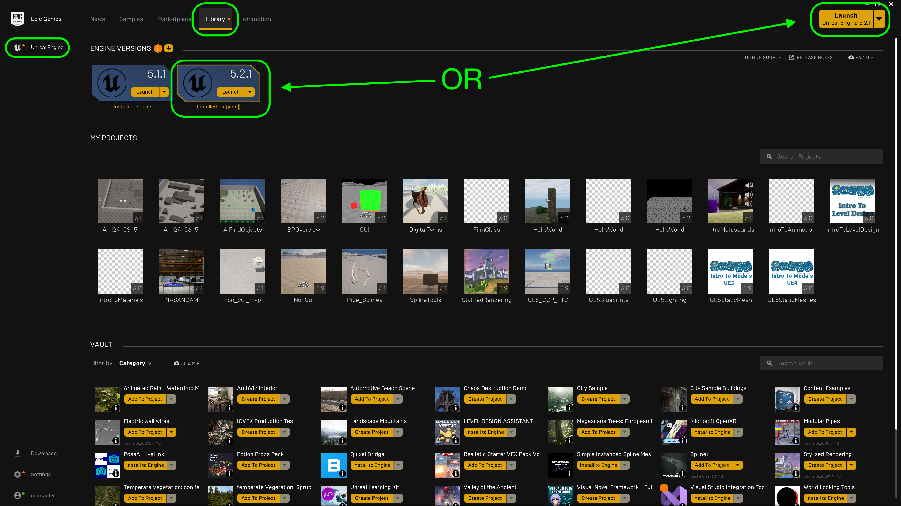

### Setting up Unreal & Github

[previous](../README.md#user-content-first-hour-in-ue4) • [home](../README.md#user-content-ue4-hello-world) • [next](../readme/README.md#user-content-readmemd-file)

We will be working in a third person game and will use the UE4 default and alter it for our needs.  This will give us all we need for a character that we can control."

 

---

##### `Step 1.`\|`SUU&G`|:small_blue_diamond:

If you have not installed the required software go and add [Epic Games Launcher](https://www.epicgames.com/store/en-US/download), [git (PC only)](https://git-scm.com/downloads), [Github Desktop](https://desktop.github.com), [Git LFS (Large File System)](https://git-lfs.github.com) on your mac or PC.  Make sure you have a valid [GitHub](https://github.com) account.  Make sure it has a `4.26` in front of the version (`4.26.x`) so that we know this walk through will be compatible with your version of Unreal.

##### `Step 2.`\|`FHIU`|:small_blue_diamond: :small_blue_diamond: 
Run the **Epic Games Launcher** and Press **Launch** button to go to the *Select or Create New Project* screen.

##### `Step 3.`\|`SUU&G`|:small_blue_diamond: :small_blue_diamond: :small_blue_diamond:

You can pick from different starting templates with Games, Film/TV, Architecture and Design as options.  Lets start by selecting Games and then press the **Next** button.

##### `Step 4.`\|`SUU&G`|:small_blue_diamond: :small_blue_diamond: :small_blue_diamond: :small_blue_diamond:

Unreal then allows us to have various starting point template for different genres of games.  We will be looking at these in later tutorials.  The sidescroller template would be interesting but it is for 2 dimensional movement and we want a fully navigatable 3-D level. For now lets just start with a **Third Person** template then press the **Next** button.

##### `Step 5.`\|`SUU&G`| :small_orange_diamond:

This now takes you to the *Project Settings* screen. The first settings on the top left is set to Blueprints.  You can select between C++ and Blueprint.  Since we will not be doing any C++ programming in this exercise we will leave it with Blueprint.  I am leaving the quality settings to **Maximum Quality** as we are developing this for a modern computer.  We will leave **Raytracing** off as we will not be using it at the moment.  We set the paltform to **Desktop** as we will be on a PC or Mac playing the game and not on a game console or on mobile.  Then you can load up the project with some basic content and we will use this content as a starting point for our gray blocking. So set **Starter Content** to `true`.

Select a folder to put it in (I suggest `Documents/github/` and then assign a project name and I am calling it `IntroLevelDesign`.  Press the **Create Project** button to start the new project.

| `version.control`\|`Introduction To Level Design`| 
| :--- |
| :floppy_disk: &nbsp;&nbsp;Version control saves lots of space on our laptops so that all project data can be safely backed up and saved on the server but we only need the assets we are currently using on our local hard drive.  It is also good practice as most game projects use some form of version control. |

##### `Step 6.`\|`SUU&G`| :small_orange_diamond: :small_blue_diamond:

In the editor select the **Edit** menu item then from the drop down menu select **Editor Preferences**. Select **Loading & Saving** tab from the left hand side.  Go to *Source Control* and set **Prompt for Checkout on Asset Modification** to `true` and **Add New Files when Modified** to `true`.  Leave the other two settings at `false` and accept their default editor to deal with merge conflicts. 

https://user-images.githubusercontent.com/5504953/127741784-aa262ff8-e4be-4973-9bb7-4ce7abbc171b.mp4

##### `Step 7.`\|`SUU&G`| :small_orange_diamond: :small_blue_diamond: :small_blue_diamond:

Make sure you have a GitHub account and that you are logged into it. Click on [GitHub Classroom Introduction-to-Level-Design-FA21 Link](https://classroom.github.com/a/bV3pgozG). Accept the prompt if it asks you go join the class and you should get to a **Accept the Assignment – Introduction To Level Design-FA21**. Press the Accept this assignment button.

##### `Step 8.`\|`SUU&G`| :small_orange_diamond: :small_blue_diamond: :small_blue_diamond: :small_blue_diamond:

Go back to **Unreal Engine** and press the <kbd>Source Control</kbd> button and select the **Provider** `None` dropdown.

##### `Step 9.`\|`SUU&G`| :small_orange_diamond: :small_blue_diamond: :small_blue_diamond: :small_blue_diamond: :small_blue_diamond:

##### `Step 10.`\|`SUU&G`| :large_blue_diamond:

##### `Step 11.`\|`SUU&G`| :large_blue_diamond: :small_blue_diamond: 

##### `Step 12.`\|`SUU&G`| :large_blue_diamond: :small_blue_diamond: :small_blue_diamond: 

##### `Step 13.`\|`SUU&G`| :large_blue_diamond: :small_blue_diamond: :small_blue_diamond:  :small_blue_diamond: 

##### `Step 14.`\|`SUU&G`| :large_blue_diamond: :small_blue_diamond: :small_blue_diamond: :small_blue_diamond:  :small_blue_diamond: 

##### `Step 15.`\|`SUU&G`| :large_blue_diamond: :small_orange_diamond: 

##### `Step 16.`\|`SUU&G`| :large_blue_diamond: :small_orange_diamond:   :small_blue_diamond: 

##### `Step 17.`\|`SUU&G`| :large_blue_diamond: :small_orange_diamond: :small_blue_diamond: :small_blue_diamond:

##### `Step 18.`\|`SUU&G`| :large_blue_diamond: :small_orange_diamond: :small_blue_diamond: :small_blue_diamond: :small_blue_diamond:

##### `Step 19.`\|`SUU&G`| :large_blue_diamond: :small_orange_diamond: :small_blue_diamond: :small_blue_diamond: :small_blue_diamond: :small_blue_diamond:

##### `Step 20.`\|`SUU&G`| :large_blue_diamond: :large_blue_diamond:

##### `Step 21.`\|`SUU&G`| :large_blue_diamond: :large_blue_diamond: :small_blue_diamond:

___

| [previous](../first-hour/README.md#user-content-first-hour-in-ue4)| [home](../README.md#user-content-ue4-hello-world) | [next](../readme/README.md#user-content-readmemd-file)|
|---|---|---|
